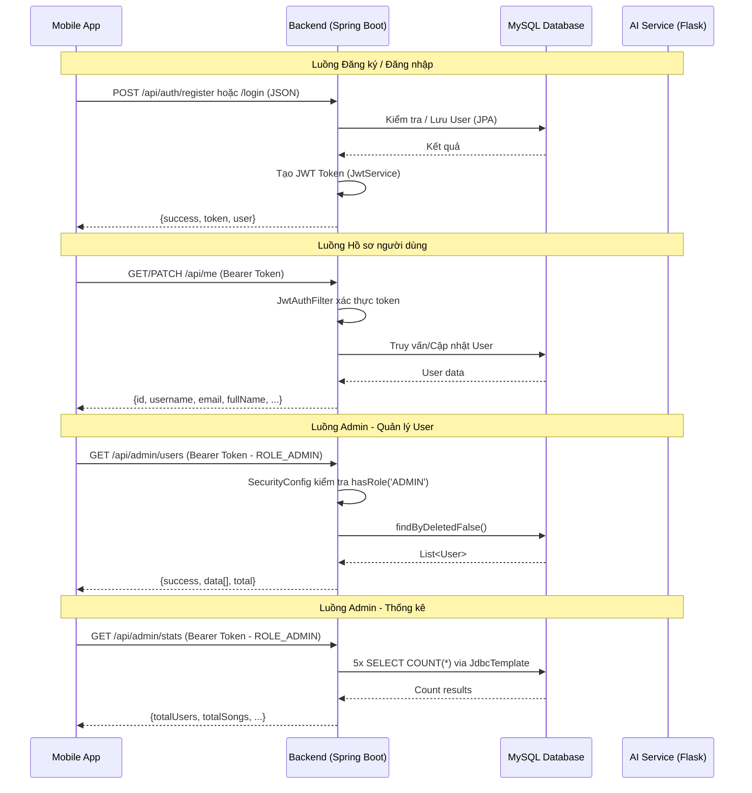
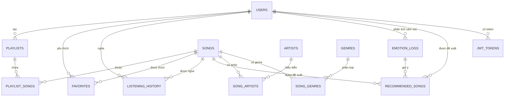

# TÀI LIỆU KIẾN TRÚC HỆ THỐNG & CHỨC NĂNG CHI TIẾT

## Ứng dụng Music App với AI Nhận Diện Cảm Xúc

> **Phiên bản tài liệu**: 1.0  
> **Ngày cập nhật**: 26/05/2026  
> **Các chức năng được mô tả**: Đăng nhập, Đăng ký, Hồ sơ người dùng, Quản lý User, Thống kê

---

# MỤC LỤC

- [PHẦN I – KIẾN TRÚC TỔNG QUAN HỆ THỐNG](#phần-i--kiến-trúc-tổng-quan-hệ-thống)
  - [1. Sơ đồ kiến trúc tổng thể](#1-sơ-đồ-kiến-trúc-tổng-thể)
  - [2. Các thành phần chính](#2-các-thành-phần-chính)
  - [3. Luồng kết nối giữa các thành phần](#3-luồng-kết-nối-giữa-các-thành-phần)
  - [4. Kiến trúc phân lớp Backend](#4-kiến-trúc-phân-lớp-backend)
  - [5. Kiến trúc phân lớp Mobile](#5-kiến-trúc-phân-lớp-mobile)
  - [6. Chuỗi xác thực JWT (Security Chain)](#6-chuỗi-xác-thực-jwt-security-chain)
- [PHẦN II – CHI TIẾT CHỨC NĂNG](#phần-ii--chi-tiết-chức-năng)
  - [CHỨC NĂNG 1: ĐĂNG NHẬP](#chức-năng-1-đăng-nhập)
  - [CHỨC NĂNG 2: ĐĂNG KÝ](#chức-năng-2-đăng-ký)
  - [CHỨC NĂNG 3: HỒ SƠ NGƯỜI DÙNG](#chức-năng-3-hồ-sơ-người-dùng)
  - [CHỨC NĂNG 4: QUẢN LÝ USER (ADMIN)](#chức-năng-4-quản-lý-user-admin)
  - [CHỨC NĂNG 5: THỐNG KÊ (ADMIN)](#chức-năng-5-thống-kê-admin)
- [PHẦN III – CƠ SỞ DỮ LIỆU](#phần-iii--cơ-sở-dữ-liệu)
- [PHẦN IV – HƯỚNG DẪN CÀI ĐẶT VÀ TRIỂN KHAI](#phần-iv--hướng-dẫn-cài-đặt-và-triển-khai)
- [PHẦN V – CÁC LƯU Ý QUAN TRỌNG](#phần-v--các-lưu-ý-quan-trọng)

---

# PHẦN I – KIẾN TRÚC TỔNG QUAN HỆ THỐNG

## 1. Sơ đồ kiến trúc tổng thể

```
┌─────────────────────────────────────────────────────────────────────────────┐
│                          KIẾN TRÚC HỆ THỐNG MUSIC APP                      │
├─────────────────────────────────────────────────────────────────────────────┤
│                                                                             │
│  ┌───────────────────┐                                                     │
│  │   MOBILE CLIENT   │        HTTP/REST (JSON)                             │
│  │  (Android - Java) │ ──────────────────────────┐                         │
│  │                   │                            │                         │
│  │  • LoginActivity  │                            ▼                         │
│  │  • RegisterAct.   │              ┌──────────────────────────┐            │
│  │  • ProfileFrag.   │              │    BACKEND API SERVER    │            │
│  │  • AdminActivity  │              │   (Spring Boot - Java)   │            │
│  │  • AdminHomeFrag. │              │                          │            │
│  │  • AdminUsersFrag.│              │  Port: 8080              │            │
│  │                   │              │                          │            │
│  │  Retrofit + OkHttp│              │  ┌────────────────────┐  │            │
│  │  JWT Interceptor  │              │  │  Spring Security   │  │            │
│  └───────────────────┘              │  │  + JWT Filter      │  │            │
│                                     │  └────────────────────┘  │            │
│                                     │  ┌────────────────────┐  │            │
│                                     │  │  Controllers       │  │            │
│                                     │  │  • AuthController  │  │  HTTP/REST │
│                                     │  │  • MeController    │──┼──────┐     │
│                                     │  │  • AdminController │  │      │     │
│                                     │  └────────────────────┘  │      │     │
│                                     │  ┌────────────────────┐  │      │     │
│                                     │  │  JwtService        │  │      ▼     │
│                                     │  └────────────────────┘  │ ┌────────┐ │
│                                     │  ┌────────────────────┐  │ │AI Svc  │ │
│                                     │  │  JPA Repositories  │  │ │(Flask) │ │
│                                     │  │  + JdbcTemplate    │  │ │Port:   │ │
│                                     │  └────────┬───────────┘  │ │5000    │ │
│                                     └───────────┼──────────────┘ └────────┘ │
│                                                 │                           │
│                                                 ▼                           │
│                                     ┌──────────────────────────┐            │
│                                     │      MySQL DATABASE      │            │
│                                     │    music_app_db           │            │
│                                     │    Port: 3307             │            │
│                                     │                          │            │
│                                     │  13 bảng:                │            │
│                                     │  users, songs, playlists │            │
│                                     │  favorites, emotion_logs │            │
│                                     │  listening_history, ...  │            │
│                                     └──────────────────────────┘            │
└─────────────────────────────────────────────────────────────────────────────┘
```

## 2. Các thành phần chính

| # | Thành phần | Công nghệ | Port | Vai trò |
|---|-----------|-----------|------|---------|
| 1 | **Mobile Client** | Android (Java), SDK 24+, Retrofit 2.9.0 | — | Giao diện người dùng, gọi API |
| 2 | **Backend API** | Spring Boot 2.7.14, Java 11, Spring Security | 8080 | Xử lý business logic, xác thực JWT, cung cấp REST API |
| 3 | **AI Service** | Python 3.8+, Flask 3.1, TensorFlow 2.21 | 5000 | Nhận diện cảm xúc khuôn mặt |
| 4 | **Database** | MySQL 8.0 | 3307 | Lưu trữ dữ liệu |

## 3. Luồng kết nối giữa các thành phần



## 4. Kiến trúc phân lớp Backend

```
┌──────────────────────────────────────────────────────────┐
│                    PRESENTATION LAYER                     │
│  (Controllers - Nhận request, trả response)              │
│                                                          │
│  AuthController.java     → /api/auth/**                  │
│  MeController.java       → /api/me                       │
│  AdminController.java    → /api/admin/**                  │
├──────────────────────────────────────────────────────────┤
│                    SECURITY LAYER                         │
│  (Xác thực & Phân quyền)                                │
│                                                          │
│  SecurityConfig.java        → Cấu hình URL rules         │
│  JwtAuthenticationFilter.java → Đọc & validate JWT       │
│  JwtService.java            → Tạo/Parse/Validate JWT     │
├──────────────────────────────────────────────────────────┤
│                    DATA ACCESS LAYER                      │
│  (Truy cập CSDL)                                         │
│                                                          │
│  UserRepository.java   (Spring Data JPA)                 │
│  SongRepository.java   (Spring Data JPA)                 │
│  JdbcTemplate          (Raw SQL cho Stats, Artist/Genre) │
├──────────────────────────────────────────────────────────┤
│                    MODEL / ENTITY LAYER                   │
│  (Ánh xạ bảng CSDL)                                     │
│                                                          │
│  User.java   → bảng users                                │
│  Song.java   → bảng songs                                │
│  (Không sử dụng DTO riêng - dùng Map<String, Object>)   │
└──────────────────────────────────────────────────────────┘
```

> **Lưu ý kiến trúc**: Dự án hiện **không có Service Layer** riêng biệt (trừ `JwtService`). Toàn bộ business logic nằm trực tiếp trong Controller. Không sử dụng DTO class — request/response được xử lý bằng `Map<String, Object>`.

## 5. Kiến trúc phân lớp Mobile

```
┌──────────────────────────────────────────────────────────┐
│                       UI LAYER                            │
│  (Activities & Fragments - Hiển thị giao diện)           │
│                                                          │
│  LoginActivity.java + activity_login.xml                 │
│  RegisterActivity.java + activity_register.xml           │
│  ProfileFragment.java + fragment_setting.xml             │
│  AdminActivity.java + activity_admin.xml                 │
│  AdminHomeFragment.java + fragment_admin_home.xml        │
│  AdminUsersFragment.java + fragment_admin_users.xml      │
├──────────────────────────────────────────────────────────┤
│                    NETWORK LAYER                          │
│  (Giao tiếp với Backend API)                             │
│                                                          │
│  ApiService.java        → Interface định nghĩa API      │
│  RetrofitClient.java    → Singleton cấu hình Retrofit    │
│  JwtInterceptor.java    → Tự động gắn JWT vào Header    │
├──────────────────────────────────────────────────────────┤
│                    MODEL LAYER                            │
│  (Dữ liệu & Session)                                    │
│                                                          │
│  AuthResponse.java      → Model response auth           │
│  LoginRequest.java      → DTO gửi đăng nhập             │
│  RegisterRequest.java   → DTO gửi đăng ký               │
│  SessionManager.java    → Quản lý phiên SharedPreferences│
└──────────────────────────────────────────────────────────┘
```

## 6. Chuỗi xác thực JWT (Security Chain)

```
Request từ Mobile
       │
       ▼
┌──────────────────┐    Token không có
│  OkHttp Client   │◄── hoặc hết hạn ──► Trả 401 Unauthorized
│  JwtInterceptor  │
│  (Gắn Bearer)    │
└──────┬───────────┘
       │ Authorization: Bearer <JWT>
       ▼
┌──────────────────────┐
│ JwtAuthenticationFilter │
│ (OncePerRequestFilter)  │
│                         │
│ 1. Tách token từ Header │
│ 2. extractUsername()     │
│ 3. Tìm User trong DB    │
│ 4. Validate: token hợp  │
│    lệ + isActive=true   │
│    + deleted=false       │
│ 5. Set SecurityContext   │
│    với role (ROLE_USER   │
│    hoặc ROLE_ADMIN)      │
└──────┬──────────────────┘
       │
       ▼
┌──────────────────────┐
│    SecurityConfig     │
│                       │
│ /api/auth/** → permit │
│ /api/admin/** →       │
│   hasRole('ADMIN')    │
│ Còn lại → authenticated│
└──────┬───────────────┘
       │
       ▼
┌──────────────────────┐
│    Controller xử lý   │
│    business logic      │
└───────────────────────┘
```

---

# PHẦN II – CHI TIẾT CHỨC NĂNG

---

## CHỨC NĂNG 1: ĐĂNG NHẬP

### 1.1. Mô tả

Cho phép người dùng đã có tài khoản đăng nhập vào hệ thống bằng username và password. Sau khi xác thực thành công, hệ thống trả về JWT token để sử dụng cho các request tiếp theo.

### 1.2. Sơ đồ luồng xử lý

```
┌─────────────┐     POST /api/auth/login      ┌──────────────────┐
│ LoginActivity│ ────────────────────────────► │  AuthController   │
│  (Android)   │     {username, password}      │  login()          │
└──────┬───────┘                               └────────┬─────────┘
       │                                                │
       │                                    ┌───────────▼──────────┐
       │                                    │ 1. Validate input     │
       │                                    │    (username, pass    │
       │                                    │     không rỗng)       │
       │                                    ├──────────────────────┤
       │                                    │ 2. findByUsername()   │
       │                                    │    → UserRepository   │
       │                                    ├──────────────────────┤
       │                                    │ 3. BCrypt.matches()  │
       │                                    │    So sánh mật khẩu  │
       │                                    ├──────────────────────┤
       │                                    │ 4. Kiểm tra isActive │
       │                                    │    (tài khoản bị     │
       │                                    │     khóa hay không)  │
       │                                    ├──────────────────────┤
       │                                    │ 5. JwtService        │
       │                                    │    .generateToken()  │
       │                                    │    (username + role) │
       │                                    └───────────┬──────────┘
       │     {success, token, user}                     │
       │◄───────────────────────────────────────────────┘
       │
       ▼
┌──────────────────────────────────────┐
│ Lưu vào SharedPreferences:          │
│  • token, username, userId           │
│  • fullName, role                    │
│ Chuyển sang MainActivity             │
└──────────────────────────────────────┘
```

### 1.3. Các lớp và hàm liên quan

#### A. Backend (Spring Boot)

| Lớp | File | Mô tả |
|-----|------|-------|
| `AuthController` | `app/backend/src/main/java/com/musicapp/controller/AuthController.java` | Controller xử lý endpoint đăng nhập |
| `JwtService` | `app/backend/src/main/java/com/musicapp/service/JwtService.java` | Service tạo và xác thực JWT token |
| `User` | `app/backend/src/main/java/com/musicapp/model/User.java` | Entity ánh xạ bảng `users` |
| `UserRepository` | `app/backend/src/main/java/com/musicapp/repository/UserRepository.java` | Repository truy vấn bảng `users` |

**Hàm chính trong `AuthController.login()`**:

```java
@PostMapping("/login")
public ResponseEntity<?> login(@RequestBody Map<String, String> request) {
    // 1. Lấy username, password từ request body
    String username = request.get("username");
    String password = request.get("password");

    // 2. Validate: không được rỗng
    if (username == null || password == null) → trả 400 Bad Request

    // 3. Tìm user theo username
    Optional<User> userOpt = userRepository.findByUsername(username);
    if (!userOpt.isPresent()) → trả 401 "Tên đăng nhập hoặc mật khẩu không đúng"

    // 4. So sánh mật khẩu BCrypt
    if (!passwordEncoder.matches(password, user.getPassword())) → trả 401

    // 5. Kiểm tra tài khoản có bị khóa không
    if (!user.getIsActive()) → trả 403 "Tài khoản đã bị khóa"

    // 6. Tạo JWT token chứa username và role
    String token = jwtService.generateToken(user.getUsername(), user.getRole());

    // 7. Trả response thành công
    return {success: true, token: "...", user: {id, username, email, fullName, avatarUrl, role}}
}
```

**Hàm chính trong `JwtService`**:

| Hàm | Mô tả |
|-----|-------|
| `generateToken(String username, String role)` | Tạo JWT token với subject=username, claim "role"=role, thời hạn 24h, ký bằng HS256 |
| `extractUsername(String token)` | Đọc subject (username) từ JWT |
| `extractRole(String token)` | Đọc claim "role" từ JWT |
| `validateToken(String token, String username)` | Kiểm tra token hợp lệ (username khớp + chưa hết hạn) |
| `getSigningKey()` | Tạo HMAC key từ `jwt.secret` trong application.properties |

**Hàm trong `UserRepository`**:

| Hàm | Mô tả |
|-----|-------|
| `findByUsername(String username)` | Truy vấn `SELECT * FROM users WHERE username = ?`, trả `Optional<User>` |

#### B. Mobile (Android)

| Lớp | File | Mô tả |
|-----|------|-------|
| `LoginActivity` | `app/mobile/.../LoginActivity.java` (114 dòng) | Activity hiển thị giao diện đăng nhập |
| `ApiService` | `app/mobile/.../api/ApiService.java` | Interface Retrofit định nghĩa API call |
| `LoginRequest` | `app/mobile/.../api/LoginRequest.java` | DTO chứa username + password gửi lên server |
| `AuthResponse` | `app/mobile/.../api/AuthResponse.java` | Model phản hồi chứa success, token, user info |
| `RetrofitClient` | `app/mobile/.../api/RetrofitClient.java` | Singleton cấu hình Retrofit client |

**Hàm chính trong `LoginActivity`**:

```java
// Khởi tạo Retrofit và gọi API
RetrofitClient.init(this);
apiService = RetrofitClient.getClient().create(ApiService.class);

// Xử lý khi nhấn nút Đăng nhập
btnLogin.setOnClickListener(v -> {
    String username = editTextEmail.getText().toString().trim();
    String password = editTextPassword.getText().toString().trim();

    // Validate
    if (username.isEmpty() || password.isEmpty()) → Toast lỗi

    // Gọi API
    apiService.login(new LoginRequest(username, password))
        .enqueue(new Callback<AuthResponse>() {
            onResponse() {
                if (response.isSuccessful() && body.isSuccess()) {
                    // Lưu session vào SharedPreferences
                    SharedPreferences prefs = getSharedPreferences("MusicApp", MODE_PRIVATE);
                    prefs.edit()
                        .putString("token", body.getToken())
                        .putString("username", body.getUser().getUsername())
                        .putLong("userId", body.getUser().getId())
                        .putString("fullName", body.getUser().getFullName())
                        .putString("role", body.getUser().getRole())
                        .apply();
                    // Chuyển sang MainActivity
                    startActivity(new Intent(this, MainActivity.class));
                    finish();
                }
            }
            onFailure() → Toast "Lỗi kết nối"
        });
});
```

**Định nghĩa API trong `ApiService.java`**:

```java
@POST("api/auth/login")
Call<AuthResponse> login(@Body LoginRequest request);
```

### 1.4. Bảng CSDL liên quan

| Bảng | Cột sử dụng | Vai trò trong Đăng nhập |
|------|-------------|------------------------|
| `users` | `username` | Tìm user theo tên đăng nhập |
| `users` | `password` | So sánh mật khẩu (BCrypt hash) |
| `users` | `is_active` | Kiểm tra tài khoản có bị khóa không |
| `users` | `role` | Đưa vào JWT token để phân quyền |
| `users` | `id, email, full_name, avatar_url` | Trả về thông tin user cho client |

### 1.5. API Endpoint

| Thuộc tính | Giá trị |
|-----------|---------|
| **Method** | `POST` |
| **URL** | `/api/auth/login` |
| **Authentication** | Không yêu cầu (public) |
| **Content-Type** | `application/json` |

**Request Body**:
```json
{
    "username": "testuser",
    "password": "password123"
}
```

**Response thành công** (200 OK):
```json
{
    "success": true,
    "token": "eyJhbGciOiJIUzI1NiJ9...",
    "user": {
        "id": 1,
        "username": "testuser",
        "email": "test@example.com",
        "fullName": "Test User",
        "avatarUrl": null,
        "role": "ROLE_USER"
    }
}
```

**Response thất bại** (401):
```json
{
    "success": false,
    "message": "Tên đăng nhập hoặc mật khẩu không đúng"
}
```

### 1.6. Layout giao diện

**File**: `app/mobile/app/src/main/res/layout/activity_login.xml` (256 dòng)

| Thành phần UI | ID | Mô tả |
|--------------|-----|-------|
| EditText | `editTextEmail` | Nhập username (icon person) |
| EditText | `editTextPassword` | Nhập mật khẩu (icon lock, toggle ẩn/hiện) |
| Button | `btnLogin` | Nút "Đăng nhập →" (màu tím) |
| TextView | `tvRegisterNow` | Link "Đăng ký ngay" → RegisterActivity |
| TextView | — | "Quên mật khẩu?" (chỉ có UI, chưa có logic) |

**Thiết kế**: Dark theme, ScrollView, hero card với sóng âm thanh, divider "HOẶC".

---

## CHỨC NĂNG 2: ĐĂNG KÝ

### 2.1. Mô tả

Cho phép người dùng mới tạo tài khoản. Sau khi đăng ký thành công, hệ thống tự động đăng nhập luôn (trả JWT token) và chuyển thẳng vào trang chính.

### 2.2. Sơ đồ luồng xử lý

```
┌──────────────────┐   POST /api/auth/register   ┌──────────────────┐
│ RegisterActivity  │ ───────────────────────────►│  AuthController   │
│   (Android)       │  {username, email,           │  register()       │
│                   │   password, fullName}        └────────┬─────────┘
└──────┬────────────┘                                       │
       │                                       ┌────────────▼────────────┐
       │                                       │ 1. Validate input       │
       │                                       │    (username, email,    │
       │                                       │     password bắt buộc)  │
       │                                       ├─────────────────────────┤
       │                                       │ 2. existsByUsername()    │
       │                                       │    → Kiểm tra trùng     │
       │                                       │       tên đăng nhập     │
       │                                       ├─────────────────────────┤
       │                                       │ 3. existsByEmail()      │
       │                                       │    → Kiểm tra trùng     │
       │                                       │       email             │
       │                                       ├─────────────────────────┤
       │                                       │ 4. BCrypt.encode()      │
       │                                       │    Mã hóa mật khẩu     │
       │                                       ├─────────────────────────┤
       │                                       │ 5. Tạo User entity:    │
       │                                       │    role = ROLE_USER     │
       │                                       │    isActive = true      │
       │                                       │    deleted = false      │
       │                                       ├─────────────────────────┤
       │                                       │ 6. userRepository.save()│
       │                                       ├─────────────────────────┤
       │                                       │ 7. generateToken()     │
       │                                       │    (username + role)    │
       │                                       └────────────┬────────────┘
       │   {success, token, user}                           │
       │◄───────────────────────────────────────────────────┘
       │
       ▼
┌──────────────────────────────────────┐
│ Lưu session + Chuyển MainActivity    │
│ (giống đăng nhập)                    │
└──────────────────────────────────────┘
```

### 2.3. Các lớp và hàm liên quan

#### A. Backend (Spring Boot)

| Lớp | Hàm | Mô tả |
|-----|-----|-------|
| `AuthController` | `register()` | Endpoint `POST /api/auth/register` – xử lý toàn bộ logic đăng ký |
| `UserRepository` | `existsByUsername()` | Kiểm tra username đã tồn tại chưa |
| `UserRepository` | `existsByEmail()` | Kiểm tra email đã tồn tại chưa |
| `User` | Entity | Tạo instance mới và lưu vào DB |
| `JwtService` | `generateToken()` | Tạo JWT token cho user mới |
| `PasswordEncoder` | `encode()` | Mã hóa mật khẩu bằng BCrypt |

**Hàm chính `AuthController.register()`**:

```java
@PostMapping("/register")
public ResponseEntity<?> register(@RequestBody Map<String, String> request) {
    String username = request.get("username");
    String email = request.get("email");
    String password = request.get("password");
    String fullName = request.get("fullName");

    // Validate bắt buộc
    if (username == null || email == null || password == null)
        → trả 400 "Username, email, and password are required"

    // Kiểm tra trùng
    if (userRepository.existsByUsername(username))
        → trả 400 "Username already exists"
    if (userRepository.existsByEmail(email))
        → trả 400 "Email already exists"

    // Tạo user mới
    User user = new User();
    user.setUsername(username);
    user.setEmail(email);
    user.setPassword(passwordEncoder.encode(password));  // BCrypt hash
    user.setFullName(fullName);
    user.setRole("ROLE_USER");
    user.setIsActive(true);
    user.setDeleted(false);

    userRepository.save(user);  // Lưu vào DB

    // Tạo token và trả response
    String token = jwtService.generateToken(user.getUsername(), user.getRole());
    return ResponseEntity.ok({success: true, token, user: {...}});
}
```

#### B. Mobile (Android)

| Lớp | File | Mô tả |
|-----|------|-------|
| `RegisterActivity` | `app/mobile/.../RegisterActivity.java` (119 dòng) | Activity xử lý giao diện đăng ký |
| `RegisterRequest` | `app/mobile/.../api/RegisterRequest.java` (60 dòng) | DTO chứa username, email, password, fullName |
| `AuthResponse` | `app/mobile/.../api/AuthResponse.java` | Model phản hồi (dùng chung với login) |

**Hàm chính trong `RegisterActivity`**:

```java
btnRegister.setOnClickListener(v -> {
    String username = editTextUsername.getText().toString().trim();
    String email = editTextEmail.getText().toString().trim();
    String password = editTextPassword.getText().toString().trim();
    String confirmPassword = editTextConfirmPassword.getText().toString().trim();

    // Validate
    if (bất kỳ trường nào rỗng) → Toast lỗi
    if (!password.equals(confirmPassword)) → Toast "Mật khẩu xác nhận không khớp"

    // Gọi API – fullName mặc định = username
    apiService.register(new RegisterRequest(username, email, password, username))
        .enqueue(new Callback<AuthResponse>() {
            onResponse() {
                // Lưu session giống LoginActivity
                // Chuyển sang MainActivity
            }
        });
});
```

**Định nghĩa API trong `ApiService.java`**:

```java
@POST("api/auth/register")
Call<AuthResponse> register(@Body RegisterRequest request);
```

### 2.4. Bảng CSDL liên quan

| Bảng | Cột | Vai trò trong Đăng ký |
|------|-----|----------------------|
| `users` | `username` | Kiểm tra trùng (UNIQUE) + Lưu tên đăng nhập |
| `users` | `email` | Kiểm tra trùng (UNIQUE) + Lưu email |
| `users` | `password` | Lưu mật khẩu đã hash BCrypt |
| `users` | `full_name` | Lưu tên hiển thị |
| `users` | `role` | Set mặc định `ROLE_USER` |
| `users` | `is_active` | Set mặc định `TRUE` |
| `users` | `deleted` | Set mặc định `FALSE` |
| `users` | `created_at` | Tự động set bởi `@PrePersist` |

### 2.5. API Endpoint

| Thuộc tính | Giá trị |
|-----------|---------|
| **Method** | `POST` |
| **URL** | `/api/auth/register` |
| **Authentication** | Không yêu cầu (public) |
| **Content-Type** | `application/json` |

**Request Body**:
```json
{
    "username": "newuser",
    "email": "newuser@example.com",
    "password": "mypassword",
    "fullName": "Nguyen Van A"
}
```

**Response thành công** (200 OK):
```json
{
    "success": true,
    "token": "eyJhbGciOiJIUzI1NiJ9...",
    "user": {
        "id": 2,
        "username": "newuser",
        "email": "newuser@example.com",
        "fullName": "Nguyen Van A",
        "role": "ROLE_USER"
    }
}
```

**Response thất bại** (400):
```json
{
    "success": false,
    "message": "Username already exists"
}
```

### 2.6. Layout giao diện

**File**: `app/mobile/app/src/main/res/layout/activity_register.xml` (376 dòng)

| Thành phần UI | ID | Mô tả |
|--------------|-----|-------|
| EditText | `editTextDisplayName` | Nhập username |
| EditText | `editTextEmail` | Nhập email |
| EditText | `editTextPassword` | Nhập mật khẩu (toggle ẩn/hiện) |
| EditText | `editTextConfirmPassword` | Xác nhận mật khẩu (toggle ẩn/hiện) |
| Button | `btnRegister` | Nút "Đăng ký →" (màu tím) |
| TextView | `tvLoginNow` | Link "Đăng nhập ngay" → LoginActivity |
| Button | — | Google + Apple login (chỉ UI, chưa triển khai) |

---

## CHỨC NĂNG 3: HỒ SƠ NGƯỜI DÙNG

### 3.1. Mô tả

Cho phép người dùng đã đăng nhập xem và chỉnh sửa thông tin cá nhân (tên hiển thị, email, mật khẩu). Gồm 3 chức năng con: Xem hồ sơ, Sửa hồ sơ, Đổi mật khẩu.

### 3.2. Sơ đồ luồng xử lý

```
┌─────────────────┐                                                 
│ ProfileFragment  │                                                 
│ (fragment_setting)│                                                
└────────┬────────┘                                                 
         │                                                          
    ┌────┼────────────────────┬────────────────────┐                
    ▼    ▼                    ▼                    ▼                
┌────────┐  ┌──────────────┐  ┌────────────────┐  ┌──────────┐     
│Xem hồ sơ│  │ Sửa hồ sơ    │  │ Đổi mật khẩu   │  │ Đăng xuất│     
│GET /me  │  │ AlertDialog  │  │ AlertDialog    │  │ Clear    │     
└────┬────┘  │→PATCH /me    │  │→ PATCH /me     │  │ Session  │     
     │       │{fullName,    │  │{password: ...} │  └──────────┘     
     │       │ email}       │  └────────┬───────┘                   
     │       └──────┬───────┘           │                           
     ▼              ▼                   ▼                           
┌──────────────────────────────────────────────────────┐            
│                  MeController (Backend)                │            
│                                                        │            
│  GET  /api/me  → Trả thông tin user hiện tại           │            
│  PATCH /api/me → Cập nhật fullName/email/password      │            
│                                                        │            
│  Xác định user: @AuthenticationPrincipal               │            
│  hoặc fallback qua userId/username query param         │            
└──────────────────────────────────────────────────────┘            
```

### 3.3. Các lớp và hàm liên quan

#### A. Backend (Spring Boot)

| Lớp | Hàm | Mô tả |
|-----|-----|-------|
| `MeController` | `getMe()` | `GET /api/me` – Trả thông tin hồ sơ người dùng hiện tại |
| `MeController` | `updateMe()` | `PATCH /api/me` – Cập nhật hồ sơ (fullName, email, avatarUrl, password) |
| `UserRepository` | `findByUsername()` | Tìm user theo username (fallback khi `@AuthenticationPrincipal` là null) |
| `UserRepository` | `existsByEmail()` | Kiểm tra email trùng khi cập nhật |
| `PasswordEncoder` | `encode()` | Hash mật khẩu mới khi đổi password |

**Hàm `getMe()` chi tiết**:

```java
@GetMapping("/me")
public ResponseEntity<?> getMe(@AuthenticationPrincipal User user,
                                @RequestParam(required = false) Long userId,
                                @RequestParam(required = false) String username) {
    // Ưu tiên 1: Lấy user từ SecurityContext (JWT đã xác thực)
    // Ưu tiên 2: Fallback tìm theo userId
    // Ưu tiên 3: Fallback tìm theo username

    if (user == null) → trả 401

    // Trả thông tin hồ sơ
    return {
        id, username, email, fullName,
        avatarUrl, role, isActive
    }
}
```

**Hàm `updateMe()` chi tiết**:

```java
@PatchMapping("/me")
public ResponseEntity<?> updateMe(@AuthenticationPrincipal User user,
                                   @RequestBody Map<String, Object> updates,
                                   @RequestParam(required = false) Long userId,
                                   @RequestParam(required = false) String username) {
    // Tìm user (giống getMe)

    // Cập nhật từng trường nếu có trong request:
    if (updates.containsKey("fullName")) → user.setFullName(...)
    if (updates.containsKey("email")) {
        → Kiểm tra email mới không trùng user khác
        → user.setEmail(...)
    }
    if (updates.containsKey("avatarUrl")) → user.setAvatarUrl(...)
    if (updates.containsKey("password")) → user.setPassword(encoder.encode(...))

    userRepository.save(user);  // Lưu thay đổi

    return {success: true, user: {...}}
}
```

#### B. Mobile (Android)

| Lớp | File | Mô tả |
|-----|------|-------|
| `ProfileFragment` | `app/mobile/.../ProfileFragment.java` (189 dòng) | Fragment hiển thị menu cài đặt/hồ sơ |
| `SessionManager` | `app/mobile/.../SessionManager.java` (38 dòng) | Utility đọc/ghi session từ SharedPreferences |

**Hàm chính trong `ProfileFragment`**:

```java
// Tải thông tin hồ sơ từ server
private void loadProfile() {
    apiService.me().enqueue(new Callback<ResponseBody>() {
        onResponse() {
            JSONObject json = new JSONObject(response.body().string());
            // Hiển thị username lên UI
            tvUsername.setText(json.optString("username"));
            // Nếu role = ROLE_ADMIN → hiện nút "Quản lý Admin"
            if ("ROLE_ADMIN".equals(json.optString("role"))) {
                btnAdmin.setVisibility(View.VISIBLE);
            }
        }
    });
}

// Dialog sửa hồ sơ
private void showEditProfileDialog() {
    AlertDialog với 2 trường: fullName, email
    → Khi nhấn "Lưu":
        Map<String, Object> body = new HashMap<>();
        body.put("fullName", newFullName);
        body.put("email", newEmail);
        apiService.updateMe(body).enqueue(...);
}

// Dialog đổi mật khẩu
private void showChangePasswordDialog() {
    AlertDialog với 1 trường: password (min 6 ký tự)
    → Khi nhấn "Đổi":
        Map<String, Object> body = new HashMap<>();
        body.put("password", newPassword);
        apiService.updateMe(body).enqueue(...);
}

// Đăng xuất
btnLogout → {
    SharedPreferences.edit().clear().apply();
    startActivity(new Intent(context, LoginActivity.class));
    activity.finish();
}
```

**Định nghĩa API trong `ApiService.java`**:

```java
@GET("api/me")
Call<ResponseBody> me();

@PATCH("api/me")
Call<ResponseBody> updateMe(@Body Map<String, Object> body);
```

### 3.4. Bảng CSDL liên quan

| Bảng | Cột | Vai trò |
|------|-----|---------|
| `users` | `full_name` | Đọc/Ghi tên hiển thị |
| `users` | `email` | Đọc/Ghi email (kiểm tra UNIQUE khi update) |
| `users` | `avatar_url` | Đọc/Ghi URL ảnh đại diện |
| `users` | `password` | Ghi mật khẩu mới (BCrypt hash) |
| `users` | `role` | Đọc để hiển thị nút Admin |
| `users` | `is_active` | Đọc trạng thái tài khoản |
| `users` | `updated_at` | Tự động cập nhật bởi `@PreUpdate` |

### 3.5. API Endpoints

#### GET /api/me – Xem hồ sơ

| Thuộc tính | Giá trị |
|-----------|---------|
| **Method** | `GET` |
| **URL** | `/api/me` |
| **Authentication** | Bearer Token (hoặc fallback userId/username) |

**Response** (200 OK):
```json
{
    "id": 1,
    "username": "testuser",
    "email": "test@example.com",
    "fullName": "Test User",
    "avatarUrl": null,
    "role": "ROLE_USER",
    "isActive": true
}
```

#### PATCH /api/me – Cập nhật hồ sơ

| Thuộc tính | Giá trị |
|-----------|---------|
| **Method** | `PATCH` |
| **URL** | `/api/me` |
| **Authentication** | Bearer Token |

**Request Body** (chỉ gửi trường cần cập nhật):
```json
{
    "fullName": "Tên mới",
    "email": "newemail@example.com"
}
```
Hoặc đổi mật khẩu:
```json
{
    "password": "newpassword123"
}
```

**Response** (200 OK):
```json
{
    "success": true,
    "user": {
        "id": 1,
        "username": "testuser",
        "email": "newemail@example.com",
        "fullName": "Tên mới",
        "avatarUrl": null,
        "role": "ROLE_USER"
    }
}
```

### 3.6. Layout giao diện

**File sử dụng thực tế**: `fragment_setting.xml` (59 dòng)

| Thành phần UI | ID | Mô tả |
|--------------|-----|-------|
| TextView | `tvUsername` | Hiển thị username |
| Button | `btnAdmin` | "Quản lý Admin" (ẩn mặc định, hiện cho ROLE_ADMIN) |
| Button | `btnProfile` | "Hồ sơ cá nhân" → mở dialog sửa hồ sơ |
| Button | `btnChangePassword` | "Đổi mật khẩu" → mở dialog đổi mật khẩu |
| Button | `btnLogout` | "Đăng xuất" (màu đỏ) → xóa session, về LoginActivity |

> **Lưu ý**: File `fragment_profile.xml` (486 dòng) có thiết kế phong phú hơn (avatar, thống kê, premium card) nhưng **hiện chưa được kết nối** với `ProfileFragment.java`. Fragment đang sử dụng `fragment_setting.xml`.

---

## CHỨC NĂNG 4: QUẢN LÝ USER (ADMIN)

### 4.1. Mô tả

Cho phép Admin quản lý toàn bộ người dùng trong hệ thống: xem danh sách, tạo mới, sửa thông tin, khóa/mở khóa tài khoản, và xóa mềm (soft delete). Yêu cầu đăng nhập với role `ROLE_ADMIN`.

### 4.2. Sơ đồ luồng xử lý

```
┌───────────────────────────────────┐
│        AdminActivity               │
│  (Kiểm tra role = ROLE_ADMIN)     │
│                                    │
│  Tab: Home│Users│Songs│Artists│... │
│               │                    │
│               ▼                    │
│  ┌─────────────────────────────┐  │
│  │    AdminUsersFragment       │  │
│  │                             │  │
│  │  ┌───────────────────────┐  │  │
│  │  │ Tải danh sách Users   │──┼──┼──► GET /api/admin/users
│  │  │ (với search + filter) │  │  │
│  │  └───────────────────────┘  │  │
│  │                             │  │
│  │  ┌───────────────────────┐  │  │
│  │  │ Tạo User mới          │──┼──┼──► POST /api/admin/users
│  │  └───────────────────────┘  │  │
│  │                             │  │
│  │  ┌───────────────────────┐  │  │
│  │  │ Xem chi tiết User     │──┼──┼──► GET /api/admin/users/{id}
│  │  └───────────────────────┘  │  │
│  │                             │  │
│  │  ┌───────────────────────┐  │  │
│  │  │ Sửa thông tin User    │──┼──┼──► PATCH /api/admin/users/{id}
│  │  └───────────────────────┘  │  │
│  │                             │  │
│  │  ┌───────────────────────┐  │  │
│  │  │ Khóa / Mở khóa       │──┼──┼──► POST /api/admin/users/{id}/lock
│  │  │                       │──┼──┼──► POST /api/admin/users/{id}/unlock
│  │  └───────────────────────┘  │  │
│  │                             │  │
│  │  ┌───────────────────────┐  │  │
│  │  │ Xóa User (soft)       │──┼──┼──► DELETE /api/admin/users/{id}
│  │  └───────────────────────┘  │  │
│  └─────────────────────────────┘  │
└───────────────────────────────────┘
```

### 4.3. Các lớp và hàm liên quan

#### A. Backend (Spring Boot)

| Lớp | File | Mô tả |
|-----|------|-------|
| `AdminController` | `app/backend/.../controller/AdminController.java` | Controller xử lý tất cả endpoint admin, đánh dấu `@PreAuthorize("hasRole('ADMIN')")` |
| `SecurityConfig` | `app/backend/.../config/SecurityConfig.java` | Cấu hình `/api/admin/**` → `hasRole('ADMIN')` |
| `UserRepository` | `app/backend/.../repository/UserRepository.java` | Truy vấn users (soft delete aware) |
| `User` | `app/backend/.../model/User.java` | Entity bảng users |

**Các hàm trong `AdminController` (User Management)**:

| Hàm | Endpoint | Mô tả chi tiết |
|-----|----------|----------------|
| `getUsers()` | `GET /api/admin/users` | Gọi `userRepository.findByDeletedFalse()`, trả `{success, data: [...], total: N}`. Chỉ trả users chưa bị xóa mềm |
| `createUser()` | `POST /api/admin/users` | Validate username/email/password bắt buộc, kiểm tra trùng, BCrypt password, set role (ROLE_USER hoặc ROLE_ADMIN), lưu DB |
| `getUser()` | `GET /api/admin/users/{id}` | Gọi `findByIdAndDeletedFalse(id)`, trả chi tiết 1 user |
| `updateUser()` | `PATCH /api/admin/users/{id}` | Partial update: username (kiểm tra trùng), email (kiểm tra trùng), fullName, avatarUrl, password (BCrypt), role |
| `lockUser()` | `POST /api/admin/users/{id}/lock` | Set `isActive = false`, lưu DB. User bị khóa không thể đăng nhập |
| `unlockUser()` | `POST /api/admin/users/{id}/unlock` | Set `isActive = true`, lưu DB |
| `deleteUser()` | `DELETE /api/admin/users/{id}` | Soft delete: set `deleted = true` + `isActive = false`. User vẫn tồn tại trong DB nhưng bị ẩn |

**Chi tiết hàm `getUsers()`**:
```java
@GetMapping("/users")
public ResponseEntity<?> getUsers() {
    List<User> users = userRepository.findByDeletedFalse();

    List<Map<String, Object>> data = new ArrayList<>();
    for (User u : users) {
        Map<String, Object> map = new HashMap<>();
        map.put("id", u.getId());
        map.put("username", u.getUsername());
        map.put("email", u.getEmail());
        map.put("fullName", u.getFullName());
        map.put("avatarUrl", u.getAvatarUrl());
        map.put("role", u.getRole());
        map.put("isActive", u.getIsActive());
        map.put("createdAt", u.getCreatedAt());
        data.add(map);
    }

    Map<String, Object> response = new HashMap<>();
    response.put("success", true);
    response.put("data", data);
    response.put("total", data.size());
    return ResponseEntity.ok(response);
}
```

**Chi tiết hàm `deleteUser()` (Soft Delete)**:
```java
@DeleteMapping("/users/{id}")
public ResponseEntity<?> deleteUser(@PathVariable Long id) {
    Optional<User> userOpt = userRepository.findByIdAndDeletedFalse(id);
    if (!userOpt.isPresent()) → trả 404

    User user = userOpt.get();
    user.setDeleted(true);      // Đánh dấu đã xóa
    user.setIsActive(false);    // Khóa luôn tài khoản
    userRepository.save(user);

    return {success: true, message: "User deleted successfully"}
}
```

#### B. Mobile (Android)

| Lớp | File | Mô tả |
|-----|------|-------|
| `AdminActivity` | `app/mobile/.../AdminActivity.java` (116 dòng) | Host activity cho admin panel, kiểm tra ROLE_ADMIN, quản lý tab navigation |
| `AdminUsersFragment` | `app/mobile/.../AdminUsersFragment.java` (492 dòng) | Fragment CRUD quản lý user đầy đủ |

**Các tính năng trong `AdminUsersFragment`**:

| Tính năng | Mô tả |
|-----------|-------|
| **Tải danh sách** | `apiService.getAdminUsers()` → parse JSON array → hiển thị RecyclerView |
| **Tìm kiếm** | TextWatcher real-time filter theo username, email, fullName |
| **Lọc chip** | 4 chip: ALL \| ADMINS \| ACTIVE \| LOCKED – lọc danh sách theo điều kiện |
| **Xem chi tiết** | AlertDialog hiển thị: ID, username, email, fullName, role, status + nút Delete |
| **Sửa user** | AlertDialog với fields: fullName, email, role → `PATCH /api/admin/users/{id}` |
| **Tạo user** | AlertDialog với fields: username, email, password, fullName, role → `POST /api/admin/users` |
| **Khóa/Mở khóa** | Toggle: `POST /api/admin/users/{id}/lock` hoặc `/unlock` |
| **Xóa user** | Confirm dialog → `DELETE /api/admin/users/{id}` |
| **Xử lý lỗi** | 401 → chuyển về LoginActivity; 403 → Toast "Không có quyền" |

**Định nghĩa API trong `ApiService.java`**:

```java
// Danh sách users
@GET("api/admin/users")
Call<ResponseBody> getAdminUsers();

// Tạo user mới
@POST("api/admin/users")
Call<ResponseBody> createAdminUser(@Body Map<String, Object> body);

// Chi tiết user
@GET("api/admin/users/{id}")
Call<ResponseBody> getAdminUser(@Path("id") long id);

// Cập nhật user
@PATCH("api/admin/users/{id}")
Call<ResponseBody> updateUser(@Path("id") long id, @Body Map<String, Object> body);

// Khóa user
@POST("api/admin/users/{id}/lock")
Call<ResponseBody> lockUser(@Path("id") long id);

// Mở khóa user
@POST("api/admin/users/{id}/unlock")
Call<ResponseBody> unlockUser(@Path("id") long id);

// Xóa user
@DELETE("api/admin/users/{id}")
Call<ResponseBody> deleteUser(@Path("id") long id);
```

### 4.4. Bảng CSDL liên quan

| Bảng | Cột | Vai trò trong Quản lý User |
|------|-----|---------------------------|
| `users` | `id` | Khóa chính, dùng trong URL path `{id}` |
| `users` | `username` | Hiển thị + tìm kiếm + kiểm tra trùng khi tạo/sửa |
| `users` | `email` | Hiển thị + kiểm tra trùng khi tạo/sửa |
| `users` | `password` | BCrypt hash khi tạo/sửa |
| `users` | `full_name` | Hiển thị + tìm kiếm + cho phép sửa |
| `users` | `avatar_url` | Cho phép sửa |
| `users` | `role` | `ROLE_USER` hoặc `ROLE_ADMIN` – cho phép Admin thay đổi |
| `users` | `is_active` | `true/false` – dùng cho khóa/mở khóa tài khoản |
| `users` | `deleted` | `true/false` – cờ soft delete, user bị xóa mềm vẫn tồn tại trong DB |
| `users` | `created_at` | Hiển thị ngày tạo trong chi tiết |
| `users` | `updated_at` | Tự động cập nhật khi sửa |

### 4.5. API Endpoints

| # | Method | URL | Mô tả | Request Body |
|---|--------|-----|-------|-------------|
| 1 | `GET` | `/api/admin/users` | Lấy danh sách tất cả users (chưa bị xóa mềm) | — |
| 2 | `POST` | `/api/admin/users` | Tạo user mới | `{username, email, password, fullName?, role?}` |
| 3 | `GET` | `/api/admin/users/{id}` | Xem chi tiết 1 user | — |
| 4 | `PATCH` | `/api/admin/users/{id}` | Cập nhật thông tin user (partial) | `{fullName?, email?, password?, role?, ...}` |
| 5 | `POST` | `/api/admin/users/{id}/lock` | Khóa tài khoản | — |
| 6 | `POST` | `/api/admin/users/{id}/unlock` | Mở khóa tài khoản | — |
| 7 | `DELETE` | `/api/admin/users/{id}` | Xóa mềm user | — |

> **Tất cả endpoint** yêu cầu Header: `Authorization: Bearer <JWT_TOKEN>` với `role = ROLE_ADMIN`

**Ví dụ Response `GET /api/admin/users`**:
```json
{
    "success": true,
    "data": [
        {
            "id": 1,
            "username": "admin",
            "email": "admin@musicapp.local",
            "fullName": "Admin",
            "avatarUrl": null,
            "role": "ROLE_ADMIN",
            "isActive": true,
            "createdAt": "2026-05-20T10:00:00"
        },
        {
            "id": 2,
            "username": "testuser",
            "email": "test@example.com",
            "fullName": "Test User",
            "avatarUrl": null,
            "role": "ROLE_USER",
            "isActive": true,
            "createdAt": "2026-05-20T10:05:00"
        }
    ],
    "total": 2
}
```

### 4.6. Layout giao diện

| File | Dòng | Mô tả |
|------|------|-------|
| `activity_admin.xml` | 120 | Header với icon shield + "Bảng điều khiển Admin", tab bar (Home/Users/Songs/Artists/Genres), FrameLayout container |
| `fragment_admin_users.xml` | 179 | Title "Quản Lý Người Dùng", search bar, card tổng số users + nút refresh, nút "Thêm người dùng", chip filter (All/Admins/Active/Locked), RecyclerView |
| `item_admin_user.xml` | 269 | CardView cho mỗi user: badge ID, username, email, fullName, thống kê, role + trạng thái, 3 nút action (View/Edit/Lock) |

---

## CHỨC NĂNG 5: THỐNG KÊ (ADMIN)

### 5.1. Mô tả

Hiển thị bảng thống kê tổng quan hệ thống cho Admin: tổng số người dùng, bài hát, playlist, lượt yêu thích, và lịch sử nghe. Cung cấp các nút truy cập nhanh đến các phần quản lý.

### 5.2. Sơ đồ luồng xử lý

```
┌──────────────────────┐    GET /api/admin/stats    ┌─────────────────────┐
│  AdminHomeFragment    │ ──────────────────────────►│  AdminController     │
│  (Tab "Home")         │    Bearer Token             │  getStats()          │
│                       │                             └──────────┬──────────┘
│  Hiển thị:            │                                        │
│  • Tổng Users  👥     │                             ┌──────────▼──────────┐
│  • Tổng Songs  🎵     │                             │  JdbcTemplate       │
│  • Favorites   ❤️     │                             │  5 câu SQL COUNT    │
│  • Play count  ▶️     │                             │                     │
│  • Playlists          │                             │  SELECT COUNT(*)    │
│                       │                             │  FROM users         │
│  Hành động nhanh:     │                             │  WHERE deleted=false│
│  → Quản lý Users      │                             │                     │
│  → Quản lý Songs      │                             │  SELECT COUNT(*)    │
│  → Quản lý Artists    │                             │  FROM songs         │
│  → Quản lý Genres     │                             │  ...                │
│                       │◄───────────────────────────│                     │
│                       │   {totalUsers, totalSongs,  │                     │
│                       │    totalPlaylists, ...}     │                     │
└──────────────────────┘                             └─────────────────────┘
```

### 5.3. Các lớp và hàm liên quan

#### A. Backend (Spring Boot)

| Lớp | Hàm | Mô tả |
|-----|-----|-------|
| `AdminController` | `getStats()` | Endpoint `GET /api/admin/stats` – thực hiện 5 truy vấn COUNT |
| `JdbcTemplate` | (Spring JDBC) | Thực thi raw SQL queries trực tiếp |

**Hàm `getStats()` chi tiết**:

```java
@GetMapping("/stats")
public ResponseEntity<?> getStats() {
    Map<String, Object> stats = new HashMap<>();

    // 5 câu truy vấn COUNT sử dụng JdbcTemplate
    stats.put("totalUsers",
        jdbcTemplate.queryForObject(
            "SELECT COUNT(*) FROM users WHERE deleted = false", Integer.class));

    stats.put("totalSongs",
        jdbcTemplate.queryForObject(
            "SELECT COUNT(*) FROM songs", Integer.class));

    stats.put("totalPlaylists",
        jdbcTemplate.queryForObject(
            "SELECT COUNT(*) FROM playlists", Integer.class));

    stats.put("totalFavorites",
        jdbcTemplate.queryForObject(
            "SELECT COUNT(*) FROM favorites", Integer.class));

    stats.put("totalHistory",
        jdbcTemplate.queryForObject(
            "SELECT COUNT(*) FROM listening_history", Integer.class));

    return ResponseEntity.ok(stats);
}
```

> **Lưu ý**: Sử dụng `JdbcTemplate` thay vì Repository vì đây là các truy vấn aggregate đơn giản, không cần ORM mapping.

#### B. Mobile (Android)

| Lớp | File | Mô tả |
|-----|------|-------|
| `AdminHomeFragment` | `app/mobile/.../AdminHomeFragment.java` (93 dòng) | Fragment hiển thị dashboard thống kê |

**Hàm chính trong `AdminHomeFragment`**:

```java
private void loadStats() {
    apiService.getAdminStats().enqueue(new Callback<ResponseBody>() {
        onResponse() {
            JSONObject json = new JSONObject(response.body().string());

            // Hiển thị lên các TextView
            tvTotalUsers.setText(String.valueOf(json.optInt("totalUsers", 0)));
            tvTotalSongs.setText(String.valueOf(json.optInt("totalSongs", 0)));
            tvTotalPlaylists.setText(String.valueOf(json.optInt("totalPlaylists", 0)));
            tvTotalFavorites.setText(String.valueOf(json.optInt("totalFavorites", 0)));
            tvTotalHistory.setText(String.valueOf(json.optInt("totalHistory", 0)));
        }
    });
}

// Các nút hành động nhanh
cardUsers.setOnClickListener(v ->
    ((AdminActivity) getActivity()).openUsers());
cardSongs.setOnClickListener(v ->
    ((AdminActivity) getActivity()).openSongs());
cardArtists.setOnClickListener(v ->
    ((AdminActivity) getActivity()).openArtists());
cardGenres.setOnClickListener(v ->
    ((AdminActivity) getActivity()).openGenres());
```

**Định nghĩa API**:

```java
@GET("api/admin/stats")
Call<ResponseBody> getAdminStats();
```

### 5.4. Bảng CSDL liên quan

| Bảng | Truy vấn | Thống kê |
|------|----------|----------|
| `users` | `SELECT COUNT(*) FROM users WHERE deleted = false` | Tổng số người dùng đang hoạt động (không tính đã xóa mềm) |
| `songs` | `SELECT COUNT(*) FROM songs` | Tổng số bài hát trong hệ thống |
| `playlists` | `SELECT COUNT(*) FROM playlists` | Tổng số playlist đã tạo |
| `favorites` | `SELECT COUNT(*) FROM favorites` | Tổng số lượt yêu thích |
| `listening_history` | `SELECT COUNT(*) FROM listening_history` | Tổng số lượt nghe nhạc |

### 5.5. API Endpoint

| Thuộc tính | Giá trị |
|-----------|---------|
| **Method** | `GET` |
| **URL** | `/api/admin/stats` |
| **Authentication** | Bearer Token (ROLE_ADMIN) |

**Response** (200 OK):
```json
{
    "totalUsers": 15,
    "totalSongs": 42,
    "totalPlaylists": 8,
    "totalFavorites": 120,
    "totalHistory": 350
}
```

### 5.6. Layout giao diện

**File**: `fragment_admin_home.xml` (472 dòng)

| Phần | Mô tả |
|------|-------|
| **Header** | "Tổng quan hôm nay" |
| **Row 1** | 2 card lớn: Total Users (👥, số lớn 32sp) + Total Songs (🎵, số lớn 32sp) |
| **Row 2** | 2 card: Favorites Today (❤️) + Plays Today (▶️) |
| **Row 3** | 2 mini card: Playlists + Likes |
| **Quick Actions** | "Hành động nhanh" – 4 card dẫn đến: Quản lý Users, Songs, Artists, Genres (có icon chevron →) |

---

# PHẦN III – CƠ SỞ DỮ LIỆU

## 1. Tổng quan Database

| Thuộc tính | Giá trị |
|-----------|---------|
| **DBMS** | MySQL 8.0 |
| **Tên database** | `music_app_db` |
| **Port** | 3307 |
| **Tổng số bảng** | 13 bảng |
| **File schema** | `database/schema.sql` |

## 2. Sơ đồ ERD (Entity Relationship)



## 3. Chi tiết các bảng liên quan đến 5 chức năng

### Bảng `users` – Bảng chính cho Auth, Profile, Admin

```sql
CREATE TABLE users (
    id          BIGINT PRIMARY KEY AUTO_INCREMENT,
    username    VARCHAR(50) UNIQUE NOT NULL,           -- Tên đăng nhập
    email       VARCHAR(100) UNIQUE NOT NULL,          -- Email
    password    VARCHAR(255) NOT NULL,                 -- Mật khẩu (BCrypt hash)
    full_name   VARCHAR(100),                          -- Tên hiển thị
    avatar_url  VARCHAR(500),                          -- URL ảnh đại diện
    created_at  TIMESTAMP DEFAULT CURRENT_TIMESTAMP,   -- Ngày tạo
    updated_at  TIMESTAMP DEFAULT CURRENT_TIMESTAMP
                ON UPDATE CURRENT_TIMESTAMP,           -- Ngày cập nhật
    is_active   BOOLEAN DEFAULT TRUE,                  -- Trạng thái (true=hoạt động, false=bị khóa)
    role        VARCHAR(20) DEFAULT 'ROLE_USER',       -- Phân quyền: ROLE_USER | ROLE_ADMIN
    deleted     BOOLEAN DEFAULT FALSE,                 -- Cờ xóa mềm

    INDEX idx_username (username),
    INDEX idx_email (email)
);
```

| Cột | Kiểu | Ràng buộc | Chức năng sử dụng |
|-----|------|-----------|-------------------|
| `id` | BIGINT | PK, AUTO_INCREMENT | Tất cả (identifier) |
| `username` | VARCHAR(50) | UNIQUE, NOT NULL | Đăng nhập, Đăng ký, Profile, Admin |
| `email` | VARCHAR(100) | UNIQUE, NOT NULL | Đăng ký, Profile, Admin |
| `password` | VARCHAR(255) | NOT NULL | Đăng nhập, Đăng ký, Profile (đổi MK), Admin |
| `full_name` | VARCHAR(100) | Nullable | Profile, Admin |
| `avatar_url` | VARCHAR(500) | Nullable | Profile, Admin |
| `is_active` | BOOLEAN | Default TRUE | Đăng nhập (kiểm tra khóa), Admin (lock/unlock) |
| `role` | VARCHAR(20) | Default 'ROLE_USER' | Đăng nhập (JWT), Profile (hiện nút Admin), Admin (phân quyền) |
| `deleted` | BOOLEAN | Default FALSE | Admin (soft delete), Thống kê (lọc khi COUNT) |
| `created_at` | TIMESTAMP | Auto | Admin (hiển thị), Thống kê |
| `updated_at` | TIMESTAMP | Auto update | Admin, Profile |

### Bảng `jwt_tokens` – Quản lý token

```sql
CREATE TABLE jwt_tokens (
    id          BIGINT PRIMARY KEY AUTO_INCREMENT,
    user_id     BIGINT NOT NULL,                   -- FK → users(id)
    token       VARCHAR(500) NOT NULL,             -- JWT token string
    expires_at  TIMESTAMP NOT NULL,                -- Thời điểm hết hạn
    created_at  TIMESTAMP DEFAULT CURRENT_TIMESTAMP,

    FOREIGN KEY (user_id) REFERENCES users(id) ON DELETE CASCADE,
    INDEX idx_token (token),
    INDEX idx_user_id (user_id),
    INDEX idx_expires_at (expires_at)
);
```

> **Lưu ý**: Bảng `jwt_tokens` đã được định nghĩa trong schema nhưng **hiện chưa được sử dụng** trong code backend. JWT token hiện chỉ được validate bằng secret key mà không lưu vào DB. Bảng này dự phòng cho tính năng refresh token / revoke token / logout-all-devices.

### Các bảng dùng cho Thống kê

| Bảng | Mô tả | Truy vấn thống kê |
|------|-------|-------------------|
| `songs` | Bài hát | `COUNT(*)` |
| `playlists` | Playlist (FK → users) | `COUNT(*)` |
| `favorites` | Yêu thích (FK → users, songs) | `COUNT(*)` |
| `listening_history` | Lịch sử nghe (FK → users, songs) | `COUNT(*)` |

---

# PHẦN IV – HƯỚNG DẪN CÀI ĐẶT VÀ TRIỂN KHAI

## 1. Yêu cầu hệ thống

### 1.1. Backend Server

| Thành phần | Phiên bản | Ghi chú |
|-----------|----------|---------|
| Java JDK | 11+ | Khuyến nghị OpenJDK 11 |
| Maven | 3.6+ | Build tool |
| MySQL | 8.0+ | CSDL chính |
| Port | 8080 | Spring Boot server |

### 1.2. AI Service

| Thành phần | Phiên bản | Ghi chú |
|-----------|----------|---------|
| Python | 3.8+ | Runtime |
| Flask | 3.1.0 | Web framework |
| TensorFlow | 2.21.0 | AI model runtime |
| OpenCV | 4.13.0 | Xử lý ảnh khuôn mặt |
| Port | 5000 | Flask server |

### 1.3. Mobile App

| Thành phần | Phiên bản | Ghi chú |
|-----------|----------|---------|
| Android Studio | Latest | IDE |
| Android SDK | 24+ (Android 7.0+) | Min SDK |
| Target SDK | 33 | Android 13 |
| Java | 17 | Compile compatibility |
| Gradle | 8.x | Build system |

### 1.4. Thư viện chính

**Backend (pom.xml)**:

| Thư viện | Phiên bản | Vai trò |
|---------|----------|---------|
| Spring Boot | 2.7.14 | Framework chính |
| Spring Security | (theo Boot) | Xác thực & phân quyền |
| Spring Data JPA | (theo Boot) | ORM database |
| jjwt (io.jsonwebtoken) | 0.11.5 | Xử lý JWT token |
| mysql-connector-java | 8.0.33 | MySQL driver |
| BCrypt (Spring Security) | (theo Boot) | Hash mật khẩu |
| Flyway | (theo Boot) | Database migration |
| Lombok | (theo Boot) | Reduce boilerplate |

**Mobile (build.gradle)**:

| Thư viện | Phiên bản | Vai trò |
|---------|----------|---------|
| Retrofit | 2.9.0 | HTTP client |
| OkHttp Logging | 4.11.0 | Logging HTTP requests |
| Gson Converter | 2.9.0 | JSON serialization |
| Glide | 4.15.1 | Image loading |
| CameraX | 1.2.3 | Camera cho nhận diện cảm xúc |
| TFLite | 2.14.0 | On-device AI |
| ExoPlayer (Media3) | 1.1.1 | Phát nhạc |
| ML Kit Face Detection | 16.1.5 | Phát hiện khuôn mặt |
| Material Design | 1.9.0 | UI components |

## 2. Các bước cài đặt

### Bước 1: Cài đặt Database

```bash
# 1. Kết nối MySQL
mysql -u root -p -P 3307

# 2. Tạo database
CREATE DATABASE music_app_db;
USE music_app_db;

# 3. Chạy schema
SOURCE database/schema.sql;

# 4. (Tùy chọn) Chạy dữ liệu mẫu cho artist/genre
SOURCE database/seed_filter_data_mysql.sql;
```

**Kiểm tra**:
```sql
SHOW TABLES;
-- Phải thấy 13 bảng: users, songs, playlists, playlist_songs,
-- favorites, listening_history, emotion_logs, recommended_songs,
-- jwt_tokens, artists, genres, song_artists, song_genres
```

### Bước 2: Cấu hình và chạy Backend

```bash
cd app/backend

# 1. Cấu hình database (nếu cần thay đổi)
# Sửa file: src/main/resources/application-mysql.properties
#   spring.datasource.url=jdbc:mysql://localhost:3307/music_app?...
#   spring.datasource.username=root
#   spring.datasource.password=admin123

# 2. Build
mvn clean install -DskipTests

# 3. Chạy
mvn spring-boot:run
```

**Kiểm tra**: Truy cập `http://localhost:8080/api/songs` → phải trả JSON.

**Auto Seeding**: Khi khởi động lần đầu, `DataSeeder.java` tự động tạo tài khoản admin:
- Username: `admin`
- Password: `admin123`
- Role: `ROLE_ADMIN`

### Bước 3: Cài đặt AI Service

```bash
cd AI

# 1. Tạo virtual environment
python -m venv venv

# 2. Kích hoạt
# Windows:
venv\Scripts\activate
# Linux/Mac:
source venv/bin/activate

# 3. Cài đặt thư viện
pip install -r requirements.txt

# 4. Chạy
python app.py
```

**Kiểm tra**: Truy cập `http://localhost:5000/health`

> **Lưu ý**: AI model file `.h5` cần đặt tại `detection_emotion/my_emotion_model_pro.h5` (tương đối từ thư mục gốc dự án).

### Bước 4: Cài đặt và chạy Mobile App

```bash
# 1. Mở Android Studio
# 2. Import project từ: app/mobile
# 3. Chờ Gradle sync hoàn tất
# 4. Build project (Build → Make Project)
```

**Cấu hình kết nối Backend**:

| Phương thức | Cách cấu hình |
|------------|---------------|
| **USB (khuyến nghị)** | Chạy `adb reverse tcp:8080 tcp:8080` – App tự dùng `http://127.0.0.1:8080/` |
| **Emulator** | RetrofitClient tự detect emulator → dùng `http://10.0.2.2:8080/` |
| **Wi-Fi/LAN** | Set base URL = `http://<LAN_IP_PC>:8080/` trong SharedPreferences hoặc code |

```bash
# Kiểm tra device đã kết nối
adb devices

# Mở port forwarding (cho USB)
adb reverse tcp:8080 tcp:8080

# Build và chạy
# Nhấn Run (▶) trong Android Studio
```

## 3. Thứ tự khởi động các dịch vụ

```
1. MySQL Database    (port 3307)  ← Khởi động đầu tiên
       ↓
2. Backend API       (port 8080)  ← Cần DB sẵn sàng
       ↓
3. AI Service        (port 5000)  ← Có thể chạy song song với Backend
       ↓
4. Mobile App        (Android)    ← Cần Backend đang chạy
```

---

# PHẦN V – CÁC LƯU Ý QUAN TRỌNG

## 1. Lưu ý về Bảo mật

| # | Vấn đề | Mô tả | Khuyến nghị |
|---|--------|-------|-------------|
| 1 | **JWT Secret** | Hiện dùng chuỗi mặc định trong `application.properties`: `your-secret-key-change-this-in-production-minimum-256-bits` | **BẮT BUỘC** thay đổi trước khi deploy production. Sử dụng biến môi trường thay vì hardcode |
| 2 | **CORS** | Cho phép tất cả origins (`*`) trong cả `SecurityConfig` và `CorsConfig` | Giới hạn origins cụ thể trong production |
| 3 | **Endpoint /api/me** | Có fallback cho phép truyền `userId` hoặc `username` qua query param → có thể bị giả mạo (impersonation) | **Xóa** fallback mechanism trong production, chỉ dùng `@AuthenticationPrincipal` |
| 4 | **Public endpoints** | `/api/me`, `/api/favorites/**`, `/api/history/**`, `/api/playlists/**` đang `permitAll()` để tránh lỗi 403 khi dev | Chuyển sang `authenticated()` trong production |
| 5 | **HTTPS** | Hiện tại dùng HTTP (cleartext) | Triển khai HTTPS / TLS trong production để bảo vệ JWT token |
| 6 | **Admin mặc định** | `DataSeeder` tạo admin/admin123 nếu chưa có | Đổi mật khẩu admin ngay sau lần chạy đầu |

## 2. Lưu ý về Kiến trúc Code

| # | Vấn đề | Mô tả |
|---|--------|-------|
| 1 | **Không có Service Layer** | Business logic nằm trực tiếp trong Controller (trừ `JwtService`). Với dự án lớn hơn, nên tách ra `UserService`, `AuthService`, `StatsService` |
| 2 | **Không có DTO** | Request/Response dùng `Map<String, Object>` → khó maintain. Nên tạo DTO class riêng cho từng endpoint |
| 3 | **ProfileFragment vs Layout** | `ProfileFragment.java` đang dùng `fragment_setting.xml` (đơn giản), trong khi `fragment_profile.xml` (đẹp hơn) chưa được kết nối |
| 4 | **Soft Delete** | User bị xóa (`deleted=true`) vẫn tồn tại trong DB. Cần cơ chế cleanup (cron job) nếu cần |
| 5 | **Thống kê đơn giản** | Hiện chỉ có 5 truy vấn COUNT cơ bản, chưa có thống kê theo thời gian, biểu đồ, hay analytics chi tiết |

## 3. Lưu ý về Database

| # | Vấn đề | Mô tả |
|---|--------|-------|
| 1 | **Port MySQL** | Cấu hình sẵn port `3307` (không phải mặc định `3306`). Kiểm tra lại cấu hình MySQL của bạn |
| 2 | **Flyway** | `flyway.enabled=true` trong profile mặc định nhưng `false` trong profile mysql. Nếu dùng Flyway cần tạo migration scripts |
| 3 | **Bảng jwt_tokens** | Đã có trong schema nhưng chưa được sử dụng trong code |
| 4 | **Artist/Genre columns** | Bảng `songs` trong schema mới không có cột `artist`/`genre` trực tiếp (dùng bảng join). Seed data cũ tham chiếu các cột này → có thể gặp lỗi INSERT |
| 5 | **BCrypt password** | Mật khẩu mẫu trong seed: `password123` đã hash. Nếu cần đăng nhập test user dùng: `testuser / password123` |

## 4. Lưu ý về Triển khai Mobile

| # | Vấn đề | Mô tả |
|---|--------|-------|
| 1 | **Cleartext HTTP** | `AndroidManifest.xml` bật `usesCleartextTraffic=true` cho phép HTTP. Tắt khi dùng HTTPS |
| 2 | **Emulator Detection** | `RetrofitClient` tự detect emulator bằng nhiều dấu hiệu (fingerprint, model, manufacturer...) để chọn base URL phù hợp |
| 3 | **Quyền Camera** | Cần cấp quyền CAMERA trong runtime cho tính năng nhận diện cảm xúc |
| 4 | **SharedPreferences** | Session data (token, userId, role) lưu trong `SharedPreferences("MusicApp")`. Không mã hóa → cân nhắc dùng `EncryptedSharedPreferences` trong production |
| 5 | **Java 17** | Mobile project cần Java 17 compatibility. Tham khảo file `JAVA_17_SETUP.md` nếu gặp vấn đề |

## 5. Lưu ý về AI Service

| # | Vấn đề | Mô tả |
|---|--------|-------|
| 1 | **Model file** | Cần file `.h5` tại `detection_emotion/my_emotion_model_pro.h5`. Nếu thiếu sẽ lỗi khi khởi động |
| 2 | **Face Detection** | Sử dụng 3 tầng fallback: DNN Caffe → Haar Cascade → Center Crop |
| 3 | **7 cảm xúc** | Angry, Disgust, Fear, Happy, Neutral, Sad, Surprise |
| 4 | **TTA + Temperature** | Test-Time Augmentation (flip ngang) + Temperature Scaling (T=0.6) để cải thiện độ chính xác |

---

## BẢNG TỔNG HỢP: FILE → CHỨC NĂNG

| File | Chức năng | Layer |
|------|----------|-------|
| `AuthController.java` | Đăng nhập, Đăng ký | Backend Controller |
| `MeController.java` | Hồ sơ người dùng | Backend Controller |
| `AdminController.java` | Quản lý User, Thống kê | Backend Controller |
| `JwtService.java` | Đăng nhập, Đăng ký (tạo token) | Backend Service |
| `JwtAuthenticationFilter.java` | Tất cả (xác thực request) | Backend Security |
| `SecurityConfig.java` | Tất cả (phân quyền URL) | Backend Config |
| `User.java` | Tất cả (entity) | Backend Model |
| `UserRepository.java` | Tất cả (truy vấn DB) | Backend Repository |
| `DataSeeder.java` | — (tạo admin mặc định) | Backend Config |
| `LoginActivity.java` | Đăng nhập | Mobile UI |
| `RegisterActivity.java` | Đăng ký | Mobile UI |
| `ProfileFragment.java` | Hồ sơ người dùng | Mobile UI |
| `AdminActivity.java` | Quản lý User, Thống kê | Mobile UI |
| `AdminUsersFragment.java` | Quản lý User | Mobile UI |
| `AdminHomeFragment.java` | Thống kê | Mobile UI |
| `ApiService.java` | Tất cả (định nghĩa API) | Mobile Network |
| `RetrofitClient.java` | Tất cả (HTTP client) | Mobile Network |
| `JwtInterceptor.java` | Tất cả (gắn JWT header) | Mobile Network |
| `AuthResponse.java` | Đăng nhập, Đăng ký | Mobile Model |
| `LoginRequest.java` | Đăng nhập | Mobile Model |
| `RegisterRequest.java` | Đăng ký | Mobile Model |
| `SessionManager.java` | Tất cả (quản lý session) | Mobile Utility |
| `schema.sql` | Tất cả (định nghĩa bảng) | Database |
| `application.properties` | Tất cả (cấu hình) | Backend Config |
