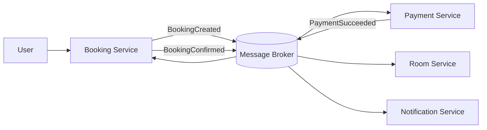
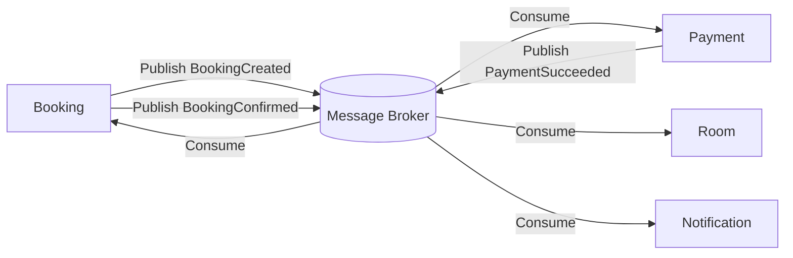
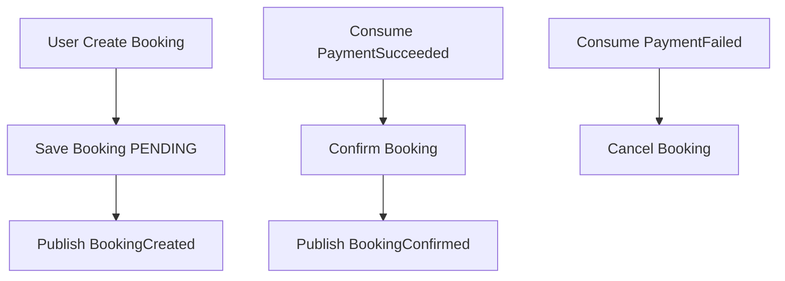
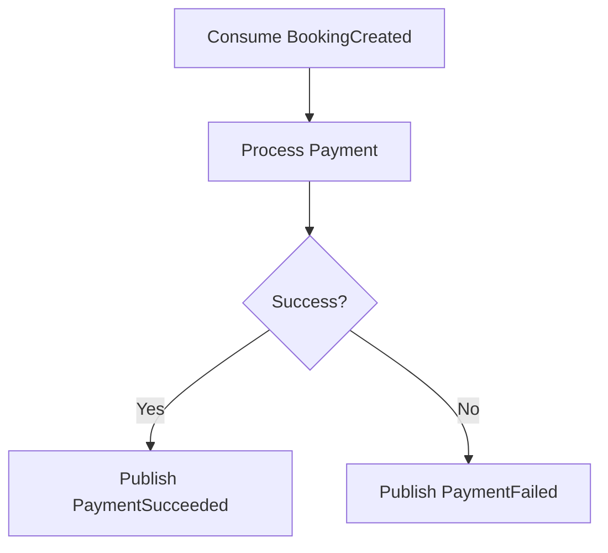
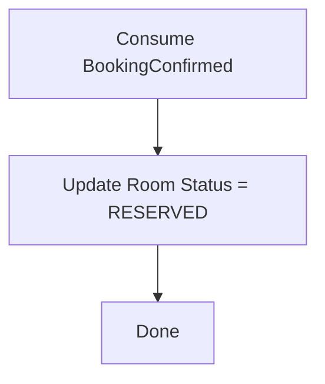
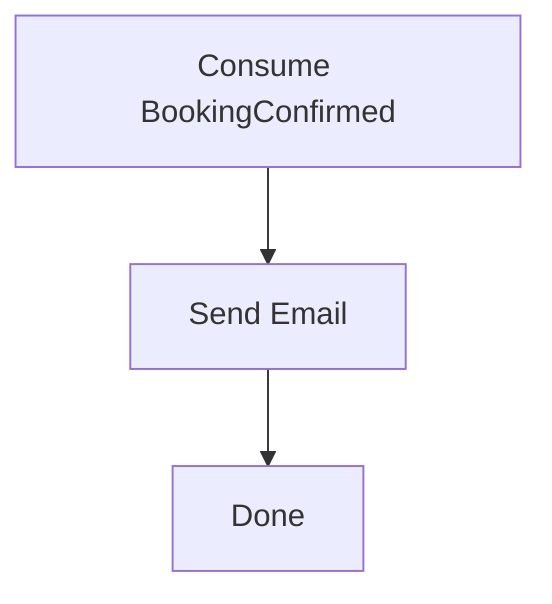

# Analysis and Design — Domain-Driven Design Approach

> **Alternative to**: [`analysis-and-design.md`](analysis-and-design.md) (SOA/Erl approach).
> Choose **one** approach, not both. Use this if your team prefers discovering service boundaries through domain events rather than process decomposition.

**References:**

1. _Domain-Driven Design: Tackling Complexity in the Heart of Software_ — Eric Evans
2. _Microservices Patterns: With Examples in Java_ — Chris Richardson
3. _Bài tập — Phát triển phần mềm hướng dịch vụ_ — Hung Dang (available in Vietnamese)

---

## Part 1 — Domain Discovery

### 1.1 Business Process Definition

Describe or diagram the high-level Business Process to be automated.

**Domain**: Hệ thống đặt phòng (Room Booking System)
**Business Process:** 
  - User chọn phòng
  - Tạo booking (PENDING)
  - Booking publish event `BookingCreated`
  - `Payment Service` consume và xử lý thanh toán (gọi External Payment Gateway nếu cần)
  - `Payment` publish `PaymentSucceeded` hoặc `PaymentFailed`
  - `Booking` cập nhật trạng thái (CONFIRMED / CANCELLED)
  - `Booking` publish `BookingConfirmed` (khi confirmed)
  - `Room` và `Notification` consume event để xử lý (reserve room, gửi email/SMS)
**Actors:** User (Khách hàng)

**Scope:** Quản lý đặt phòng , Xử lý thanh toán, Đồng bộ trạng thái phòng, Gửi thông báo, Giao tiếp bất đồng bộ qua message broker

**Process Diagram:**

### 1.2 Existing Automation Systems

| System Name | Type | Current Role                                       | Interaction Method |
| ----------- | ---- | -------------------------------------------------- | ------------------ |
| None        | -    | None — the process is currently performed manually | -                  |

### 1.3 Non-Functional Requirements

| Requirement  | Description                                                               |
| ------------ | ------------------------------------------------------------------------- |
| Performance  | Xử lý booking nhanh (< 2s cho bước tạo booking); các bước sau xử lý async |
| Security     | JWT authentication, HTTPS, validate payment callback, message validation  |
| Scalability  | Mỗi service scale độc lập; message broker scale theo partition            |
| Availability | 99.9% uptime; retry/backoff + dead-letter queue cho event                 |
| Consistency  | Eventual consistency giữa các service                                     |
| Reliability  | Đảm bảo không mất event (Outbox Pattern, message durability)              |

---

## Part 2 — Strategic Domain-Driven Design

### 2.1 Event Storming — Domain Events

List Domain Events in chronological order as they occur in the business process.

|   # | Domain Event     | Triggered By     | Description                                          |
| --: | ---------------- | ---------------- | ---------------------------------------------------- |
|   1 | RoomSelected     | User             | Người dùng chọn phòng (roomId, ngày, số lượng khách) |
|   2 | BookingCreated   | Booking Service  | Tạo booking trạng thái PENDING                       |
|   3 | PaymentProcessed | Payment Service  | Payment xử lý thanh toán (internal event)            |
|   4 | PaymentSucceeded | Payment Service  | Thanh toán thành công                                |
|   5 | PaymentFailed    | Payment Service  | Thanh toán thất bại                                  |
|   6 | BookingConfirmed | Booking Service  | Booking xác nhận sau khi nhận PaymentSucceeded       |
|   7 | BookingCancelled | Booking Service  | Booking bị hủy khi PaymentFailed                     |
|   8 | RoomReserved     | Room Service     | Room được reserve sau BookingConfirmed               |
|   9 | EmailSent        | Notification Svc | Gửi email xác nhận                                   |

### 2.2 Commands and Actors

| Command        | Actor                | Triggers Event(s)                |
| -------------- | -------------------- | -------------------------------- |
| SelectRoom     | User                 | RoomSelected                     |
| CreateBooking  | Booking Service      | BookingCreated                   |
| ProcessPayment | Payment Service      | PaymentSucceeded / PaymentFailed |
| ConfirmBooking | Booking Service      | BookingConfirmed                 |
| CancelBooking  | Booking Service      | BookingCancelled                 |
| ReserveRoom    | Room Service         | RoomReserved                     |
| SendEmail      | Notification Service | EmailSent                        |

### 2.3 Aggregates

| Aggregate    | Commands                                     | Domain Events                                      | Owned Data                                                       |
| ------------ | -------------------------------------------- | -------------------------------------------------- | ---------------------------------------------------------------- |
| Booking      | CreateBooking, ConfirmBooking, CancelBooking | BookingCreated, BookingConfirmed, BookingCancelled | bookingId, status, userId, roomId, startDate, endDate, createdAt |
| Payment      | ProcessPayment, RefundPayment                | PaymentSucceeded, PaymentFailed, PaymentRefunded   | paymentId, bookingId, amount, currency, status, paidAt           |
| Room         | ReserveRoom, ReleaseRoom                     | RoomReserved, RoomReleased                         | roomId, status, reservations[]                                   |
| Notification | SendEmail                                    | EmailSent                                          | emailId, bookingId, recipient, subject, body, sentAt             |

### 2.4 Bounded Contexts

| Bounded Context      | Aggregates   | Responsibility                                   |
| -------------------- | ------------ | ------------------------------------------------ |
| Booking Context      | Booking      | Quản lý lifecycle booking, publish domain events |
| Payment Context      | Payment      | Consume BookingCreated, xử lý thanh toán         |
| Room Context         | Room         | Consume BookingConfirmed, reserve phòng          |
| Notification Context | Notification | Consume BookingConfirmed, gửi email              |

### 2.5 Context Map

| Upstream | Downstream   | Relationship Type  |
| -------- | ------------ | ------------------ |
| Booking  | Payment      | Published Language |
| Payment  | Booking      | Published Language |
| Booking  | Room         | Published Language |
| Booking  | Notification | Published Language |

---

## Part 3 — Service-Oriented Design

### 3.1 Service Contract Design

Booking Service

| Endpoint       | Method | Media Type       | Response Codes |
| -------------- | ------ | ---------------- | -------------- |
| /bookings      | POST   | application/json | 201, 400       |
| /bookings/{id} | GET    | application/json | 200, 404       |

Payment Service

| Endpoint                             | Method | Media Type       | Response Codes |
| ------------------------------------ | ------ | ---------------- | -------------- |
| /payments                            | POST   | application/json | 200, 400       |

Room Service

| Endpoint        | Method | Media Type | Response Codes |
| --------------- | ------ | ---------- | -------------- |
| (No public API) | -      | -          | -              |

Notification Service

| Endpoint        | Method | Media Type | Response Codes |
| --------------- | ------ | ---------- | -------------- |
| (No public API) | -      | -          | -              |

Even Contracts

| Event Name       | Producer | Consumer           |
| ---------------- | -------- | ------------------ |
| BookingCreated   | Booking  | Payment            |
| PaymentSucceeded | Payment  | Booking            |
| PaymentFailed    | Payment  | Booking            |
| BookingConfirmed | Booking  | Room, Notification |

### 3.2 Service Logic Design (flowcharts)

booking-service

payment-service

room-service

notification-service

