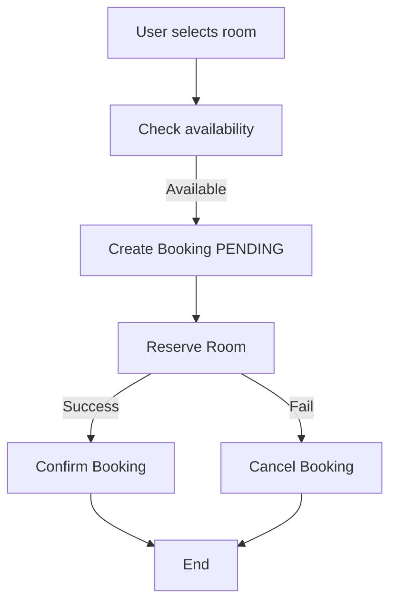
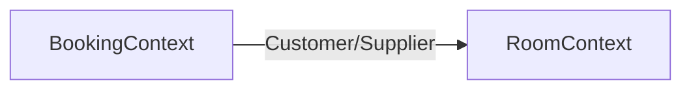
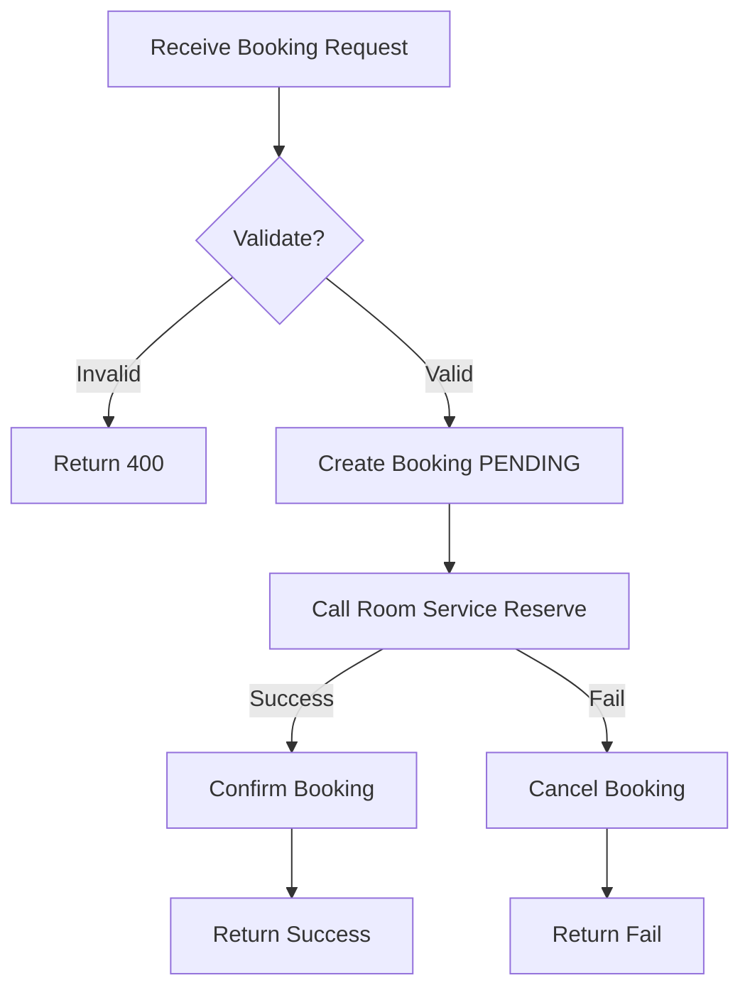
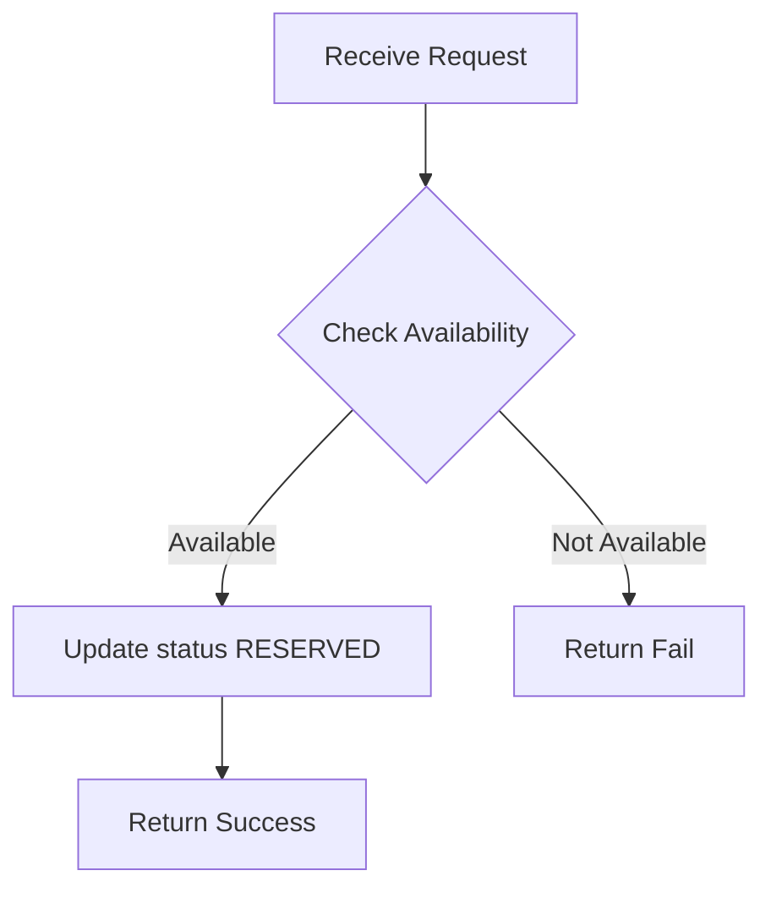

# Analysis and Design — Domain-Driven Design Approach

> **Alternative to**: [`analysis-and-design.md`](analysis-and-design.md) (SOA/Erl approach).
> Choose **one** approach, not both. Use this if your team prefers discovering service boundaries through domain events rather than process decomposition.

**References:**

1. _Domain-Driven Design: Tackling Complexity in the Heart of Software_ — Eric Evans
2. _Microservices Patterns: With Examples in Java_ — Chris Richardson
3. _Bài tập — Phát triển phần mềm hướng dịch vụ_ — Hung Dang (available in Vietnamese)

---

## Part 1 — Domain Discovery

### 1.1 Business Process Definition

Describe or diagram the high-level Business Process to be automated.

- **Domain**: Hotel Booking System
- **Business Process**: Online Room Reservation
- **Actors**:
  - Customer
  - Booking System
  - Room Service
- **Scope**:
  - Search room
  - Check availability
  - Booking room
  - Hold the room temporarily
  - Confirm or cancel booking

**Process Diagram:**

### 1.2 Existing Automation Systems

| System Name | Type | Current Role | Interaction Method |
| ----------- | ---- | ------------ | ------------------ |
| None        |      |              |                    |

> If none exist, state: _"None — the process is currently performed manually."_

### 1.3 Non-Functional Requirements

| Requirement  | Description                                      |
| ------------ | ------------------------------------------------ |
| Performance  | Handle booking < 200ms, support concurrent users |
| Security     | JWT authentication, validate input               |
| Scalability  | Horizontal scaling                               |
| Availability | 99.9% uptime, retry when service fails           |

---

## Part 2 — Strategic Domain-Driven Design

### 2.1 Event Storming — Domain Events

List Domain Events in chronological order as they occur in the business process.
Format: past tense (e.g., "OrderPlaced", "PaymentReceived").

| #   | Domain Event     | Triggered By      | Description                        |
| --- | ---------------- | ----------------- | ---------------------------------- |
| 1   | RoomChecked      | CheckAvailability | Kiểm tra phòng còn hay không       |
| 2   | BookingCreated   | CreateBooking     | Tạo booking với trạng thái PENDING |
| 3   | RoomReserved     | ReserveRoom       | Phòng được giữ tạm                 |
| 4   | BookingConfirmed | ConfirmBooking    | Booking thành công                 |
| 5   | BookingCancelled | CancelBooking     | Booking bị hủy                     |
| 6   | RoomReleased     | ReleaseRoom       | Phòng được trả lại                 |

### 2.2 Commands and Actors

What Commands trigger those Domain Events, and who issues them?

| Command           | Actor           | Triggers Event(s) |
| ----------------- | --------------- | ----------------- |
| CheckAvailability | User            | RoomChecked       |
| CreateBooking     | User            | BookingCreated    |
| ReserveRoom       | Booking Service | RoomReserved      |
| ConfirmBooking    | System          | BookingConfirmed  |
| CancelBooking     | System/User     | BookingCancelled  |
| ReleaseRoom       | Booking Service | RoomReleased      |

### 2.3 Aggregates

Group related Commands and Events around the business entities (Aggregates) they operate on.

| Aggregate | Commands                                     | Domain Events                                      | Owned Data                              |
| --------- | -------------------------------------------- | -------------------------------------------------- | --------------------------------------- |
| Booking   | CreateBooking, ConfirmBooking, CancelBooking | BookingCreated, BookingConfirmed, BookingCancelled | bookingId, userId, roomId, status, date |
| Room      | ReserveRoom, ReleaseRoom                     | RoomReserved, RoomReleased                         | roomId, status, availability            |

### 2.4 Bounded Contexts

Draw boundaries around Aggregates that belong to the same business context. Each Bounded Context = one potential service.

| Bounded Context | Aggregates | Responsibility            |
| --------------- | ---------- | ------------------------- |
| Booking Context | Booking    | Quản lý lifecycle booking |
| Room Context    | Room       | Quản lý trạng thái phòng  |

### 2.5 Context Map

Show relationships between Bounded Contexts.

**Relationship types:** Upstream/Downstream, Customer/Supplier, Conformist, Anti-Corruption Layer (ACL), Shared Kernel, Open Host Service (OHS), Published Language.

| Upstream        | Downstream      | Relationship Type |
| --------------- | --------------- | ----------------- |
| Room Context    | Booking Context | Supplier          |
| Booking Context | Room context    | Customer          |

---

## Part 3 — Service-Oriented Design

### 3.1 Uniform Contract Design

Service Contract specification for each Bounded Context / service.
Full OpenAPI specs:

- [`docs/api-specs/service-a.yaml`](api-specs/service-a.yaml)
- [`docs/api-specs/service-b.yaml`](api-specs/service-b.yaml)

**Booking Service:**

| Endpoint               | Method | Media Type       | Response Codes |
| ---------------------- | ------ | ---------------- | -------------- |
| /bookings              | POST   | application/json | 201, 400       |
| /bookings/{id}         | GET    | application/json | 200, 404       |
| /bookings/{id}/confirm | POST   | application/json | 200, 400       |
| /bookings/{id}/cancel  | POST   | application/json | 200, 400       |

**Room Service:**

| Endpoint                 | Method | Media Type       | Response Codes |
| ------------------------ | ------ | ---------------- | -------------- |
| /rooms/{id}/availability | GET    | application/json | 200            |
| /rooms/{id}/reserve      | POST   | application/json | 200, 400       |
| /rooms/{id}/release      | POST   | application/json | 200            |

### 3.2 Service Logic Design

Internal processing flow for each service.

**Service A:**

**Service B:**

