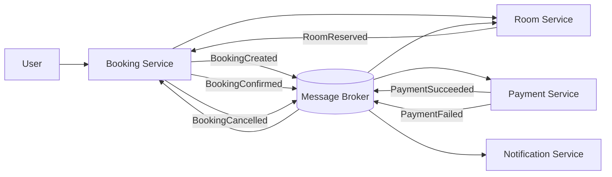
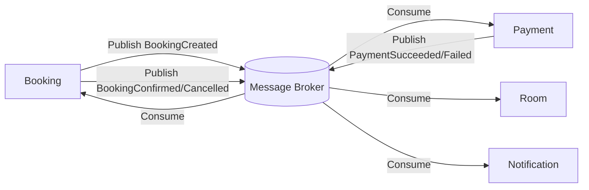
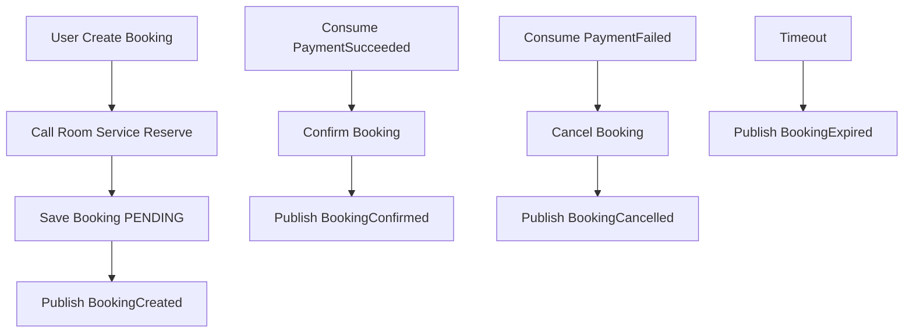
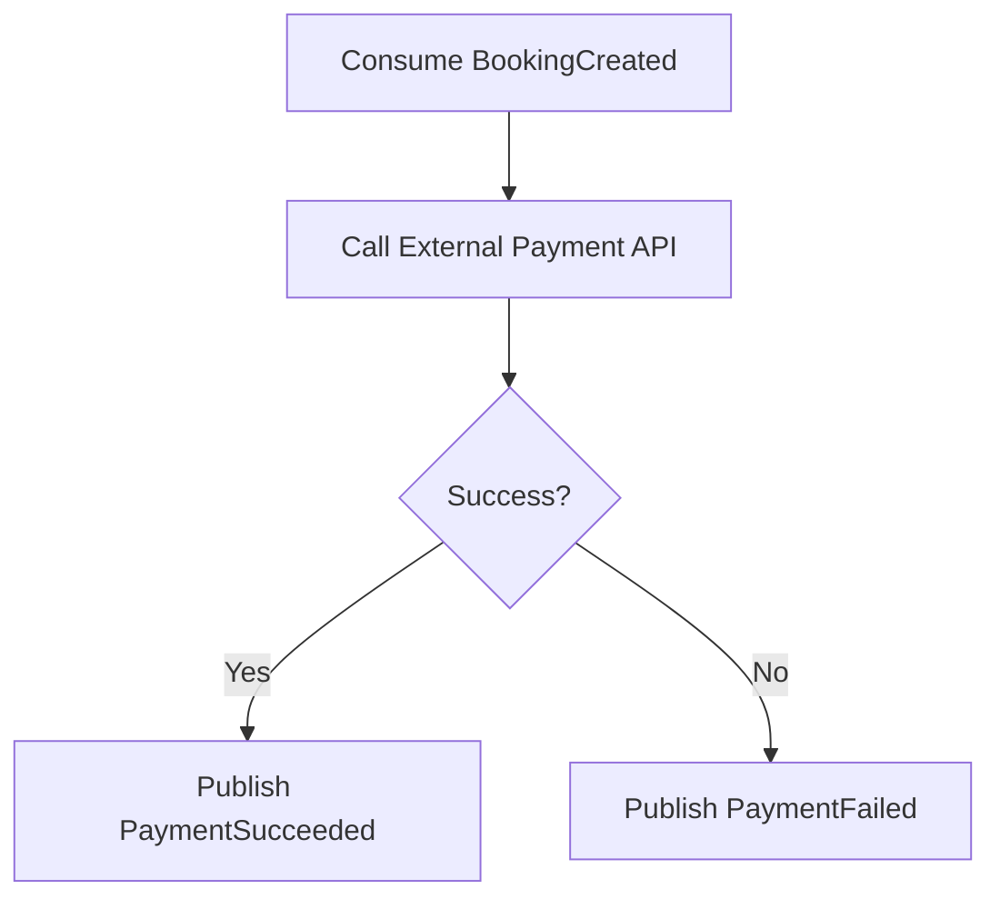
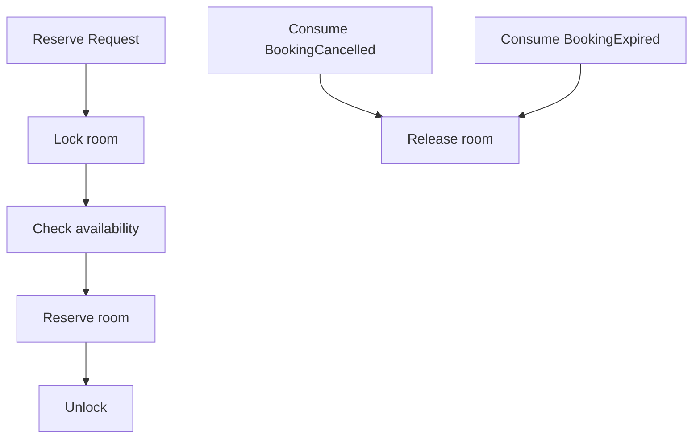
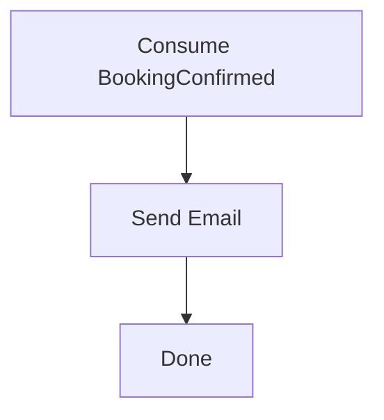

# Analysis and Design — Domain-Driven Design Approach

## Part 1 — Domain Discovery

### 1.1 Business Process Definition

Describe or diagram the high-level Business Process to be automated.

**Domain:** Hệ thống đặt phòng (Room Booking System)

**Business Process:**

- User chọn phòng
- Booking Service gọi Room Service để reserve phòng (tạm giữ)
- Tạo booking (PENDING)
- Booking publish event BookingCreated
- Payment Service consume và xử lý thanh toán (gọi External Payment Gateway nếu cần)
- Payment publish:
- PaymentSucceeded hoặc PaymentFailed
- Booking cập nhật trạng thái:
- CONFIRMED (nếu success)
- CANCELLED (nếu fail)
- Booking publish:
- BookingConfirmed (khi success)
- BookingCancelled (khi fail)
- Room Service consume:
- BookingCancelled → release room
- Notification consume event để gửi email/SMS
- Nếu quá thời gian chưa thanh toán:
- BookingExpired → release room

**Actors:** User (Khách hàng)

**Scope:** Quản lý đặt phòng, Xử lý thanh toán, Đồng bộ trạng thái phòng, Gửi thông báo, Giao tiếp bất đồng bộ qua message broker

**Process Diagram (UPDATED)**

### 1.2 Existing Automation Systems

| System Name | Type | Current Role                                       | Interaction Method |
| ----------- | ---- | -------------------------------------------------- | ------------------ |
| None        | -    | None — the process is currently performed manually | -                  |

### 1.3 Non-Functional Requirements (UPDATED)

| Requirement  | Description                                                               |
| ------------ | ------------------------------------------------------------------------- |
| Performance  | Xử lý booking nhanh (< 2s cho bước tạo booking); các bước sau xử lý async |
| Security     | JWT authentication, HTTPS, validate payment callback, message validation  |
| Scalability  | Mỗi service scale độc lập; message broker scale theo partition            |
| Availability | 99.9% uptime; retry/backoff + dead-letter queue cho event                 |
| Consistency  | Eventual consistency giữa các service                                     |
| Reliability  | Đảm bảo không mất event (Outbox Pattern, message durability)              |
| Concurrency  | Tránh overbooking bằng Redis lock hoặc optimistic locking                 |
| Timeout      | Booking hết hạn sau X phút nếu chưa thanh toán                            |

## Part 2 — Strategic Domain-Driven Design

### 2.1 Event Storming — Domain Events (UPDATED)

| #   | Domain Event     | Triggered By     | Description                                          |
| --- | ---------------- | ---------------- | ---------------------------------------------------- |
| 1   | RoomSelected     | User             | Người dùng chọn phòng (roomId, ngày, số lượng khách) |
| 2   | RoomReserved     | Room Service     | Phòng được giữ tạm                                   |
| 3   | BookingCreated   | Booking Service  | Tạo booking trạng thái PENDING                       |
| 4   | PaymentProcessed | Payment Service  | Payment xử lý thanh toán (internal event)            |
| 5   | PaymentSucceeded | Payment Service  | Thanh toán thành công                                |
| 6   | PaymentFailed    | Payment Service  | Thanh toán thất bại                                  |
| 7   | BookingConfirmed | Booking Service  | Booking xác nhận sau khi nhận PaymentSucceeded       |
| 8   | BookingCancelled | Booking Service  | Booking bị hủy khi PaymentFailed                     |
| 9   | BookingExpired   | Booking Service  | Booking hết hạn nếu không thanh toán                 |
| 10  | RoomReleased     | Room Service     | Giải phóng phòng                                     |
| 11  | EmailSent        | Notification Svc | Gửi email xác nhận                                   |

### 2.2 Commands and Actors (UPDATED)

| Command        | Actor                | Triggers Event(s)                |
| -------------- | -------------------- | -------------------------------- |
| SelectRoom     | User                 | RoomSelected                     |
| ReserveRoom    | Room Service         | RoomReserved                     |
| CreateBooking  | Booking Service      | BookingCreated                   |
| ProcessPayment | Payment Service      | PaymentSucceeded / PaymentFailed |
| ConfirmBooking | Booking Service      | BookingConfirmed                 |
| CancelBooking  | Booking Service      | BookingCancelled                 |
| ExpireBooking  | Booking Service      | BookingExpired                   |
| ReleaseRoom    | Room Service         | RoomReleased                     |
| SendEmail      | Notification Service | EmailSent                        |

### 2.3 Aggregates (UPDATED)

| Aggregate    | Commands                                     | Domain Events                                                      | Owned Data                                                                  |
| ------------ | -------------------------------------------- | ------------------------------------------------------------------ | --------------------------------------------------------------------------- |
| Booking      | CreateBooking, ConfirmBooking, CancelBooking | BookingCreated, BookingConfirmed, BookingCancelled, BookingExpired | bookingId, status, userId, roomId, startDate, endDate, createdAt, expiredAt |
| Payment      | ProcessPayment, RefundPayment                | PaymentSucceeded, PaymentFailed, PaymentRefunded                   | paymentId, bookingId, amount, currency, status, paidAt                      |
| Room         | ReserveRoom, ReleaseRoom                     | RoomReserved, RoomReleased                                         | roomId, status, reservations[], version                                     |
| Notification | SendEmail                                    | EmailSent                                                          | emailId, bookingId, recipient, subject, body, sentAt                        |

### 2.4 Bounded Contexts (UPDATED)

| Bounded Context      | Aggregates   | Responsibility                                   |
| -------------------- | ------------ | ------------------------------------------------ |
| Booking Context      | Booking      | Quản lý lifecycle booking, publish domain events |
| Payment Context      | Payment      | Consume BookingCreated, xử lý thanh toán         |
| Room Context         | Room         | Reserve và release phòng, tránh overbooking      |
| Notification Context | Notification | Consume event và gửi email                       |

### 2.5 Context Map (UPDATED)

| Upstream | Downstream   | Relationship Type  |
| -------- | ------------ | ------------------ |
| Booking  | Payment      | Published Language |
| Payment  | Booking      | Published Language |
| Booking  | Room         | Published Language |
| Booking  | Notification | Published Language |

## Part 3 — Service-Oriented Design

### 3.1 Service Contract Design

#### Booking Service

| Endpoint       | Method | Media Type       | Response Codes |
| -------------- | ------ | ---------------- | -------------- |
| /bookings      | POST   | application/json | 201, 400       |
| /bookings/{id} | GET    | application/json | 200, 404       |

#### Payment Service

| Endpoint  | Method | Media Type       | Response Codes |
| --------- | ------ | ---------------- | -------------- |
| /payments | POST   | application/json | 200, 400       |

#### Room Service

| Endpoint    | Method | Media Type       | Response Codes |
| ----------- | ------ | ---------------- | -------------- |
| /rooms      | GET    | application/json | 200            |
| /rooms/{id} | GET    | application/json | 200, 404       |

#### Notification Service

| Endpoint        | Method | Media Type | Response Codes |
| --------------- | ------ | ---------- | -------------- |
| (No public API) | -      | -          | -              |

#### Event Contracts (UPDATED)

| Event Name       | Producer | Consumer     |
| ---------------- | -------- | ------------ |
| BookingCreated   | Booking  | Payment      |
| PaymentSucceeded | Payment  | Booking      |
| PaymentFailed    | Payment  | Booking      |
| BookingConfirmed | Booking  | Notification |
| BookingCancelled | Booking  | Room         |
| BookingExpired   | Booking  | Room         |

### 3.2 Service Logic Design (flowcharts)

#### booking-service (UPDATED)

#### payment-service (UPDATED)

#### room-service (UPDATED)

#### notification-service

