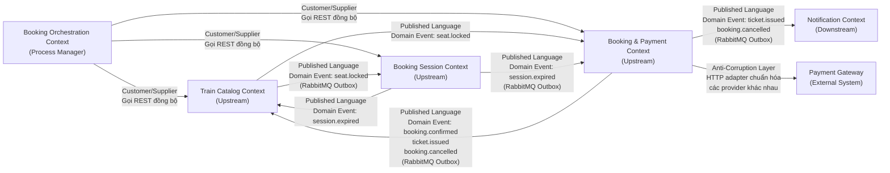
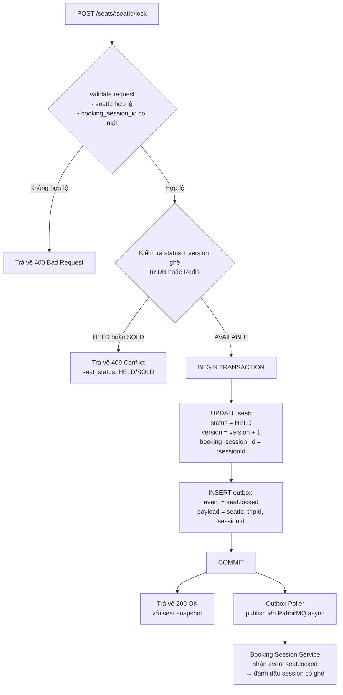
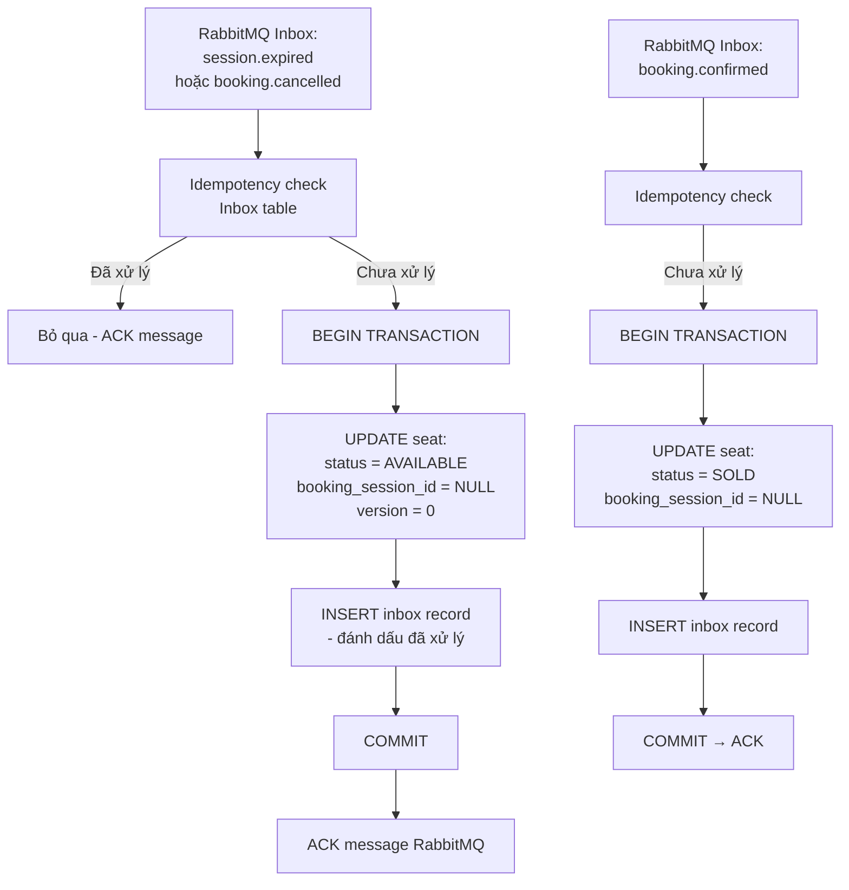
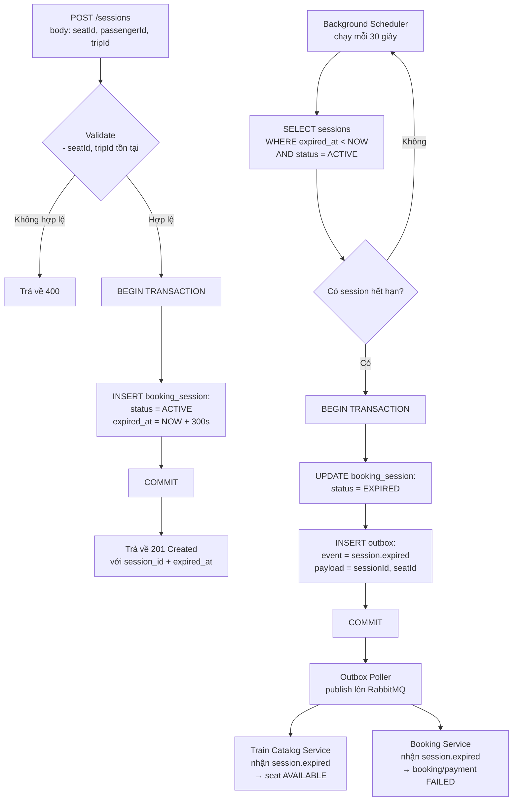
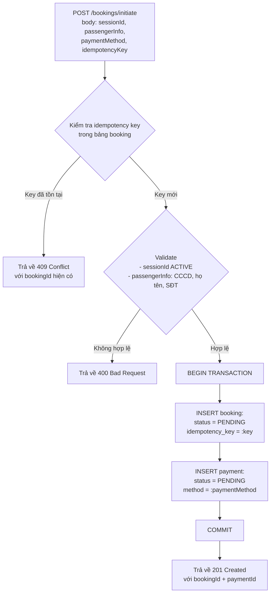
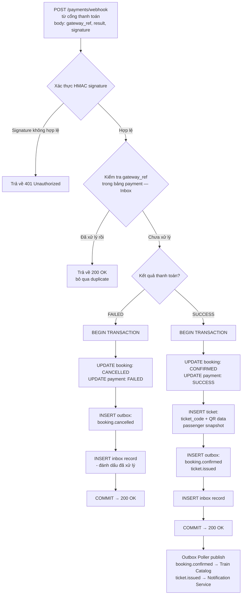
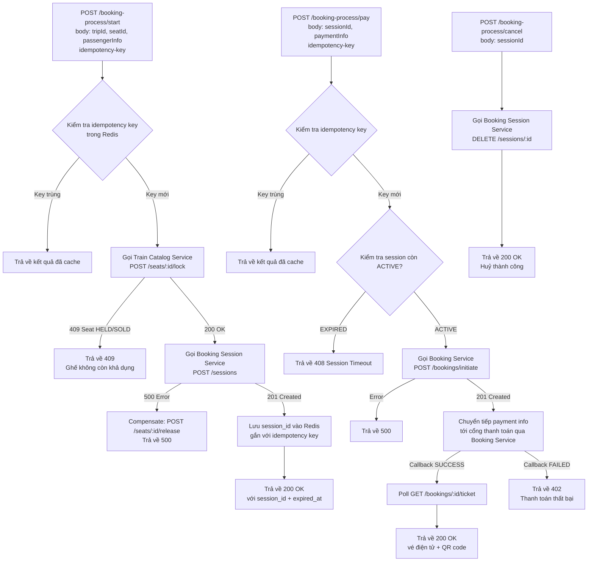
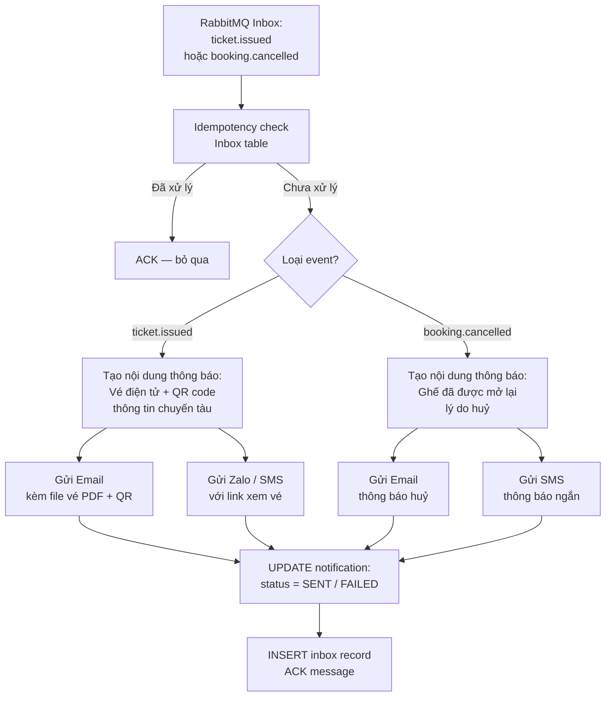
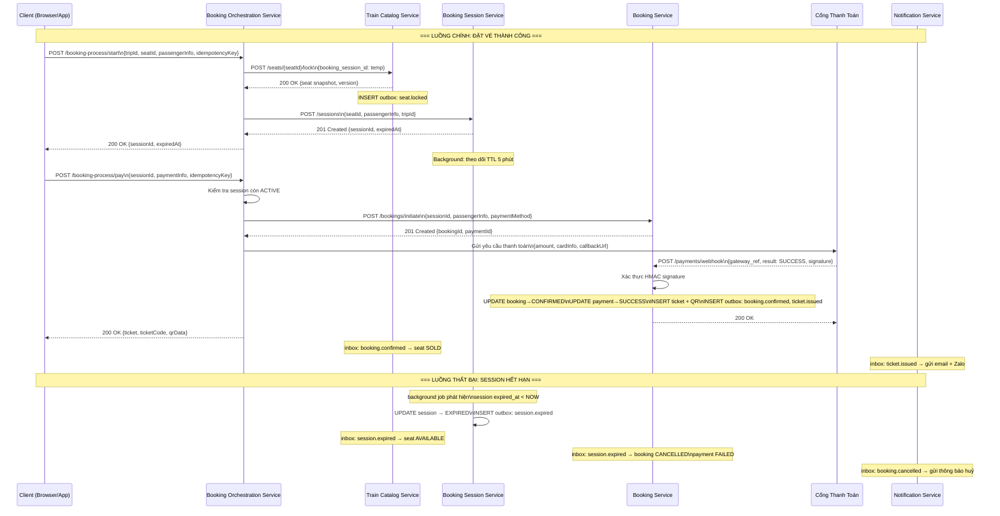

# Analysis and Design — Hệ Thống Bán Vé Tàu Cao Tốc Liên Tỉnh Trực Tuyến

> **Approach**: Domain-Driven Design (DDD)
> **Scope**: Quy trình đặt vé tàu cao tốc liên tỉnh trực tuyến — từ tìm kiếm chuyến tàu, chọn chỗ ngồi, đặt vé, thanh toán đến nhận vé điện tử xác nhận.

**References:**

1. _Domain-Driven Design: Tackling Complexity in the Heart of Software_ — Eric Evans
2. _Microservices Patterns: With Examples in Java_ — Chris Richardson
3. _Bài tập — Phát triển phần mềm hướng dịch vụ_ — Hung Dang

---

## Part 1 — Domain Discovery

### 1.1 Business Process Definition

- **Domain**: Giao thông vận tải — Bán vé tàu cao tốc liên tỉnh trực tuyến
- **Business Process**: Đặt vé tàu cao tốc trực tuyến — từ tìm kiếm chuyến tàu theo tuyến/ngày, chọn toa và ghế, khởi tạo đặt chỗ, thanh toán, đến nhận vé điện tử kèm mã QR.
- **Actors**: Hành khách (người dùng cuối), Cổng thanh toán (hệ thống bên ngoài), Hệ thống quản lý tàu (nguồn dữ liệu lịch trình)
- **Scope**: Một giao dịch đặt vé cho một phiên người dùng. Bao gồm toàn bộ vòng đời: tìm kiếm chuyến → chọn ghế → khóa ghế → tạo booking session → tạo booking → thanh toán → phát hành vé điện tử, bao gồm các luồng thất bại và hết thời gian chờ.

**Sơ đồ quy trình nghiệp vụ:**

```
[Hành Khách]
     |
     v
[Tìm kiếm chuyến tàu (ga đi, ga đến, ngày)]
     |
     v
[Xem danh sách chuyến tàu + giá vé]
     |
     v
[Chọn chuyến tàu & hạng ghế (Thường / VIP)]
     |
     v
[Xem sơ đồ toa & chọn ghế cụ thể]
     |
     v
[Điền thông tin hành khách (họ tên, CCCD, SĐT)]
     |
     v
[Nhấn "Đặt vé" → Hệ thống khóa ghế (TTL 5 phút)]
     |
     v
[Chọn phương thức thanh toán & xác nhận]
     |
     v
      +-----------------+------------------+
      |                                    |
[Thanh toán thành công]          [Thất bại / Hết giờ]
      |                                    |
      v                                    v
[Phát hành vé điện tử + QR]      [Mở lại ghế + Huỷ booking]
      |                                    |
      v                                    v
[Gửi vé qua Email / Zalo]        [Thông báo thất bại]
```

### 1.2 Existing Automation Systems

| System Name | Type | Current Role                       | Interaction Method |
| ----------- | ---- | ---------------------------------- | ------------------ |
| Không có    | —    | Quy trình mới, chưa có hệ thống cũ | —                  |

> Hệ thống được xây dựng mới hoàn toàn (greenfield).

### 1.3 Non-Functional Requirements

| Requirement      | Description                                                                                                                                                                           |
| ---------------- | ------------------------------------------------------------------------------------------------------------------------------------------------------------------------------------- |
| Hiệu năng        | Thời gian phản hồi < 200ms cho tất cả API đồng bộ; tìm kiếm chuyến tàu < 100ms nhờ cache Redis                                                                                        |
| Bảo mật          | Validate CCCD/passport hành khách tại đầu vào; sử dụng idempotency key cho API khởi tạo booking và thanh toán để chống double-submit; xác thực webhook thanh toán bằng HMAC signature |
| Khả năng mở rộng | Xử lý 2.000 request đồng thời (đặc biệt khi mở bán vé dịp lễ Tết); scale container theo chiều ngang bằng Docker Compose / Kubernetes                                                  |
| Tính sẵn sàng    | 99.9% uptime; không có điểm lỗi đơn; các service phải phục hồi được sau khi container khởi động lại                                                                                   |
| Đồng bộ dữ liệu  | Các domain event giữa các service không bao giờ bị mất — đảm bảo bằng Outbox Pattern + RabbitMQ; Inbox Pattern chống xử lý trùng                                                      |
| Kiểm tra CCCD    | Validate định dạng CMND/CCCD/Passport theo nghiệp vụ vận tải; lưu vào vé điện tử phục vụ soát vé                                                                                      |

---

## Part 2 — Strategic Domain-Driven Design

### 2.1 Event Storming — Domain Events

Liệt kê các Domain Event theo thứ tự thời gian xảy ra trong quy trình nghiệp vụ. Tất cả ở dạng quá khứ.

| #   | Domain Event                   | Triggered By              | Description                                                                            |
| --- | ------------------------------ | ------------------------- | -------------------------------------------------------------------------------------- |
| 1   | `TrainScheduleSearched`        | Hành khách                | Hành khách tìm kiếm chuyến tàu theo ga đi, ga đến, ngày khởi hành                      |
| 2   | `TrainTripSelected`            | Hành khách                | Hành khách chọn một chuyến tàu cụ thể trong danh sách kết quả                          |
| 3   | `CarriageMapLoaded`            | Hệ thống                  | Sơ đồ toa + trạng thái từng ghế được tải về cho chuyến tàu đã chọn                     |
| 4   | `SeatSelected`                 | Hành khách                | Hành khách click chọn một ghế cụ thể trên sơ đồ toa                                    |
| 5   | `SeatAvailabilityChecked`      | Hệ thống                  | Hệ thống kiểm tra ghế có trạng thái AVAILABLE hay không (optimistic lock)              |
| 6   | `SeatUnavailable`              | Hệ thống                  | Ghế không còn khả dụng (HELD/SOLD) — trả lỗi cho client                                |
| 7   | `BookingInitiated`             | Hành khách                | Hành khách điền thông tin hành khách và nhấn "Đặt vé"                                  |
| 8   | `SeatLocked`                   | Hệ thống                  | Ghế chuyển sang trạng thái HELD, gắn với booking session (TTL 5 phút)                  |
| 9   | `BookingSessionCreated`        | Hệ thống                  | Phiên đặt vé được tạo với trạng thái ACTIVE, expired_at = now + 300s                   |
| 10  | `PassengerInfoValidated`       | Hệ thống                  | Thông tin hành khách (CCCD, họ tên, SĐT) được xác thực hợp lệ                          |
| 11  | `BookingRecordCreated`         | Hệ thống                  | Bản ghi booking và payment (PENDING) được INSERT vào DB kèm idempotency key            |
| 12  | `PaymentRequested`             | Hệ thống                  | Thông tin thanh toán được gửi đến cổng thanh toán bên ngoài                            |
| 13  | `PaymentConfirmed`             | Cổng thanh toán           | Cổng thanh toán callback thành công — xác nhận giao dịch                               |
| 14  | `BookingConfirmed`             | Hệ thống                  | Booking và payment được UPDATE → SUCCESS                                               |
| 15  | `SeatSold`                     | Hệ thống                  | Ghế chuyển trạng thái HELD → SOLD, xóa booking_session_id                              |
| 16  | `TicketIssued`                 | Hệ thống                  | Vé điện tử được tạo với ticket_code + QR code gắn với thông tin hành khách             |
| 17  | `TicketNotificationSent`       | Hệ thống                  | Vé điện tử được gửi qua email và Zalo/SMS cho hành khách                               |
| 18  | `PaymentFailed`                | Cổng thanh toán / Timeout | Cổng thanh toán trả về lỗi hoặc không nhận được callback                               |
| 19  | `BookingSessionExpired`        | Hệ thống (background job) | Phiên đặt vé hết hạn 5 phút mà chưa hoàn thành thanh toán                              |
| 20  | `BookingCancelled`             | Hệ thống / Hành khách     | Booking bị huỷ do session hết hạn, thanh toán thất bại, hoặc hành khách chủ động thoát |
| 21  | `SeatReleased`                 | Hệ thống                  | Ghế chuyển từ HELD → AVAILABLE, sẵn sàng cho người dùng khác                           |
| 22  | `CancellationNotificationSent` | Hệ thống                  | Thông báo huỷ vé được gửi async cho hành khách                                         |

---

### 2.2 Commands and Actors

| Command                                                  | Actor                     | Triggers Event(s)                                                                                                          |
| -------------------------------------------------------- | ------------------------- | -------------------------------------------------------------------------------------------------------------------------- |
| `SearchTrainSchedule(origin, destination, date)`         | Hành khách                | `TrainScheduleSearched`                                                                                                    |
| `SelectTrainTrip(tripId)`                                | Hành khách                | `TrainTripSelected`, `CarriageMapLoaded`                                                                                   |
| `SelectSeat(tripId, carriageId, seatId)`                 | Hành khách                | `SeatSelected`, `SeatAvailabilityChecked`                                                                                  |
| `InitiateBooking(seatId, passengerInfo, idempotencyKey)` | Hành khách                | `BookingInitiated`, `SeatLocked`, `BookingSessionCreated`, `PassengerInfoValidated`, `BookingRecordCreated`                |
| `SubmitPayment(sessionId, paymentInfo, idempotencyKey)`  | Hành khách                | `PaymentRequested`                                                                                                         |
| `ReceivePaymentCallback(gatewayRef, result)`             | Cổng thanh toán (webhook) | `PaymentConfirmed` / `PaymentFailed`, `BookingConfirmed` / `BookingCancelled`, `SeatSold` / `SeatReleased`, `TicketIssued` |
| `CancelBooking(sessionId)`                               | Hành khách / Hệ thống     | `BookingCancelled`, `SeatReleased`, `CancellationNotificationSent`                                                         |
| `ExpireBookingSessions()`                                | Hệ thống (scheduler)      | `BookingSessionExpired`, `BookingCancelled`, `SeatReleased`                                                                |
| `SendTicketNotification(ticketId)`                       | Hệ thống                  | `TicketNotificationSent`                                                                                                   |

---

### 2.3 Aggregates

| Aggregate          | Commands                                                                | Domain Events                                                                                          | Owned Data                                                                                                                                                               |
| ------------------ | ----------------------------------------------------------------------- | ------------------------------------------------------------------------------------------------------ | ------------------------------------------------------------------------------------------------------------------------------------------------------------------------ |
| **TrainTrip**      | `SearchTrainSchedule`, `SelectTrainTrip`                                | `TrainScheduleSearched`, `TrainTripSelected`, `CarriageMapLoaded`                                      | `trip_id`, `train_code`, `origin_station`, `destination_station`, `departure_time`, `arrival_time`, `status` (SCHEDULED / CANCELLED)                                     |
| **Seat**           | `SelectSeat`, `LockSeat`, `ReleaseSeat`, `SoldSeat`                     | `SeatSelected`, `SeatAvailabilityChecked`, `SeatUnavailable`, `SeatLocked`, `SeatSold`, `SeatReleased` | `seat_id`, `carriage_id`, `trip_id`, `seat_number`, `seat_class` (STANDARD / VIP), `status` (AVAILABLE / HELD / SOLD), `booking_session_id`, `version` (optimistic lock) |
| **BookingSession** | `CreateBookingSession`, `ExpireBookingSessions`, `CancelBookingSession` | `BookingSessionCreated`, `BookingSessionExpired`, `BookingCancelled`                                   | `session_id`, `seat_id`, `passenger_info`, `status` (ACTIVE / EXPIRED / COMPLETED), `created_at`, `expired_at`                                                           |
| **Booking**        | `InitiateBooking`, `ConfirmBooking`, `CancelBooking`                    | `BookingInitiated`, `BookingRecordCreated`, `BookingConfirmed`, `BookingCancelled`                     | `booking_id`, `session_id`, `passenger_info` (name, cccd, phone, email), `total_price`, `status` (PENDING / CONFIRMED / CANCELLED), `idempotency_key`                    |
| **Payment**        | `RequestPayment`, `ConfirmPayment`, `FailPayment`                       | `PaymentRequested`, `PaymentConfirmed`, `PaymentFailed`                                                | `payment_id`, `booking_id`, `amount`, `gateway_ref`, `method` (CARD / MOMO / ZALOPAY), `status` (PENDING / SUCCESS / FAILED)                                             |
| **Ticket**         | `IssueTicket`                                                           | `TicketIssued`                                                                                         | `ticket_id`, `booking_id`, `seat_id`, `passenger_name`, `cccd`, `trip_info` (snapshot), `ticket_code` (unique), `qr_data`, `issued_at`                                   |
| **Notification**   | `SendTicketNotification`, `SendCancellationNotification`                | `TicketNotificationSent`, `CancellationNotificationSent`                                               | `notification_id`, `type` (TICKET / CANCELLATION), `channel` (EMAIL / ZALO / SMS), `recipient`, `status` (SENT / FAILED), `sent_at`                                      |

---

### 2.4 Bounded Contexts

| Bounded Context                   | Aggregates                     | Responsibility                                                                                                                                                                                              |
| --------------------------------- | ------------------------------ | ----------------------------------------------------------------------------------------------------------------------------------------------------------------------------------------------------------- |
| **Train Catalog Context**         | `TrainTrip`, `Seat`            | Quản lý lịch trình tàu, thông tin tuyến/ga, sơ đồ toa và trạng thái ghế theo thời gian thực. Cung cấp tìm kiếm chuyến tàu theo điều kiện. Xử lý khóa/mở ghế với optimistic locking.                         |
| **Booking Session Context**       | `BookingSession`               | Quản lý vòng đời phiên đặt vé: tạo session khi ghế được khóa, theo dõi TTL 5 phút, tự động hết hạn qua background scheduler. Là Aggregate độc lập vì yêu cầu tính chính xác thời gian cao và scale độc lập. |
| **Booking & Payment Context**     | `Booking`, `Payment`, `Ticket` | Xử lý toàn bộ vòng đời giao dịch: tạo booking với idempotency, giao tiếp cổng thanh toán, xử lý callback, cập nhật trạng thái booking/payment, phát hành vé điện tử với QR.                                 |
| **Notification Context**          | `Notification`                 | Gửi thông báo async (email, Zalo, SMS) cho hành khách khi vé được phát hành hoặc bị huỷ. Hoàn toàn bất đồng bộ, không chặn luồng chính.                                                                     |
| **Booking Orchestration Context** | _(stateless orchestrator)_     | Điều phối luồng đặt vé end-to-end: nhận lệnh từ client, gọi đúng thứ tự các context, xử lý saga (rollback khi thất bại). Không có aggregate riêng — chỉ là process manager.                                 |

---

### 2.5 Context Map



| Upstream                      | Downstream                | Relationship Type                                                                                       |
| ----------------------------- | ------------------------- | ------------------------------------------------------------------------------------------------------- |
| Train Catalog Context         | Booking Session Context   | Published Language — emit event `seat.locked` qua RabbitMQ                                              |
| Train Catalog Context         | Booking & Payment Context | Published Language — emit event `seat.locked` qua RabbitMQ                                              |
| Booking Session Context       | Booking & Payment Context | Published Language — emit event `session.expired` qua RabbitMQ                                          |
| Booking Session Context       | Train Catalog Context     | Published Language — emit event `session.expired` → release seat                                        |
| Booking & Payment Context     | Train Catalog Context     | Published Language — emit `booking.confirmed` → seat SOLD; `booking.cancelled` → seat release           |
| Booking & Payment Context     | Notification Context      | Published Language — emit `ticket.issued`, `booking.cancelled` qua RabbitMQ                             |
| Booking & Payment Context     | Payment Gateway           | Anti-Corruption Layer — adapter chuẩn hóa interface giữa các provider thanh toán (VNPay, MoMo, ZaloPay) |
| Booking Orchestration Context | Tất cả Context            | Customer/Supplier — orchestrator là downstream consumer, các context kia là supplier                    |

---

## Part 3 — Service-Oriented Design

### 3.1 Uniform Contract Design

**Train Catalog Service** _(Train Catalog Context)_

| Endpoint                    | Method | Media Type       | Response Codes                 |
| --------------------------- | ------ | ---------------- | ------------------------------ |
| `/trains/search`            | GET    | application/json | 200, 400, 500                  |
| `/trips/{tripId}`           | GET    | application/json | 200, 404, 500                  |
| `/trips/{tripId}/carriages` | GET    | application/json | 200, 404, 500                  |
| `/trips/{tripId}/seats`     | GET    | application/json | 200, 404, 500                  |
| `/seats/{seatId}/lock`      | POST   | application/json | 200, 409 (HELD/SOLD), 404, 500 |
| `/seats/{seatId}/release`   | POST   | application/json | 200, 404, 500                  |
| `/seats/{seatId}/sold`      | POST   | application/json | 200, 404, 500                  |
| `/health`                   | GET    | application/json | 200                            |

**Booking Session Service** _(Booking Session Context)_

| Endpoint                | Method | Media Type       | Response Codes |
| ----------------------- | ------ | ---------------- | -------------- |
| `/sessions`             | POST   | application/json | 201, 400, 500  |
| `/sessions/{sessionId}` | GET    | application/json | 200, 404       |
| `/sessions/{sessionId}` | DELETE | application/json | 200, 404, 500  |
| `/health`               | GET    | application/json | 200            |

**Booking Service** _(Booking & Payment Context)_

| Endpoint                       | Method | Media Type       | Response Codes                         |
| ------------------------------ | ------ | ---------------- | -------------------------------------- |
| `/bookings/initiate`           | POST   | application/json | 201, 400, 409 (idempotency trùng), 500 |
| `/bookings/{bookingId}`        | GET    | application/json | 200, 404                               |
| `/payments/webhook`            | POST   | application/json | 200, 400, 500                          |
| `/tickets/{ticketId}`          | GET    | application/json | 200, 404                               |
| `/bookings/{bookingId}/ticket` | GET    | application/json | 200, 404                               |
| `/health`                      | GET    | application/json | 200                                    |

**Booking Orchestration Service** _(Booking Orchestration Context)_

| Endpoint                  | Method | Media Type       | Response Codes                                                  |
| ------------------------- | ------ | ---------------- | --------------------------------------------------------------- |
| `/booking-process/start`  | POST   | application/json | 200, 400, 409 (ghế không khả dụng), 500                         |
| `/booking-process/pay`    | POST   | application/json | 200, 400, 402 (thanh toán thất bại), 408 (session hết giờ), 500 |
| `/booking-process/cancel` | POST   | application/json | 200, 404, 500                                                   |
| `/health`                 | GET    | application/json | 200                                                             |

**Notification Service** _(Notification Context)_

| Endpoint              | Method | Media Type       | Response Codes                 |
| --------------------- | ------ | ---------------- | ------------------------------ |
| `/notifications/send` | POST   | application/json | 202 (accepted async), 400, 500 |
| `/health`             | GET    | application/json | 200                            |

---

### 3.2 Service Logic Design

#### Train Catalog Service — Luồng khóa ghế



#### Train Catalog Service — Luồng nhận event session.expired / booking.confirmed



#### Booking Session Service — Luồng tạo và phát hiện session hết hạn



#### Booking Service — Luồng khởi tạo booking



#### Booking Service — Luồng xử lý webhook thanh toán



#### Booking Orchestration Service — Luồng điều phối đặt vé (Saga Pattern)



#### Notification Service — Luồng gửi thông báo async



---

### 3.3 Service Composition — Sequence Diagram



---

### 3.4 Utility Services & Infrastructure Concerns

| Component                  | Type                  | Justification                                                                                                                                 |
| -------------------------- | --------------------- | --------------------------------------------------------------------------------------------------------------------------------------------- |
| **API Gateway (Nginx)**    | Utility Service       | Rate limiting (N req/IP/s), định tuyến đến đúng service, xác thực JWT token, cân bằng tải giữa các replica container                          |
| **Redis Cache**            | Utility Service       | Cache kết quả tìm kiếm chuyến tàu (TTL 60s), idempotency key store, trạng thái ghế hot-cache để đáp ứng < 200ms                               |
| **RabbitMQ**               | Utility Service       | Message broker cho tất cả domain events. Dead-letter queue cho retry khi consumer lỗi                                                         |
| **Outbox + Inbox Pattern** | Cross-cutting         | Outbox đảm bảo event không mất khi crash (commit DB + event trong cùng transaction). Inbox đảm bảo idempotency khi RabbitMQ deliver nhiều lần |
| **HikariCP**               | Utility Service       | Connection pooling (20 slot/DB) — tránh quá tải kết nối khi scale horizontal                                                                  |
| **Payment ACL Adapter**    | Anti-Corruption Layer | Chuẩn hóa interface giữa các cổng thanh toán khác nhau (VNPay, MoMo, ZaloPay) — Booking Service chỉ biết một interface duy nhất               |

---
