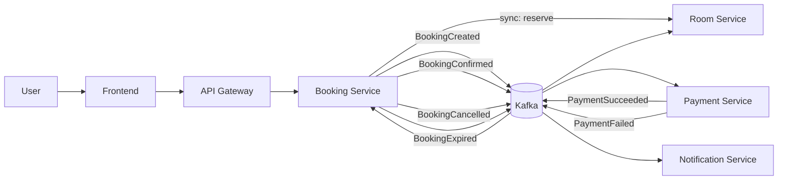
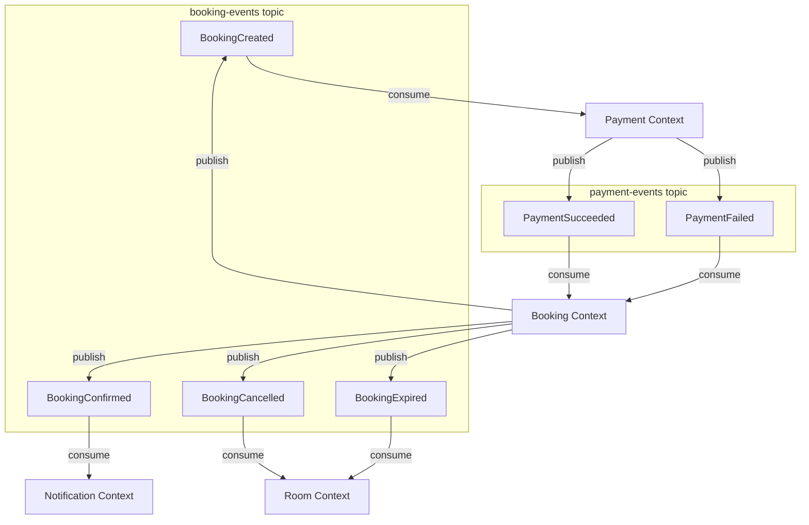
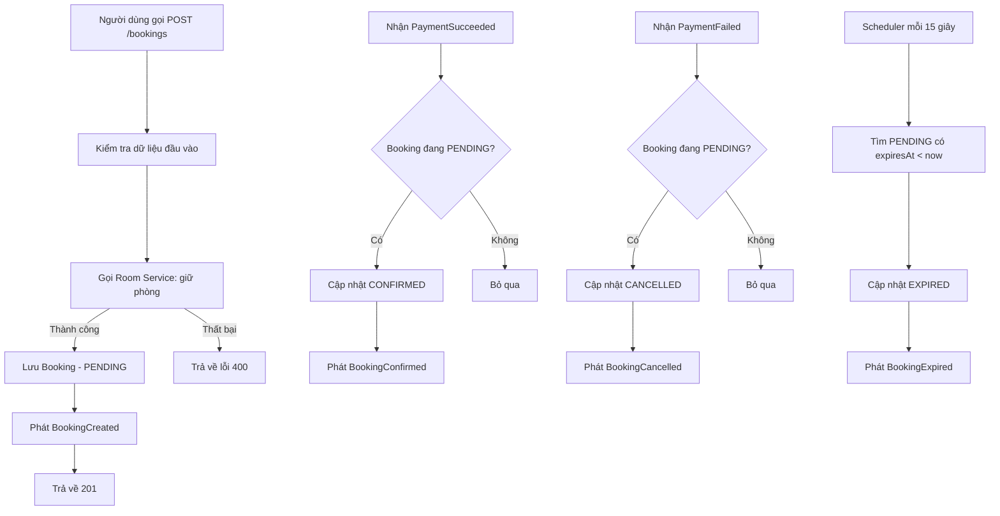
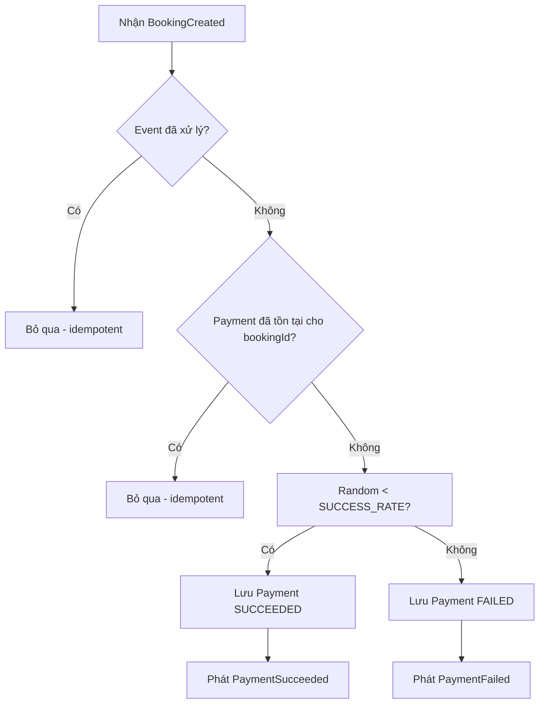
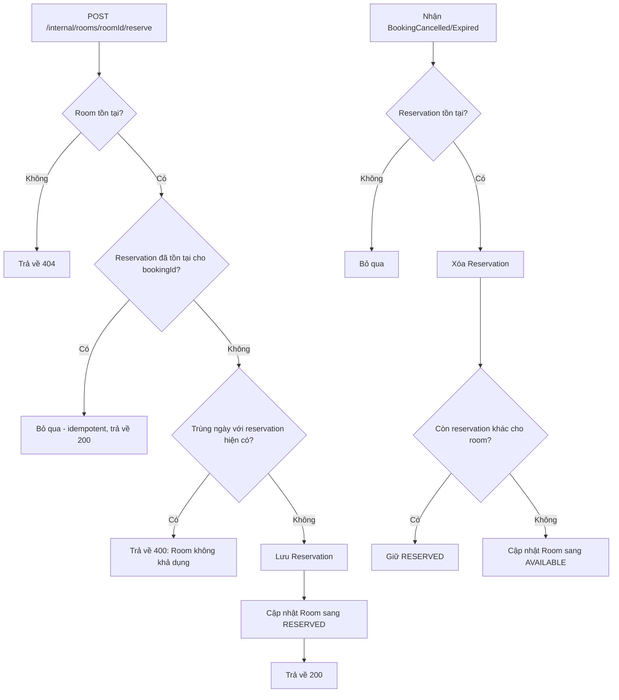
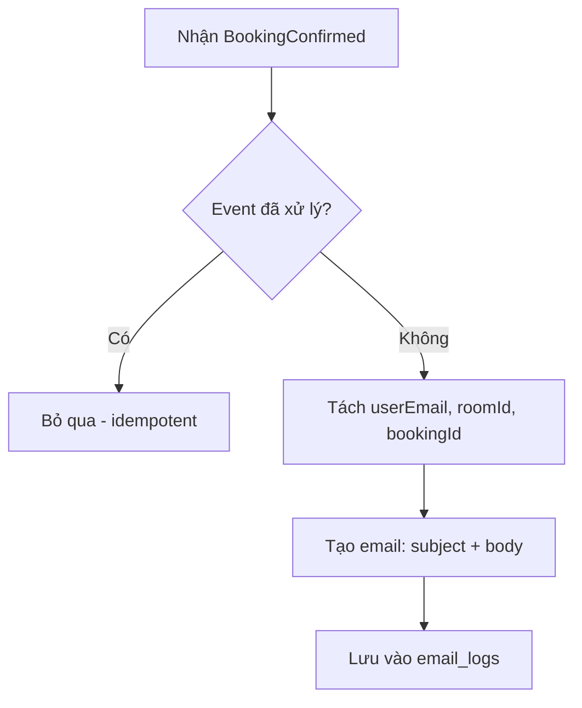

# Analysis and Design — Hệ Thống Đặt Phòng Khách Sạn Trực Tuyến (DDD)

> **Goal**: Phân tích một quy trình nghiệp vụ cụ thể và thiết kế giải pháp tự động hóa theo hướng Domain-Driven Design (DDD) và Microservices.
> Scope: Tập trung vào quy trình **đặt phòng khách sạn trực tuyến**.

**References:**

1. _Domain-Driven Design: Tackling Complexity in the Heart of Software_ — Eric Evans
2. _Implementing Domain-Driven Design_ — Vaughn Vernon
3. _Microservices Patterns: With Examples in Java_ — Chris Richardson
4. _Bài tập — Phát triển phần mềm hướng dịch vụ_ — Hung Dang

---

## Part 1 — Analysis Preparation

### 1.1 Business Process Definition

Mô tả hoặc minh họa quy trình nghiệp vụ mức cao cần được tự động hóa.

- **Domain**: Khách sạn — Đặt phòng trực tuyến
- **Business Process**: Người dùng chọn phòng, tạo booking tạm thời, xử lý thanh toán, xác nhận hoặc hủy booking, đồng bộ trạng thái phòng và gửi thông báo.
- **Actors**: Khách hàng (người dùng cuối)
- **Scope**: Quản lý đặt phòng, xử lý thanh toán mô phỏng, đồng bộ trạng thái phòng theo event, và gửi thông báo xác nhận qua luồng bất đồng bộ.

**Luồng quy trình chính:**

1. Người dùng chọn phòng từ danh sách (xem trạng thái AVAILABLE/RESERVED)
2. Booking Service gọi Room Service (REST đồng bộ) để giữ phòng — kiểm tra trùng khoảng ngày
3. Tạo booking trạng thái `PENDING`, thiết lập TTL (mặc định 10 phút)
4. Booking Service phát event `BookingCreated` vào Kafka topic `booking-events`
5. Payment Service nhận `BookingCreated`, mô phỏng thanh toán (tỷ lệ thành công 85%)
6. Payment Service phát kết quả:
   - `PaymentSucceeded` → Kafka topic `payment-events`
   - `PaymentFailed` (reason: `card_declined`) → Kafka topic `payment-events`
7. Booking Service nhận payment events và cập nhật trạng thái:
   - `PaymentSucceeded` → Booking `CONFIRMED` → phát `BookingConfirmed`
   - `PaymentFailed` → Booking `CANCELLED` → phát `BookingCancelled`
8. Room Service nhận `BookingCancelled` / `BookingExpired` và mở lại phòng (xóa reservation, set AVAILABLE)
9. Notification Service nhận `BookingConfirmed` và lưu email log xác nhận
10. Scheduler kiểm tra mỗi 15 giây: booking `PENDING` quá TTL → `EXPIRED` → phát `BookingExpired`

**Sơ đồ quy trình:**



### 1.2 Existing Automation Systems

Liệt kê các hệ thống, cơ sở dữ liệu, hoặc logic cũ liên quan đến quy trình này.

| System Name | Type | Current Role                       | Interaction Method |
| ----------- | ---- | ---------------------------------- | ------------------ |
| Không có    | —    | Quy trình mới, chưa có hệ thống cũ | —                  |

> Hệ thống được xây dựng mới hoàn toàn (greenfield).

### 1.3 Non-Functional Requirements

Các yêu cầu phi chức năng là đầu vào để xác định ranh giới service và lựa chọn mô hình triển khai phù hợp.

| Requirement      | Description                                                                              |
| ---------------- | ---------------------------------------------------------------------------------------- |
| Hiệu năng        | Tạo booking < 2s cho phần đồng bộ; các bước sau đó xử lý bất đồng bộ qua Kafka           |
| Khả năng mở rộng | Mỗi service scale độc lập; message broker scale theo partition                           |
| Tính sẵn sàng    | Service restart không mất dữ liệu; event retry tự động                                   |
| Tính nhất quán   | Eventual consistency giữa các bounded context qua Saga Pattern (Choreography)            |
| Độ tin cậy       | Không mất event, không xử lý trùng bằng idempotency table `processed_events`             |
| Đồng thời        | Tránh overbooking bằng optimistic locking (`version` trên Room) kết hợp kiểm tra overlap |
| Timeout          | Booking hết hạn nếu chưa thanh toán (TTL 10 phút, scheduler quét mỗi 15 giây)            |

---

## Part 2 — Domain-Driven Modeling

### 2.1 Event Storming — Domain Events

Xác định các domain event cốt lõi từ quy trình nghiệp vụ.

| #   | Domain Event     | Triggered By    | Kafka Topic      | Description                                        |
| --- | ---------------- | --------------- | ---------------- | -------------------------------------------------- |
| 1   | BookingCreated   | Booking Service | `booking-events` | Tạo booking `PENDING` sau khi giữ phòng thành công |
| 2   | PaymentSucceeded | Payment Service | `payment-events` | Thanh toán thành công                              |
| 3   | PaymentFailed    | Payment Service | `payment-events` | Thanh toán thất bại (`card_declined`)              |
| 4   | BookingConfirmed | Booking Service | `booking-events` | Booking được xác nhận sau `PaymentSucceeded`       |
| 5   | BookingCancelled | Booking Service | `booking-events` | Booking bị hủy sau `PaymentFailed`                 |
| 6   | BookingExpired   | Booking Service | `booking-events` | Booking hết hạn do quá TTL                         |

### 2.2 Commands and Actors

Liên kết command với tác nhân/kích hoạt và event đầu ra.

| Command        | Actor / Trigger                         | Service              | Triggers Event(s)                |
| -------------- | --------------------------------------- | -------------------- | -------------------------------- |
| CreateBooking  | User (qua API)                          | Booking Service      | BookingCreated                   |
| ReserveRoom    | Booking Service (sync call)             | Room Service         | — (sync response)                |
| ProcessPayment | BookingCreated event                    | Payment Service      | PaymentSucceeded / PaymentFailed |
| ConfirmBooking | PaymentSucceeded event                  | Booking Service      | BookingConfirmed                 |
| CancelBooking  | PaymentFailed event                     | Booking Service      | BookingCancelled                 |
| ExpireBooking  | Scheduler (TTL check)                   | Booking Service      | BookingExpired                   |
| ReleaseRoom    | BookingCancelled / BookingExpired event | Room Service         | —                                |
| SendEmail      | BookingConfirmed event                  | Notification Service | —                                |

### 2.3 Aggregates

Xác định ranh giới aggregate, dữ liệu sở hữu và trách nhiệm miền.

| Aggregate | Entity                | Commands                                                    | Domain Events                                                      | Owned Data                                                                                                              |
| --------- | --------------------- | ----------------------------------------------------------- | ------------------------------------------------------------------ | ----------------------------------------------------------------------------------------------------------------------- |
| Booking   | `Booking`             | CreateBooking, ConfirmBooking, CancelBooking, ExpireBooking | BookingCreated, BookingConfirmed, BookingCancelled, BookingExpired | id, userEmail, roomId, startDate, endDate, amount, status, createdAt, expiresAt                                         |
| Payment   | `Payment`             | ProcessPayment                                              | PaymentSucceeded, PaymentFailed                                    | id, bookingId, amount, status (SUCCEEDED/FAILED), createdAt                                                             |
| Room      | `Room`, `Reservation` | ReserveRoom, ReleaseRoom                                    | —                                                                  | Room: id, name, city, capacity, pricePerNight, status, version · Reservation: id, roomId, bookingId, startDate, endDate |
| EmailLog  | `EmailLog`            | SendEmail                                                   | —                                                                  | id, bookingId, recipient, subject, body, sentAt                                                                         |

### 2.4 Bounded Contexts

Ánh xạ aggregate vào bounded context và service triển khai.

| Bounded Context      | Aggregate(s)      | Service                      | Database       | Responsibility                           |
| -------------------- | ----------------- | ---------------------------- | -------------- | ---------------------------------------- |
| Booking Context      | Booking           | booking-service (:8081)      | bookingdb      | Quản lý vòng đời booking, điều phối Saga |
| Payment Context      | Payment           | payment-service (:8082)      | paymentdb      | Xử lý thanh toán và phát kết quả         |
| Room Context         | Room, Reservation | room-service (:8083)         | roomdb         | Giữ/mở phòng, chống overbooking          |
| Notification Context | EmailLog          | notification-service (:8084) | notificationdb | Gửi email xác nhận (mô phỏng)            |

### 2.5 Context Map

Mô tả quan hệ upstream/downstream và cách tích hợp giữa các context.



| Upstream | Downstream   | Relationship                    | Communication               |
| -------- | ------------ | ------------------------------- | --------------------------- |
| Booking  | Payment      | Published Language              | Async (Kafka)               |
| Payment  | Booking      | Published Language              | Async (Kafka)               |
| Booking  | Room         | Published Language + Conformist | Sync (REST) + Async (Kafka) |
| Booking  | Notification | Published Language              | Async (Kafka)               |

---

## Part 3 — Service-Oriented Design

### 3.1 Uniform Contract Design

Đặc tả Service Contract cho từng service. Tài liệu OpenAPI đầy đủ:

- [`docs/api-specs/booking-service.yaml`](api-specs/booking-service.yaml)
- [`docs/api-specs/room-service.yaml`](api-specs/room-service.yaml)

**Booking Service:**

| Endpoint         | Method | Media Type       | Request Body                                      | Response Codes |
| ---------------- | ------ | ---------------- | ------------------------------------------------- | -------------- |
| `/health`        | GET    | application/json | —                                                 | 200            |
| `/bookings`      | POST   | application/json | `{userEmail, roomId, startDate, endDate, amount}` | 201, 400       |
| `/bookings`      | GET    | application/json | —                                                 | 200            |
| `/bookings/{id}` | GET    | application/json | —                                                 | 200, 404       |

**Room Service:**

| Endpoint                           | Method | Media Type       | Request Body                      | Response Codes |
| ---------------------------------- | ------ | ---------------- | --------------------------------- | -------------- |
| `/health`                          | GET    | application/json | —                                 | 200            |
| `/rooms`                           | GET    | application/json | —                                 | 200            |
| `/rooms/{id}`                      | GET    | application/json | —                                 | 200, 404       |
| `/internal/rooms/{roomId}/reserve` | POST   | application/json | `{bookingId, startDate, endDate}` | 200, 400       |

**Payment Service:**

| Endpoint  | Method | Media Type       | Response Codes |
| --------- | ------ | ---------------- | -------------- |
| `/health` | GET    | application/json | 200            |

> Không có public REST API — xử lý hoàn toàn qua Kafka events.

**Notification Service:**

| Endpoint  | Method | Media Type       | Response Codes |
| --------- | ------ | ---------------- | -------------- |
| `/health` | GET    | application/json | 200            |

> Không có public REST API — xử lý hoàn toàn qua Kafka events.

**Event Contracts:**

Tất cả events sử dụng `EventEnvelope` wrapper:

```json
{
  "eventId": "uuid (unique, dùng cho idempotency)",
  "eventType": "BookingCreated | PaymentSucceeded | ...",
  "aggregateId": "bookingId",
  "timestamp": "ISO-8601",
  "payload": { ... }
}
```

| Event Name       | Topic          | Producer | Consumer(s)  | Payload                                                      |
| ---------------- | -------------- | -------- | ------------ | ------------------------------------------------------------ |
| BookingCreated   | booking-events | Booking  | Payment      | `{bookingId, userEmail, roomId, startDate, endDate, amount}` |
| PaymentSucceeded | payment-events | Payment  | Booking      | `{bookingId, amount}`                                        |
| PaymentFailed    | payment-events | Payment  | Booking      | `{bookingId, amount, reason}`                                |
| BookingConfirmed | booking-events | Booking  | Notification | `{userEmail, roomId}`                                        |
| BookingCancelled | booking-events | Booking  | Room         | `{reason}`                                                   |
| BookingExpired   | booking-events | Booking  | Room         | `{}`                                                         |

### 3.2 Service Logic Design

Luồng xử lý nội bộ cho từng service.

**Booking Service — luồng tạo booking và xử lý trạng thái thanh toán:**



**Payment Service — luồng xử lý thanh toán từ event BookingCreated:**



**Room Service — luồng reserve/release phòng:**



**Notification Service — luồng tạo email log khi booking được xác nhận:**


