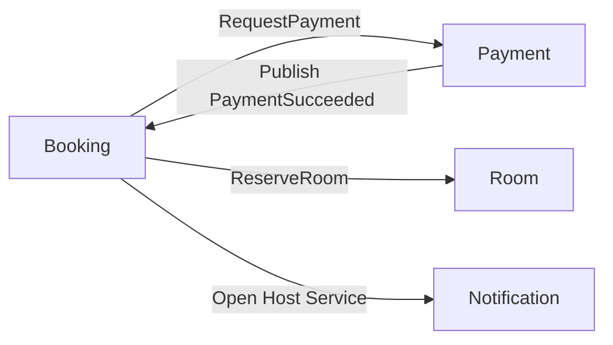
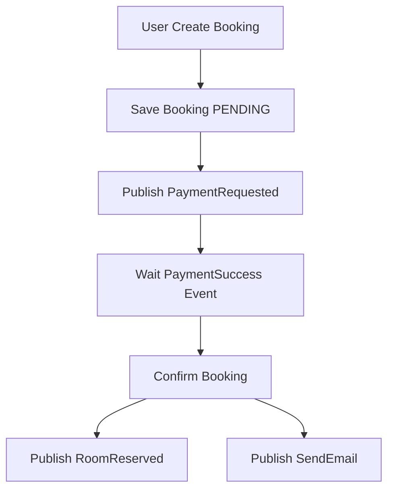
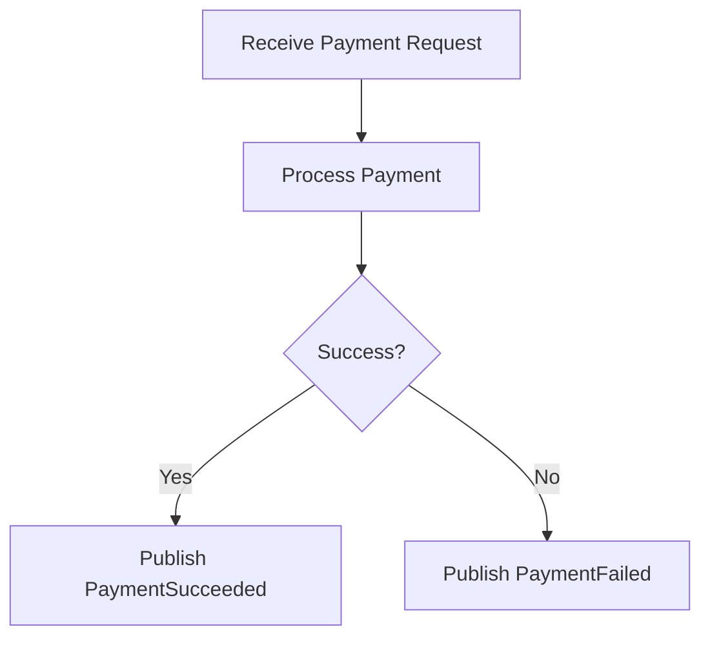
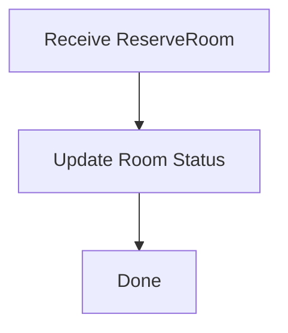
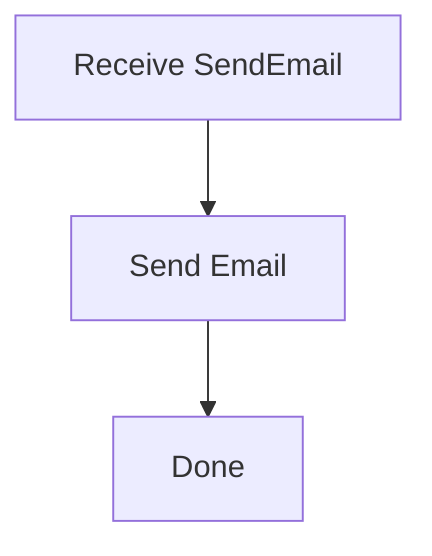

# Analysis and Design — Domain-Driven Design Approach

> **Alternative to**: [`analysis-and-design.md`](analysis-and-design.md) (SOA/Erl approach).
> Choose **one** approach, not both. Use this if your team prefers discovering service boundaries through domain events rather than process decomposition.

**References:**

1. _Domain-Driven Design: Tackling Complexity in the Heart of Software_ — Eric Evans
2. _Microservices Patterns: With Examples in Java_ — Chris Richardson
3. _Bài tập — Phát triển phần mềm hướng dịch vụ_ — Hung Dang (available in Vietnamese)

---

## Part 1 — Domain Discovery

### 1.1 Business Process Definition

Describe or diagram the high-level Business Process to be automated.

- **Domain**: Hệ thống đặt phòng (Room Booking System)
- **Business Process:** Quy trình đặt phòng và thanh toán
- **Actors:** User (Khách hàng), Booking Service, Payment Service, Room Service, Email Service
- **Scope:** Quản lý đặt phòng, Thanh toán, Đồng bộ trạng thái phòng, Gửi thông báo

**Process Diagram:**

Insert BPMN/flowchart into `docs/asset/` (ví dụ `docs/asset/booking-flow.png`) và tham chiếu ở đây.

### 1.2 Existing Automation Systems

| System Name | Type | Current Role       | Interaction Method |
| ----------- | ---- | ------------------ | ------------------ |
| None        | -    | Quy trình thủ công | -                  |

> Nếu không có hệ thống tự động: "None — the process is currently performed manually."

### 1.3 Non-Functional Requirements

| Requirement  | Description                                                                   |
| ------------ | ----------------------------------------------------------------------------- |
| Performance  | Xử lý booking < 2s end-to-end (soft goal)                                     |
| Security     | JWT authentication, HTTPS, validate payment callbacks, signature verification |
| Scalability  | Mỗi service (Booking, Payment, Room, Email) có thể scale độc lập              |
| Availability | 99.9% uptime; event retry/backoff cho các thao tác không thành công           |

---

## Part 2 — Strategic Domain-Driven Design

### 2.1 Event Storming — Domain Events

List Domain Events in chronological order as they occur in the business process.

|   # | Domain Event     | Triggered By    | Description                                                                    |
| --: | ---------------- | --------------- | ------------------------------------------------------------------------------ |
|   1 | RoomSelected     | User            | Người dùng chọn phòng (chọn roomId, ngày, số lượng khách)                      |
|   2 | BookingCreated   | Booking Service | Tạo booking với trạng thái PENDING (bookingId, userId, roomId)                 |
|   3 | PaymentRequested | Booking Service | Booking Service gửi yêu cầu thanh toán tới Payment Service (amount, bookingId) |
|   4 | PaymentSucceeded | Payment Service | Thanh toán thành công, trả về paymentId và status                              |
|   5 | BookingConfirmed | Booking Service | Booking Service xác nhận booking sau khi nhận PaymentSucceeded                 |
|   6 | RoomReserved     | Room Service    | Room Service cập nhật phòng là reserved cho khoảng thời gian tương ứng         |
|   7 | EmailSent        | Email Service   | Email Service gửi email xác nhận tới khách hàng                                |

### 2.2 Commands and Actors

| Command        | Actor           | Triggers Event(s) |
| -------------- | --------------- | ----------------- |
| SelectRoom     | User            | RoomSelected      |
| CreateBooking  | Booking Service | BookingCreated    |
| RequestPayment | Booking Service | PaymentRequested  |
| ProcessPayment | Payment Service | PaymentSucceeded  |
| ConfirmBooking | Booking Service | BookingConfirmed  |
| ReserveRoom    | Room Service    | RoomReserved      |
| SendEmail      | Email Service   | EmailSent         |

### 2.3 Aggregates

| Aggregate    | Commands                                      | Domain Events                                                      | Owned Data                                                       |
| ------------ | --------------------------------------------- | ------------------------------------------------------------------ | ---------------------------------------------------------------- |
| Booking      | CreateBooking, ConfirmBooking, CancelBooking  | BookingCreated, BookingConfirmed, BookingCancelled                 | bookingId, status, userId, roomId, startDate, endDate, createdAt |
| Payment      | RequestPayment, ProcessPayment, RefundPayment | PaymentRequested, PaymentSucceeded, PaymentFailed, PaymentRefunded | paymentId, bookingId, amount, currency, status, paidAt           |
| Room         | ReserveRoom, ReleaseRoom                      | RoomReserved, RoomReleased                                         | roomId, status, reservations[] (periods), capacity, price        |
| Notification | SendEmail                                     | EmailSent                                                          | emailId, bookingId, recipient, subject, body, sentAt             |

### 2.4 Bounded Contexts

| Bounded Context      | Aggregates   | Responsibility                                                  |
| -------------------- | ------------ | --------------------------------------------------------------- |
| Booking Context      | Booking      | Quản lý vòng đời booking, orchestration payment và confirmation |
| Payment Context      | Payment      | Xử lý thanh toán, lưu lịch sử giao dịch, webhook xử lý callback |
| Room Context         | Room         | Quản lý trạng thái phòng, kiểm tra khả năng đặt và khóa phòng   |
| Notification Context | Notification | Gửi email/SMS thông báo cho user                                |

### 2.5 Context Map

| Upstream | Downstream   | Relationship Type  |
| -------- | ------------ | ------------------ |
| Booking  | Payment      | Customer/Supplier  |
| Payment  | Booking      | Published Language |
| Booking  | Room         | Customer/Supplier  |
| Booking  | Notification | Open Host Service  |

---

## Part 3 — Service-Oriented Design

### 3.1 Service Contract Design

🟦 Booking Service

| Endpoint               | Method | Media Type       | Response Codes |
| ---------------------- | ------ | ---------------- | -------------- |
| /bookings              | POST   | application/json | 201, 400       |
| /bookings/{id}/confirm | POST   | application/json | 200, 404       |

🟩 Payment Service

| Endpoint  | Method | Media Type       | Response Codes |
| --------- | ------ | ---------------- | -------------- |
| /payments | POST   | application/json | 200, 400       |

🟨 Room Service

| Endpoint            | Method | Media Type       | Response Codes |
| ------------------- | ------ | ---------------- | -------------- |
| /rooms/{id}/reserve | POST   | application/json | 200, 404       |

🟥 Notification Service

| Endpoint             | Method | Media Type       | Response Codes |
| -------------------- | ------ | ---------------- | -------------- |
| /notifications/email | POST   | application/json | 200            |

### 3.2 Service Logic Design (flowcharts)

booking-service

payment-service

room-service

notification-service

---

**Ghi chú triển khai:**

- Sử dụng JWT cho xác thực giữa các service (service-to-service) hoặc mTLS nếu cần.
- Các events (PaymentSucceeded, BookingCreated, RoomReserved) nên được publish qua message broker (RabbitMQ/ Kafka) để đảm bảo eventual consistency và retry.
- Mỗi service cần health check `/health` trả `{ "status": "ok" }`.

Tài liệu này đã điền theo đề bài: quy trình, sự kiện, commands, aggregates, bounded contexts và contract tóm tắt. Bạn muốn tôi lưu lại phiên bản Markdown hoàn chỉnh vào repository (hiện đã cập nhật file này), hay tạo thêm OpenAPI spec mẫu cho từng service không?
