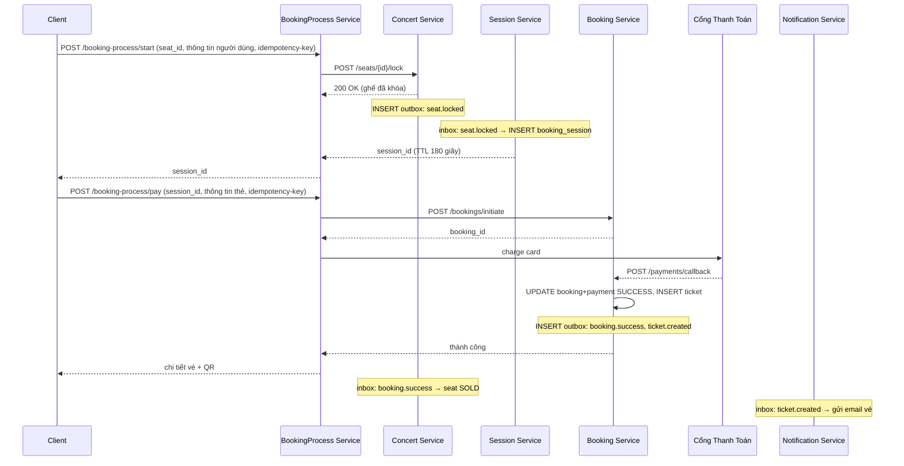
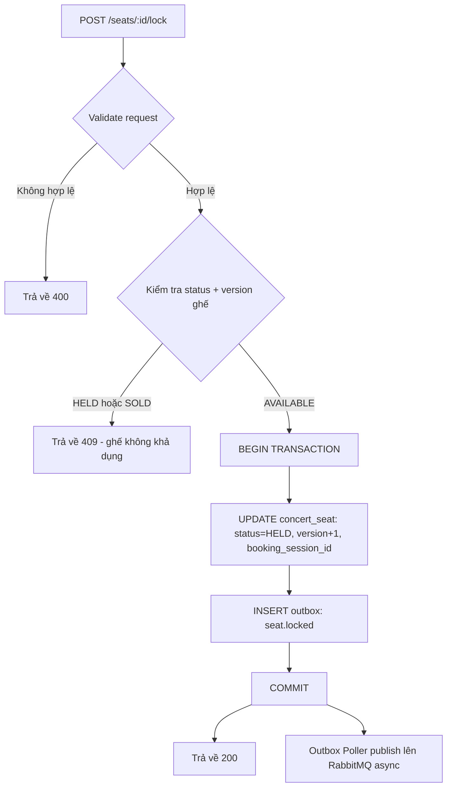
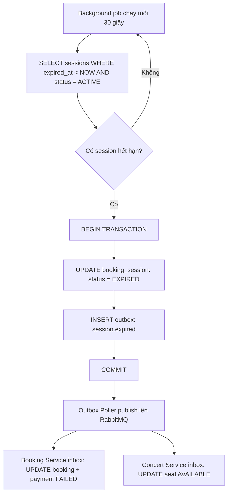
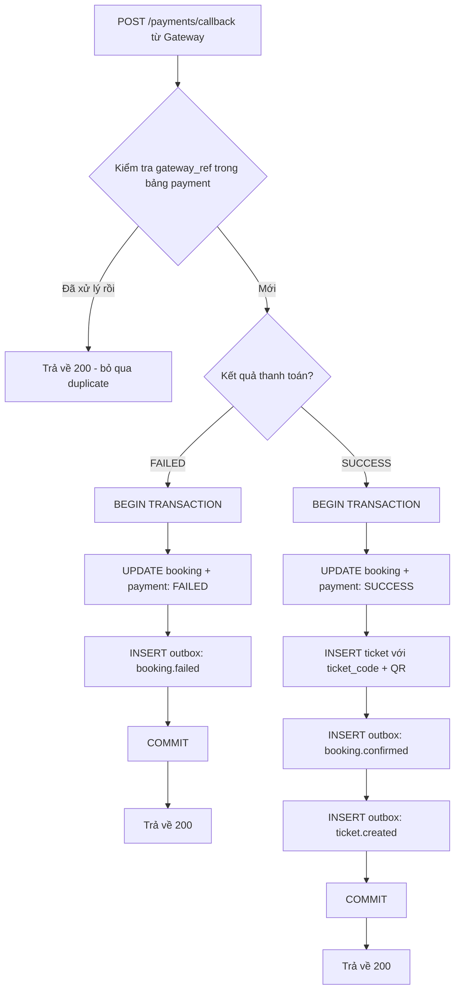
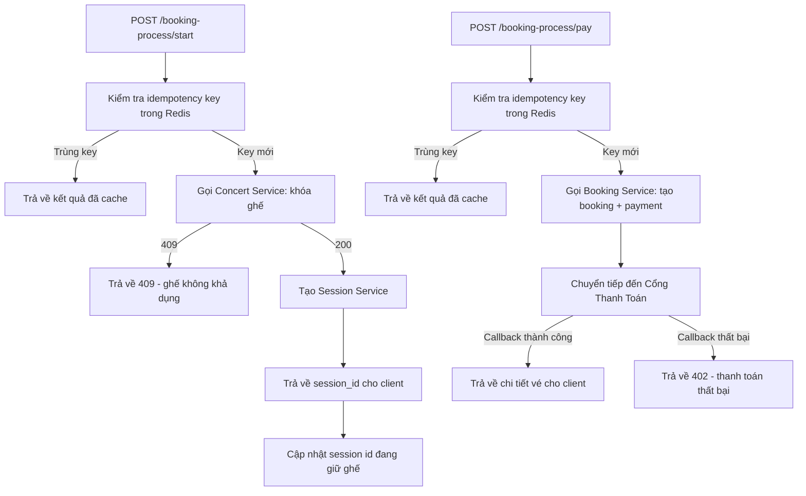

# Analysis and Design — Hệ Thống Bán Vé Concert Trực Tuyến

> **Goal**: Analyze a specific business process and design a service-oriented automation solution (SOA/Microservices).
> Scope: Focus on the **online concert ticket booking** business process.

**References:**
1. *Service-Oriented Architecture: Analysis and Design for Services and Microservices* — Thomas Erl (2nd Edition)
2. *Microservices Patterns: With Examples in Java* — Chris Richardson
3. *Bài tập — Phát triển phần mềm hướng dịch vụ* — Hung Dang

---

## Part 1 — Analysis Preparation

### 1.1 Business Process Definition

Describe or diagram the high-level Business Process to be automated.

- **Domain**: Giải trí — Bán vé sự kiện trực tuyến
- **Business Process**: Đặt vé concert trực tuyến — từ việc duyệt danh sách concert, chọn ghế, khởi tạo đặt vé, thanh toán, đến nhận vé xác nhận.
- **Actors**: Khách hàng (người dùng cuối), Cổng thanh toán (hệ thống bên ngoài)
- **Scope**: Một giao dịch đặt vé cho một phiên người dùng. Bao gồm toàn bộ vòng đời: chọn ghế → khóa ghế → tạo phiên đặt vé → tạo booking → thanh toán → phát hành vé, bao gồm cả các luồng thất bại và hết thời gian chờ.

**Sơ đồ quy trình:**

### 1.2 Existing Automation Systems
List existing systems, databases, or legacy logic related to this process.

| System Name | Type | Current Role | Interaction Method |
|-------------|------|--------------|-------------------|
| Không có | — | Quy trình mới, chưa có hệ thống cũ | — |

> Hệ thống được xây dựng mới hoàn toàn (greenfield).

### 1.3 Non-Functional Requirements

Non-functional requirements serve as input for identifying Utility Service and Microservice Candidates in step 2.7.

| Requirement | Description |
|---------|-------|
| Hiệu năng | Thời gian phản hồi < 200ms cho tất cả các API đồng bộ |
| Bảo mật | Validate dữ liệu đầu vào tại tất cả các endpoint; sử dụng idempotency key tại 2 API quan trọng (khởi tạo đặt vé và thanh toán) để chống double-submit |
| Khả năng mở rộng | Xử lý 1.000 request đồng thời; scale container theo chiều ngang bằng Docker Compose |
| Tính sẵn sàng | 99.9% uptime — không có điểm lỗi đơn; các service phải phục hồi được sau khi container khởi động lại |
| Đồng bộ dữ liệu | Các event giữa các service không bao giờ bị mất — đảm bảo bằng Outbox Pattern + RabbitMQ |

---

## Part 2 — REST/Microservices Modeling

### 2.1 Decompose Business Process & 2.2 Filter Unsuitable Actions

Decompose the process from 1.1 into granular actions. Mark actions unsuitable for service encapsulation.

| # | Action | Actor | Description | Suitable? |
|---|-----------|----------|-------|----------|
| 1 | Tải danh sách concert | Hệ thống | Lấy tất cả concert từ DB (ưu tiên cache Redis) | ✅ |
| 2 | Hiển thị danh sách concert | Giao diện client | Render danh sách lên màn hình | ❌ |
| 3 | Người dùng chọn concert | Người dùng | Click điều hướng | ❌ |
| 4 | Tải chi tiết concert | Hệ thống | Lấy thông tin concert, sơ đồ ghế, trạng thái ghế | ✅ |
| 5 | Hiển thị chi tiết concert & sơ đồ ghế | Giao diện client | Render sơ đồ ghế với màu trạng thái | ❌ |
| 6 | Người dùng nhấn "ghế" | Người dùng | Click ghế | ❌ |
| 7 | Kiểm tra ghế còn trống | Hệ thống | Xác minh status = AVAILABLE bằng optimistic lock (version) | ✅ |
| 8 | Từ chối ghế không khả dụng | Hệ thống | Trả về lỗi nếu ghế đang HELD hoặc SOLD | ✅ |
| 9 | Khóa ghế tạm thời | Giao diện client  | chuyển ghế thành đang được giữ | ❌ |
| 10 | Người dùng điền thông tin cá nhân | Người dùng | Nhập form (họ tên, SĐT, email) | ❌ |
| 11 | Người dùng nhấn "Đặt vé" | Người dùng | Click nút | ❌ |
| 12 | Khóa ghế | Hệ thống | UPDATE concert_seat: status=HELD, version+1, booking_session_id | ✅ |
| 13 | Tạo phiên đặt vé | Hệ thống | INSERT booking_session: status=ACTIVE, expired_at=now+180s | ✅ |
| 14 | Bắt đầu bộ đếm 3 phút | Hệ thống | Background job định kỳ quét expired_at < NOW() | ✅ |
| 15 | Hiển thị giao diện thanh toán | Giao diện client | Render form nhập thẻ | ❌ |
| 16 | Người dùng nhập thông tin thẻ và nhấn nút thanh toán| Người dùng | Nhập form | ❌ |
| 17 | Tạo bản ghi booking và payment| Hệ thống | INSERT booking, payment (PENDING) kèm thông tin người dùng, kiểm tra idempotency key | ✅ |
| 18 | Gửi thông tin đến cổng thanh toán | Hệ thống | HTTP call đến gateway bên ngoài với dữ liệu thẻ | ✅ |
| 19 | Nhận callback thanh toán | Hệ thống | Webhook HTTP POST từ gateway | ✅ |
| 20 | Đánh dấu thanh toán thành công | Hệ thống | UPDATE booking, payment → SUCCESS | ✅ |
| 21 | Đánh dấu ghế đã bán | Hệ thống | UPDATE concert_seat: status=SOLD, SessionBooking_id=null | ✅ |
| 22 | Tạo vé + QR | Hệ thống | INSERT ticket với ticket_code được sinh tự động | ✅ |
| 23 | Gửi thông báo thành công | Hệ thống | Async — push notification + email kèm vé | ✅ |
| 24 | Hiển thị chi tiết vé | Giao diện client | Render vé và ticket code | ❌ |
| 25 | Phát hiện người dùng thoát, thanh toán thất bại, session hết hạn | Hệ thống | Client gọi DELETE /session | ✅ |
| 26 | Hủy phiên đặt vé | Hệ thống | UPDATE booking_session: status=EXPIRED | ✅ |
| 27 | Đánh dấu thanh toán thất bại | Hệ thống | UPDATE booking, payment → FAILED | ✅ |
| 28 | Mở lại ghế | Hệ thống | UPDATE concert_seat: status=AVAILABLE, hold_by=null, version=0 | ✅ |
| 29 | Thông báo thất bại cho người dùng | Hệ thống | Async — gửi thông báo thất bại | ✅ |

> Các hành động đánh dấu ❌: chỉ thực hiện trên giao diện client, do người dùng tương tác trực tiếp, hoặc không thể đóng gói thành service.

### 2.3 Entity Service Candidates

Identify business entities and group reusable (agnostic) actions into Entity Service Candidates.

| Entity | Service Candidate | Agnostic Actions |
|----------|-----------------|------------------------|
| Concert, Seat, ConcertSeat | Concert Service | Tải danh sách concert, tải chi tiết concert, tải sơ đồ ghế, kiểm tra ghế còn trống, khóa ghế, mở lại ghế, đánh dấu ghế đã bán |
| Booking, Payment, Ticket | Booking Service | Tạo bản ghi booking, payment cập nhật trạng thái booking,payment, tạo vé + QR, gửi thông tin đến cổng thanh toán, nhận callback thanh toán |
| BookingSession | Session Service | Tạo phiên đặt vé, hủy phiên đặt vé, phát hiện phiên hết hạn qua background job |

### 2.4 Task Service Candidate

Group process-specific (non-agnostic) actions into a Task Service Candidate.

| Non-agnostic Action  | Task Service Candidate |
|------------------------|------------------------|
| Điều phối toàn bộ luồng đặt vé (kiểm tra ghế → khóa → tạo session → tạo booking → gọi gateway thanh toán → xử lý kết quả) | BookingProcess Service |
| Quyết định: từ chối nếu ghế không khả dụng | BookingProcess Service |
| Quyết định: khi thanh toán thành công → kích hoạt sold + tạo vé + thông báo | BookingProcess Service |
| Quyết định: khi thanh toán thất bại / người dùng thoát / hết giờ → kích hoạt expired session + release ghế + booking fail | BookingProcess Service |

### 2.5 Identify Resources

Map entities/processes to REST URI Resources.

| Entity / Process | Resource URI                                                                               |
|----------------------|--------------------------------------------------------------------------------------------|
| Danh sách concert | `GET /concerts`                                                                            |
| Chi tiết concert | `GET /concerts/{id}`                                                                       |
| Sơ đồ ghế của concert | `GET /concerts/{id}/seats`                                                                 |
| Khóa ghế | `POST /concerts/{id}/seats/{seatId}/lock`                                                  |
| Mở lại ghế | `POST /concerts/{id}/seats/{seatId}/release`                                               |
| Đánh dấu ghế đã bán | `POST /concerts/{id}/seats/{seatId}/sold`                                                  |
| Phiên đặt vé | `POST /sessions`, `DELETE /sessions/{id}`, `GET /sessions/{id}`                            |
| Khởi tạo đặt vé | `POST /bookings/initiate`                                                                  |
| Callback từ cổng thanh toán | `POST /payments/callback`                                                                   |
| Chi tiết vé | `GET /tickets/{id}`                                                                        |
| Điều phối luồng đặt vé | `POST /booking-process/start`, `POST /booking-process/pay`, `POST /booking-process/cancel` |

### 2.6 Associate Capabilities with Resources and Methods

| Service Candidate | Capability | Resource                                | HTTP Method |
|-----------------|---------|-----------------------------------------|-------------|
| Concert Service | Lấy danh sách concert | `/concerts`                             | GET |
| Concert Service | Lấy chi tiết concert | `/concerts/{id}`                        | GET |
| Concert Service | Lấy sơ đồ ghế + trạng thái | `/concerts/{id}/seats`                  | GET |
| Concert Service | Khóa ghế tạm thời | `/concerts/{id}/seats/{seatId}/lock`    | POST |
| Concert Service | Mở lại ghế | `/concerts/{id}/seats/{seatId}/release` | POST |
| Concert Service | Đánh dấu ghế đã bán | `/concerts/{id}/seats/{seatId}/sold`    | POST |
| Session Service | Tạo phiên đặt vé | `/sessions`                             | POST |
| Session Service | Lấy trạng thái phiên | `/sessions/{id}`                        | GET |
| Session Service | Hủy phiên đặt vé | `/sessions/{id}`                        | DELETE |
| Booking Service | Tạo booking + payment | `/bookings/initiate`                    | POST |
| Booking Service | Nhận callback thanh toán | `/payments/webhook`                     | POST |
| Booking Service | Lấy chi tiết vé | `/tickets/{id}`                         | GET |
| BookingProcess Service | Khởi động luồng đặt vé | `/booking-process/start`                | POST |
| BookingProcess Service | Xử lý thanh toán | `/booking-process/pay`                  | POST |
| BookingProcess Service | Hủy luồng đặt vé | `/booking-process/cancel`               | POST |
| Notification Service | Gửi thông báo (nội bộ) | `/notifications/send`                   | POST |

### 2.7 Utility Service & Microservice Candidates

Based on Non-Functional Requirements (1.3) and Processing Requirements, identify cross-cutting utility logic or logic requiring high autonomy/performance.

| Candidate | Type (Utility / Microservice) | Justification |
|----------|-------------------------------|---------|
| Notification Service | Utility Service | Xuyên suốt hệ thống: gửi email và push notification bất kể service nào kích hoạt. Tái sử dụng được trong nhiều tình huống. Hoàn toàn async — không chặn luồng phản hồi chính. |
| Session Service | Microservice | Yêu cầu độ chính xác thời gian cao (TTL 3 phút cho từng phiên đồng thời), phải xử lý hàng nghìn phiên giữ ghế cùng lúc khi mở bán. Nếu thành phần này bị treo, toàn bộ quy trình bán vé sẽ thất bại. Tách riêng để scale độc lập và cô lập lỗi. |
| API Gateway (Nginx) | Utility Service | Xuyên suốt hệ thống: giới hạn tốc độ request (N request/IP/s), định tuyến, validate đầu vào, cân bằng tải giữa các container được scale. |
| Redis Cache | Utility Service | Xuyên suốt hệ thống: cache dữ liệu concert/ghế (đáp ứng yêu cầu < 200ms), lưu trữ idempotency key. |
| RabbitMQ + Outbox/Inbox Pattern | Utility Service | Đảm bảo giao nhận event async đáng tin cậy. Outbox Pattern đảm bảo không mất event khi crash. Inbox Pattern đảm bảo không xử lý trùng khi RabbitMQ deliver nhiều lần. |
| HIKARI | Utility Service | Connection pooling — 20 slot kết nối cho mỗi DB. Tránh quá tải kết nối khi nhiều container chạy song song. |

### 2.8 Service Composition Candidates

Interaction diagram showing how Service Candidates collaborate to fulfill the business process.

---

## Part 3 — Service-Oriented Design

### 3.1 Uniform Contract Design

Service Contract specification for each service. Full OpenAPI specs:
- [`docs/api-specs/concert-service.yaml`](api-specs/concert-service.yaml)
- [`docs/api-specs/session-service.yaml`](api-specs/session-service.yaml)
- [`docs/api-specs/booking-service.yaml`](api-specs/booking-service.yaml)
- [`docs/api-specs/booking-process-service.yaml`](api-specs/booking-process-service.yaml)
- [`docs/api-specs/notification-service.yaml`](api-specs/notification-service.yaml)

**Concert Service:**

| Endpoint | Method | Media Type | Response Codes |
|----------|--------|------------|----------------|
| `/concerts` | GET | application/json | 200, 500 |
| `/concerts/{id}` | GET | application/json | 200, 404, 500 |
| `/concerts/{id}/seats` | GET | application/json | 200, 404, 500 |
| `/concerts/{id}/seats/{seatId}/lock` | POST | application/json | 200, 409 (ghế đã bị giữ/bán), 404, 500 |
| `/concerts/{id}/seats/{seatId}/release` | POST | application/json | 200, 404, 500 |
| `/concerts/{id}/seats/{seatId}/sold` | POST | application/json | 200, 404, 500 |
| `/health` | GET | application/json | 200 |

**Session Service:**

| Endpoint | Method | Media Type | Response Codes |
|----------|--------|------------|----------------|
| `/sessions` | POST | application/json | 201, 400, 500 |
| `/sessions/{id}` | GET | application/json | 200, 404 |
| `/sessions/{id}` | DELETE | application/json | 200, 404, 500 |
| `/health` | GET | application/json | 200 |

**Booking Service:**

| Endpoint | Method | Media Type | Response Codes |
|----------|--------|------------|----------------|
| `/bookings/initiate` | POST | application/json | 201, 400, 409 (idempotency trùng), 500 |
| `/bookings/{id}` | GET | application/json | 200, 404 |
| `/payments/callback` | POST | application/json | 200, 400, 500 |
| `/tickets/{id}` | GET | application/json | 200, 404 |
| `/bookings/{bookingId}/ticket` | GET | application/json | 200, 404 |
| `/health` | GET | application/json | 200 |

**BookingProcess Service:**

| Endpoint | Method | Media Type | Response Codes |
|----------|--------|------------|----------------|
| `/booking-process/start` | POST | application/json | 200, 400, 409 (ghế không còn trống), 500 |
| `/booking-process/pay` | POST | application/json | 200, 400, 402 (thanh toán thất bại), 408 (hết giờ), 500 |
| `/booking-process/cancel` | POST | application/json | 200, 404, 500 |
| `/health` | GET | application/json | 200 |

**Notification Service:**

| Endpoint | Method | Media Type | Response Codes |
|----------|--------|------------|----------------|
| `/notifications/send` | POST | application/json | 202 (chấp nhận async), 400, 500 |
| `/health` | GET | application/json | 200 |

### 3.2 Service Logic Design

Internal processing flow for each service.

**Concert Service — luồng khóa ghế:**

**Session Service — luồng phát hiện hết giờ:**

**Booking Service — luồng nhận callback thanh toán:**

**BookingProcess Service — luồng điều phối:**

