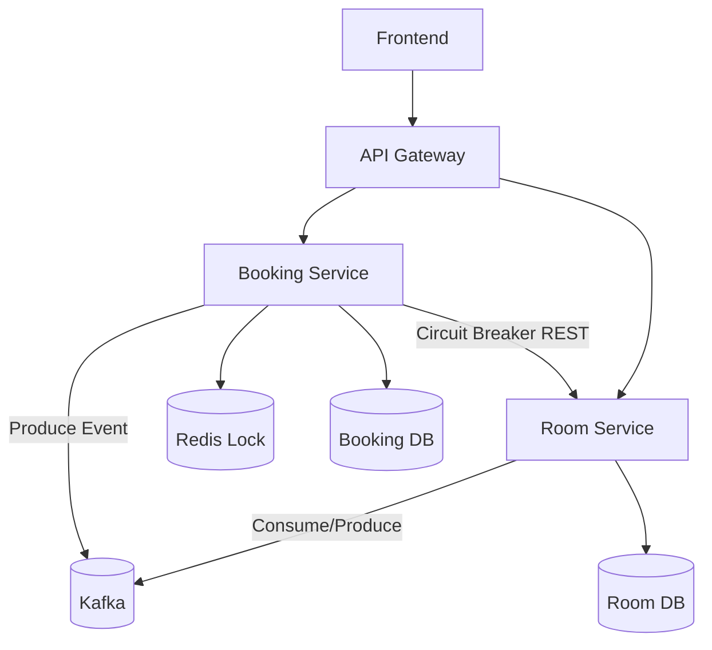

# System Architecture

> This document is completed **after** [Analysis and Design](analysis-and-design.md).
> Based on the Service Candidates and Non-Functional Requirements identified there, select appropriate architecture patterns and design the deployment architecture.

**References:**

1. _Service-Oriented Architecture: Analysis and Design for Services and Microservices_ — Thomas Erl (2nd Edition)
2. _Microservices Patterns: With Examples in Java_ — Chris Richardson
3. _Bài tập — Phát triển phần mềm hướng dịch vụ_ — Hung Dang (available in Vietnamese)

---

## 1. Pattern Selection

Select patterns based on business/technical justifications from your analysis.

| Pattern                      | Selected? | Business/Technical Justification                            |
| ---------------------------- | --------- | ----------------------------------------------------------- |
| API Gateway                  | ✅        | Entry point duy nhất, xử lý auth, routing, rate limit       |
| Database per Service         | ✅        | Tách DB cho Booking & Room -> loose coupling, scale độc lập |
| Shared Database              | ❌        | Tránh coupling, vi phạm microservice principle              |
| Saga                         | ✅        | Xử lý transaction phân tán giữa Booking ↔ Room              |
| Event-driven / Message Queue | ✅        | Dùng Kafka để async communication, giảm coupling            |
| CQRS                         | ❌        | System nhỏ, chưa cần tách read/write                        |
| Circuit Breaker              | ✅        | Dùng Resilience4j để tránh cascade failure                  |
| Service Registry / Discovery | ❌        | Dùng Docker network (static), chưa cần Eureka               |
| Other: Redis Lock            | ✅        | Distributed lock để tránh overbooking                       |

> Reference: _Microservices Patterns_ — Chris Richardson, chapters on decomposition, data management, and communication patterns.

---

## 2. System Components

| Component           | Responsibility                      | Tech Stack           | Port |
| ------------------- | ----------------------------------- | -------------------- | ---- |
| **Frontend**        | UI đặt phòng, gọi API               | React / Next.js      | 3000 |
| **Gateway**         | Routing, auth, rate limit           | Spring Cloud Gateway | 8080 |
| **Booking Service** | Quản lý booking + Saga orchestrator | Spring Boot + Kafka  | 5001 |
| **Room Service**    | Quản lý phòng + xử lý event         | Spring Boot + Kafka  | 5002 |
| **Kafka Broker**    | Message queue (event-driven)        | Apache Kafka         | 9092 |
| **Redis**           | Distributed lock                    | Redis                | 6379 |
| **Booking DB**      | Lưu booking                         | PostgreSQL           | 5433 |
| **Room DB**         | Lưu room                            | PostgreSQL           | 5434 |

---

## 3. Communication

### Inter-service Communication Matrix

| From → To     | Service A (Booking) | Service B (Room)   | Gateway | Database | Kafka | Redis |
| ------------- | ------------------- | ------------------ | ------- | -------- | ----- | ----- |
| **Frontend**  | ❌                  | ❌                 | ✅      | ❌       | ❌    | ❌    |
| **Gateway**   | ✅                  | ✅                 | ❌      | ❌       | ❌    | ❌    |
| **Service A** | ❌                  | ⚠️ (fallback REST) | ❌      | ✅       | ✅    | ✅    |
| **Service B** | ❌                  | ❌                 | ❌      | ✅       | ✅    | ❌    |

---

## 4. Architecture Diagram

> Place diagrams in `docs/asset/` and reference here.

---

## 5. Deployment

- All services containerized with Docker
- Orchestrated via Docker Compose
- Single command: `docker compose up --build`
