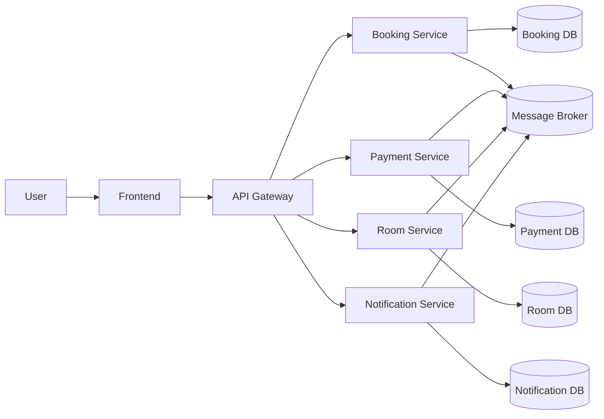

# System Architecture

> This document is completed **after** [Analysis and Design](analysis-and-design.md).
> Based on the Service Candidates and Non-Functional Requirements identified there, select appropriate architecture patterns and design the deployment architecture.

**References:**

1. _Service-Oriented Architecture: Analysis and Design for Services and Microservices_ — Thomas Erl (2nd Edition)
2. _Microservices Patterns: With Examples in Java_ — Chris Richardson
3. _Bài tập — Phát triển phần mềm hướng dịch vụ_ — Hung Dang (available in Vietnamese)

---

## 1. Pattern Selection

Select patterns based on business/technical justifications from your analysis.

| Pattern                      | Selected?     | Business/Technical Justification                                                                                            |
| ---------------------------- | ------------- | --------------------------------------------------------------------------------------------------------------------------- |
| API Gateway                  | ✅            | Central entry point cho client, routing request đến các service (Booking, Payment, Room, Notification), xử lý auth, logging |
| Database per Service         | ✅            | Mỗi service có DB riêng → loose coupling, dễ scale, phù hợp DDD                                                             |
| Shared Database              | ❌            | Vi phạm tính độc lập service, gây coupling cao                                                                              |
| Saga                         | ✅            | Quản lý transaction phân tán: Booking → Payment → Confirm → Room → Email                                                    |
| Event-driven / Message Queue | ✅            | Giao tiếp async giữa các service (PaymentSuccess, BookingConfirmed, etc.)                                                   |
| CQRS                         | ⚠️ (Optional) | Có thể dùng cho read-heavy (ví dụ dashboard), chưa bắt buộc                                                                 |
| Circuit Breaker              | ✅            | Tránh cascade failure khi Payment/Room down                                                                                 |
| Service Registry / Discovery | ✅            | Dynamic service discovery (Eureka / Consul)                                                                                 |
| Other: Outbox Pattern        | ✅            | Đảm bảo không mất event khi ghi DB + publish event                                                                          |

> Reference: _Microservices Patterns_ — Chris Richardson, chapters on decomposition, data management, and communication patterns.

---

## 2. System Components

| Component               | Responsibility                                  | Tech Stack           | Port |
| ----------------------- | ----------------------------------------------- | -------------------- | ---- |
| Frontend                | UI cho user đặt phòng, thanh toán               | ReactJS + Axios      | 3000 |
| Gateway                 | Routing, Auth (JWT), Rate limit                 | Spring Cloud Gateway | 8080 |
| Booking Service         | Quản lý booking lifecycle (PENDING → CONFIRMED) | Spring Boot          | 8081 |
| Payment Service         | Xử lý thanh toán                                | Spring Boot          | 8082 |
| Room Service            | Quản lý trạng thái phòng                        | Spring Boot          | 8083 |
| Notification Service    | Gửi email xác nhận                              | Spring Boot          | 8084 |
| Message Broker          | Event-driven communication                      | Kafka / RabbitMQ     | 9092 |
| Service Registry        | Service discovery                               | Eureka Server        | 8761 |
| Database (Booking)      | Lưu booking                                     | PostgreSQL           | 5432 |
| Database (Payment)      | Lưu payment                                     | PostgreSQL           | 5433 |
| Database (Room)         | Lưu room                                        | PostgreSQL           | 5434 |
| Database (Notification) | Lưu log email                                   | PostgreSQL           | 5435 |

---

### 3. Communication

Inter-service Communication Matrix

| From → To            | Booking Service        | Payment Service          | Room Service         | Notification Service | Gateway | Database |
| -------------------- | ---------------------- | ------------------------ | -------------------- | -------------------- | ------- | -------- |
| Frontend             | ❌                     | ❌                       | ❌                   | ❌                   | ✅      | ❌       |
| Gateway              | REST                   | REST                     | REST                 | REST                 | ❌      | ❌       |
| Booking Service      | ❌                     | Event (PaymentRequested) | Event (RoomReserved) | Event (SendEmail)    | ❌      | JDBC     |
| Payment Service      | Event (PaymentSuccess) | ❌                       | ❌                   | ❌                   | ❌      | JDBC     |
| Room Service         | ❌                     | ❌                       | ❌                   | ❌                   | ❌      | JDBC     |
| Notification Service | ❌                     | ❌                       | ❌                   | ❌                   | ❌      | JDBC     |

---

## 4. Architecture Diagram

> Place diagrams in `docs/asset/` and reference here.

---

## 5. Deployment

- All services containerized with Docker
- Orchestrated via Docker Compose
- Single command: `docker compose up --build`
