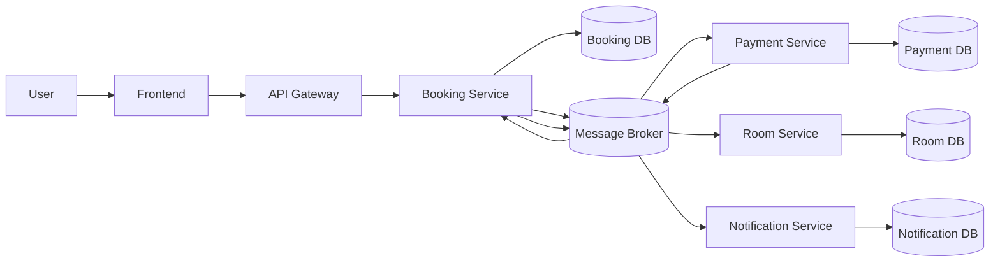

# System Architecture

> This document is completed **after** [Analysis and Design](analysis-and-design.md).
> Based on the Service Candidates and Non-Functional Requirements identified there, select appropriate architecture patterns and design the deployment architecture.

**References:**

1. _Service-Oriented Architecture: Analysis and Design for Services and Microservices_ — Thomas Erl (2nd Edition)
2. _Microservices Patterns: With Examples in Java_ — Chris Richardson
3. _Bài tập — Phát triển phần mềm hướng dịch vụ_ — Hung Dang (available in Vietnamese)

---

## 1. Pattern Selection

Select patterns based on business/technical justifications from your analysis.

| Pattern                      | Selected?     | Business/Technical Justification                                                          |
| ---------------------------- | ------------- | ----------------------------------------------------------------------------------------- |
| API Gateway                  | ✅            | Central entry point cho client, routing request đến Booking (và read APIs), auth, logging |
| Database per Service         | ✅            | Mỗi service có DB riêng → loose coupling, đúng DDD                                        |
| Shared Database              | ❌            | Gây coupling, không phù hợp microservices                                                 |
| Saga (Choreography)          | ✅            | Transaction phân tán thông qua event chain (không orchestration)                          |
| Event-driven / Message Queue | ✅            | Giao tiếp async qua Kafka/RabbitMQ                                                        |
| CQRS                         | ⚠️ (Optional) | Tách read/write (Room có thể expose API read)                                             |
| Circuit Breaker              | ⚠️            | Ít dùng hơn do async, nhưng vẫn cần cho Gateway/External calls                            |
| Service Registry / Discovery | ✅            | Dynamic discovery (Eureka)                                                                |
| Other: Outbox Pattern        | ✅            | Đảm bảo atomicity giữa DB và event publish                                                |

1. API Gateway — ✅
👉 Hiểu đơn giản:
Là cổng chính của hệ thống
📌 Ví dụ:
User chỉ gọi:
/bookings
KHÔNG cần biết:
Booking ở port nào
Service nào xử lý
👉 Gateway sẽ:
Nhận request
Chuyển đến đúng service
🎯 Vì sao cần:
Dễ quản lý
Thêm auth (JWT), logging
🟩 2. Database per Service — ✅
👉 Hiểu đơn giản:
Mỗi service có database riêng
📌 Ví dụ:
Booking DB → chỉ chứa booking
Payment DB → chỉ chứa payment
🎯 Vì sao cần:
Tránh phụ thuộc nhau
Không bị lỗi dây chuyền
🟥 3. Shared Database — ❌
👉 Nếu dùng:
Tất cả service dùng chung 1 DB
❌ Vấn đề:
Booking sửa DB → Payment bị ảnh hưởng
Khó scale
👉 Giống kiểu:
nhiều người cùng sửa 1 file → dễ lỗi
🟨 4. Saga (Choreography) — ✅
👉 Hiểu đơn giản:
Là cách xử lý nhiều bước liên tiếp
📌 Flow của bạn:
Booking tạo
Payment xử lý
Booking confirm
Room reserve
Email gửi
👉 Không có “thằng điều khiển trung tâm”
👉 Mỗi service tự làm khi có event
🎯 Vì sao chọn:
Đơn giản
Phù hợp event-driven
🟪 5. Event-driven — ✅ (quan trọng nhất)
👉 Hiểu đơn giản:
Service không gọi nhau
👉 Thay vào đó:
Gửi “event”
📌 Ví dụ:
Booking tạo xong:
BookingCreated
Payment nghe thấy → xử lý
🎯 Lợi ích:
Không phụ thuộc nhau
Dễ mở rộng
Dễ thêm service mới
⚪ 6. CQRS — ❌
👉 CQRS là gì:
Tách:
Write (ghi)
Read (đọc)
📌 Nhưng hệ thống bạn:
Chưa tách riêng DB read
Chỉ đơn giản là:
Event để write
API để read
👉 Chưa đủ “level” CQRS
⚫ 7. Circuit Breaker — ❌
👉 Dùng khi:
Service gọi nhau bằng REST
📌 Nhưng bạn:
Dùng event (async)
Không gọi trực tiếp
👉 Không cần
🟧 8. Service Discovery — ✅
👉 Hiểu đơn giản:
Service có thể đổi IP/port
👉 Discovery giúp:
Tìm service tự động
📌 Ví dụ:
Gateway không cần biết:
booking-service:8081
🟫 9. Outbox Pattern — ✅ (rất quan trọng)
👉 Vấn đề thực tế:
Booking:
Lưu DB
Gửi event
👉 Nếu:
Lưu DB thành công
Nhưng gửi event FAIL
❌ → hệ thống bị sai
👉 Outbox giải quyết:
Ghi event vào DB trước
Sau đó gửi đi
👉 Không mất event

---

## 2. System Components

| Component            | Responsibility                          | Tech Stack           | Port |
| -------------------- | --------------------------------------- | -------------------- | ---- |
| Frontend             | UI đặt phòng                            | ReactJS              | 3000 |
| Gateway              | Routing + Auth                          | Spring Cloud Gateway | 8080 |
| Booking Service      | Booking lifecycle + publish event       | Spring Boot          | 8081 |
| Payment Service      | Consume BookingCreated + xử lý payment  | Spring Boot          | 8082 |
| Room Service         | Consume BookingConfirmed + reserve room | Spring Boot          | 8083 |
| Notification Service | Consume BookingConfirmed + gửi email    | Spring Boot          | 8084 |
| Message Broker       | Event streaming                         | Kafka / RabbitMQ     | 9092 |
| Service Registry     | Service discovery                       | Eureka               | 8761 |
| Booking DB           | Lưu booking                             | PostgreSQL           | 5432 |
| Payment DB           | Lưu payment                             | PostgreSQL           | 5433 |
| Room DB              | Lưu room                                | PostgreSQL           | 5434 |
| Notification DB      | Lưu log email                           | PostgreSQL           | 5435 |

---

### 3. Communication

Inter-service Communication Matrix

| From → To            | Booking Service                 | Payment Service        | Room Service             | Notification Service     | Gateway | Database |
| -------------------- | ------------------------------- | ---------------------- | ------------------------ | ------------------------ | ------- | -------- |
| Frontend             | ❌                              | ❌                     | ❌                       | ❌                       | ✅      | ❌       |
| Gateway              | REST (read APIs only)           | ❌                     | REST (read)              | ❌                       | ❌      | ❌       |
| Booking Service      | ❌                              | Event (BookingCreated) | Event (BookingConfirmed) | Event (BookingConfirmed) | ❌      | JDBC     |
| Payment Service      | Event (PaymentSucceeded/Failed) | ❌                     | ❌                       | ❌                       | ❌      | JDBC     |
| Room Service         | ❌                              | ❌                     | ❌                       | ❌                       | ❌      | JDBC     |
| Notification Service | ❌                              | ❌                     | ❌                       | ❌                       | ❌      | JDBC     |

| Event Name       | Producer | Consumer           |
| ---------------- | -------- | ------------------ |
| BookingCreated   | Booking  | Payment            |
| PaymentSucceeded | Payment  | Booking            |
| PaymentFailed    | Payment  | Booking            |
| BookingConfirmed | Booking  | Room, Notification |

---

## 4. Architecture Diagram

> Place diagrams in `docs/asset/` and reference here.

---

## 5. Deployment

- All services containerized with Docker
- Orchestrated via Docker Compose
- Single command: `docker compose up --build`
