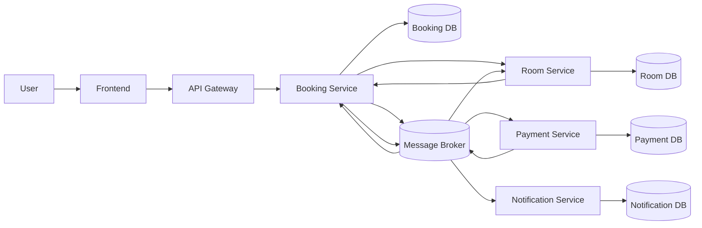

# System Architecture

> This document is completed **after** [Analysis and Design](analysis-and-design.md).
> Based on the Service Candidates and Non-Functional Requirements identified there, select appropriate architecture patterns and design the deployment architecture.

**References:**

1. _Service-Oriented Architecture: Analysis and Design for Services and Microservices_ — Thomas Erl (2nd Edition)
2. _Microservices Patterns: With Examples in Java_ — Chris Richardson
3. _Bài tập — Phát triển phần mềm hướng dịch vụ_ — Hung Dang (available in Vietnamese)

---

## 1. Pattern Selection 

| Pattern              | Selected? | Business/Technical justifications                                |
| -------------------- | --------- | ---------------------------------------------------------------- |
| API Gateway          | ✅        | Single entry point, routing, authentication                      |
| Database per Service | ✅        | Đảm bảo data ownership và giảm coupling giữa services            |
| Shared Database      | ❌        | Gây coupling, khó scale và deploy độc lập                        |
| Saga (Choreography)  | ✅        | Xử lý distributed transaction thông qua event-driven             |
| Event-driven         | ✅        | Giao tiếp bất đồng bộ, giảm coupling, tăng resilience            |
| CQRS                 | ❌        | Chưa cần tách read/write, hệ thống chưa đủ phức tạp              |
| Circuit Breaker      | ✅        | Bảo vệ khi gọi external payment gateway, tránh cascading failure |
| Service Discovery    | ✅        | Cho phép service tìm nhau dynamic (Eureka)                       |
| Outbox Pattern       | ✅        | Đảm bảo consistency giữa DB và message broker                    |

---

## 2. System Components 

| Component            | Responsibility                             | Tech Stack           | Port |
| -------------------- | ------------------------------------------ | -------------------- | ---- |
| Frontend             | UI đặt phòng                               | ReactJS              | 3000 |
| Gateway              | Routing + Auth                             | Spring Cloud Gateway | 8080 |
| Booking Service      | Booking lifecycle + publish event          | Spring Boot          | 8081 |
| Payment Service      | Consume BookingCreated + xử lý payment     | Spring Boot          | 8082 |
| Room Service         | Reserve & release room (tránh overbooking) | Spring Boot          | 8083 |
| Notification Service | Consume BookingConfirmed + gửi email       | Spring Boot          | 8084 |
| Message Broker       | Event streaming                            | Kafka / RabbitMQ     | 9092 |
| Service Registry     | Service discovery                          | Eureka               | 8761 |
| Booking DB           | Lưu booking                                | PostgreSQL           | 5432 |
| Payment DB           | Lưu payment                                | PostgreSQL           | 5433 |
| Room DB              | Lưu room + reservation                     | PostgreSQL           | 5434 |
| Notification DB      | Lưu log email                              | PostgreSQL           | 5435 |

---

## 3. Communication
### Inter-service Communication Matrix

| From → To            | Booking Service                 | Payment Service        | Room Service              | Notification Service     | Gateway | Database |
| -------------------- | ------------------------------- | ---------------------- | ------------------------- | ------------------------ | ------- | -------- |
| Frontend             | ❌                              | ❌                     | ❌                        | ❌                       | ✅      | ❌       |
| Gateway              | REST (create/read booking)      | ❌                     | REST (read room)          | ❌                       | ❌      | ❌       |
| Booking Service      | ❌                              | Event (BookingCreated) | ❌ (reserve qua sync API) | Event (BookingConfirmed) | ❌      | JDBC     |
| Payment Service      | Event (PaymentSucceeded/Failed) | ❌                     | ❌                        | ❌                       | ❌      | JDBC     |
| Room Service         | ❌                              | ❌                     | ❌                        | ❌                       | ❌      | JDBC     |
| Notification Service | ❌                              | ❌                     | ❌                        | ❌                       | ❌      | JDBC     |

### Event Contracts

| Event Name       | Producer | Consumer     |
| ---------------- | -------- | ------------ |
| BookingCreated   | Booking  | Payment      |
| PaymentSucceeded | Payment  | Booking      |
| PaymentFailed    | Payment  | Booking      |
| BookingConfirmed | Booking  | Notification |
| BookingCancelled | Booking  | Room         |
| BookingExpired   | Booking  | Room         |

---

## 4. Architecture Diagram

---

## 5. Deployment

- All services are containerized using Docker
- Orchestrated via Docker Compose
- Each service runs independently with its own database
- Message broker (Kafka/RabbitMQ) is deployed as a separate container
- System can be started using: docker compose up --build
