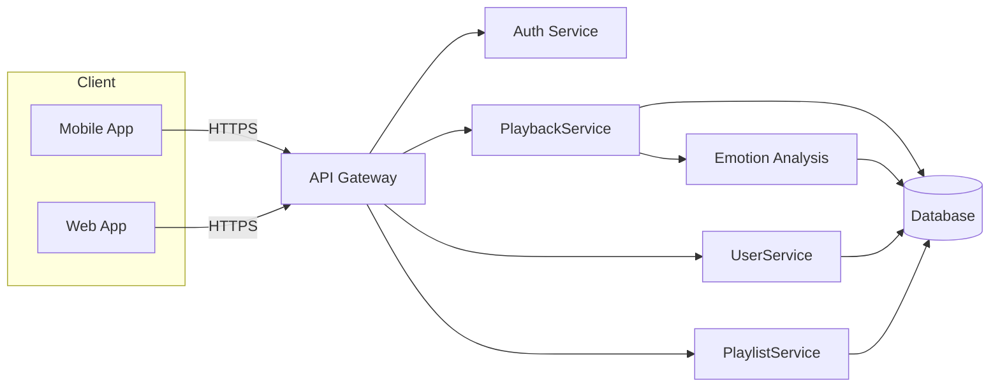
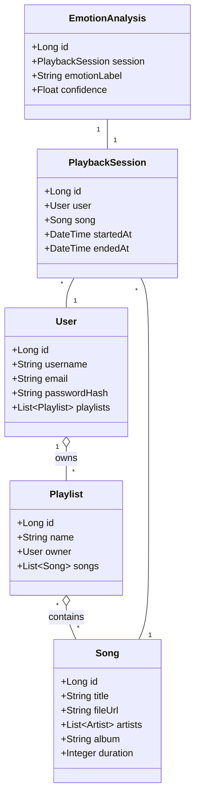
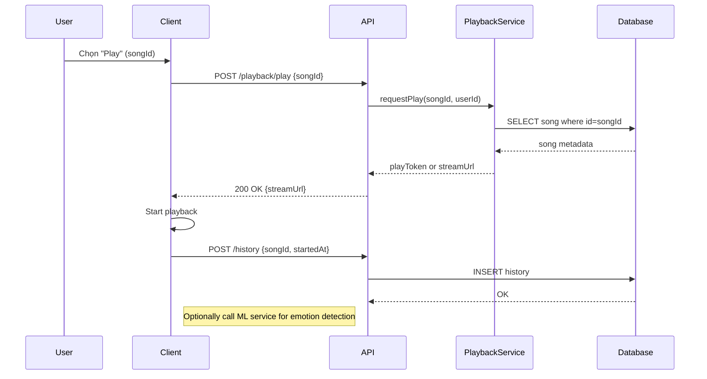
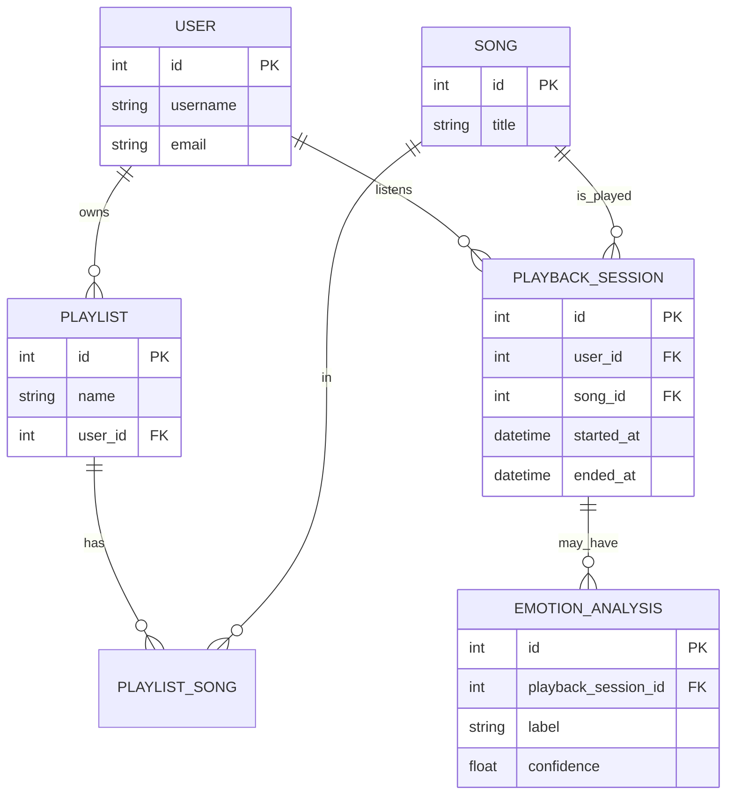

# Tài liệu: Kiến trúc & Thiết kế hệ thống MusicApp

Tài liệu này mô tả tổng quan kiến trúc, sơ đồ use-case (tổng quan và chi tiết), sơ đồ lớp, sơ đồ tuần tự, sơ đồ thực thể (ER) / cấu trúc collections cho NoSQL và giao diện chức năng cùng luồng.

---

## 1. Kiến trúc tổng quan

Mô tả các khối chính:

- Client: Web app, Mobile app (Android), có giao diện người dùng, gửi yêu cầu tới API.
- API Gateway / Backend Controller: REST API (Spring Boot) chịu trách nhiệm xác thực, điều phối yêu cầu.
- Services: Business logic (PlaybackService, UserService, PlaylistService, EmotionService, HistoryService).
- Persistence: MySQL (quan hệ) hoặc MongoDB (NoSQL) để lưu thông tin bài hát, người dùng, playlist, lịch sử.
- External/ML: Mô-đun phân tích cảm xúc (TensorFlow Lite trên thiết bị hoặc service riêng).

Mermaid sơ đồ kiến trúc (graph):



---

## 2. Biểu đồ Use Case - Tổng quan

```mermaid
usecase
actor User as "Người dùng"
actor Admin as "Admin"

User --> (Đăng nhập/Đăng ký)
User --> (Phát nhạc)
User --> (Tạo/Chỉnh sửa Playlist)
User --> (Xem Lịch sử)
User --> (Gợi ý theo cảm xúc)

Admin --> (Quản lý nội dung)
Admin --> (Quản lý người dùng)
```

---

## 3. Biểu đồ Use Case - Chi tiết (ví dụ: Phát nhạc)

- Actor: `Người dùng`
- Mục tiêu: Phát một bài hát, lưu lịch sử, kích hoạt phân tích cảm xúc (nếu bật).

Luồng chính (tóm tắt):

1. Người dùng chọn bài hát trên UI.
2. Client gọi `POST /playback/play` với `songId`.
3. Backend xác thực, gọi PlaybackService để trả URL stream hoặc token.
4. Client bắt đầu phát, gửi sự kiện play đến HistoryService.
5. Nếu bật phân tích cảm xúc, client hoặc ML service ghi nhận và gửi kết quả về EmotionService.

Chi tiết use case (kịch bản):

- Preconditions: Người dùng đã đăng nhập (hoặc cho phép phát công khai).
- Success: Bài hát phát, lịch sử lưu, cảm xúc được gắn (nếu có).
- Alternate: Nếu không có quyền, trả lỗi 401; nếu bài hát không tồn tại, trả 404.

---

## 4. Sơ đồ lớp (Class Diagram) - mô hình dữ liệu chính



---

## 5. Sơ đồ tuần tự (Sequence Diagram) - Play song



---

## 6. Sơ đồ thực thể (ER) - cho RDBMS



### Nếu dùng NoSQL (MongoDB) - Collections & mẫu quan hệ

- `users` collection: { \_id, username, email, passwordHash, preferences }
- `songs` collection: { \_id, title, artists: [artistIds], album, fileUrl, duration }
- `playlists` collection: { \_id, name, ownerId, songIds: [songId], visibility }
- `playback_sessions` collection: { \_id, userId, songId, startedAt, endedAt }
- `emotion_analyses` collection: { \_id, playbackSessionId, label, confidence }

Quan hệ thường là tham chiếu bằng id (ObjectId). Để tối ưu tra cứu history cho user, thêm chỉ mục `userId` trên `playback_sessions`.

---

## 7. Giao diện đáp ứng chức năng và luồng (UI & UX flows)

Các màn hình chính:

- Home / Discover: danh sách gợi ý, playlist, trending.
- Player Screen: controls (play/pause/seek), song info, emotion indicator.
- Playlist Management: xem/tao/sửa playlist.
- Profile / History: danh sách bài đã nghe, bộ lọc theo ngày.
- Admin Dashboard: quản lý bài hát, nghệ sĩ, người dùng.

Luồng chính (Play từ Discover):

1. Home hiển thị danh sách bài.
2. Người dùng chạm vào item -> mở Player (modal hoặc trang mới).
3. Player gửi request tới API để lấy stream URL.
4. Player bắt đầu phát; UI hiển thị progress, cung cấp nút "Thích", "Thêm vào playlist".
5. Người dùng có thể mở phần "Emotion" để xem gợi ý/biểu đồ cảm xúc nếu có.

Mermaid flow cho luồng Play:

```mermaid
flowchart TD
    Home[Home/Discover] -->|Chọn bài| Player[Player Screen]
    Player -->|Gọi API| API[API Server]
    API --> DB[(Database)]
    Player -->|Ghi History| API
    Player -->|(Option) ML| ML[Emotion Service]
    ML --> API
    API --> Player
```

---

## 8. Gợi ý cài đặt kỹ thuật & API mẫu

- Endpoints chính (REST):
  - `POST /auth/login` - đăng nhập
  - `POST /auth/register` - đăng ký
  - `GET /songs` - lấy danh sách bài
  - `GET /songs/{id}` - lấy metadata
  - `POST /playback/play` - bắt đầu phát
  - `POST /history` - lưu lịch sử phát
  - `POST /emotion` - gửi kết quả phân tích cảm xúc
  - `GET /users/{id}/history` - lịch sử người dùng

- Index/Performance: đánh chỉ mục theo `songId`, `userId`, `startedAt` cho bảng lịch sử; cache metadata bài hát (Redis) để giảm truy vấn DB khi phát phổ biến.

---

## 9. Kết luận & bước tiếp theo

- Tài liệu này cung cấp khung thiết kế cao cấp để triển khai hệ thống MusicApp.
- Nếu muốn, tôi có thể: xuất sơ đồ Mermaid thành PNG/SVG, mở rộng chi tiết API (OpenAPI spec), hoặc tạo ER migration SQL cụ thể.

---

Tệp được tạo tự động: [document.md](document.md)
