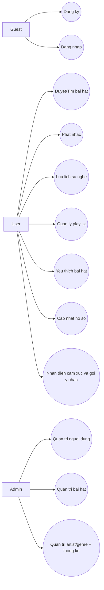
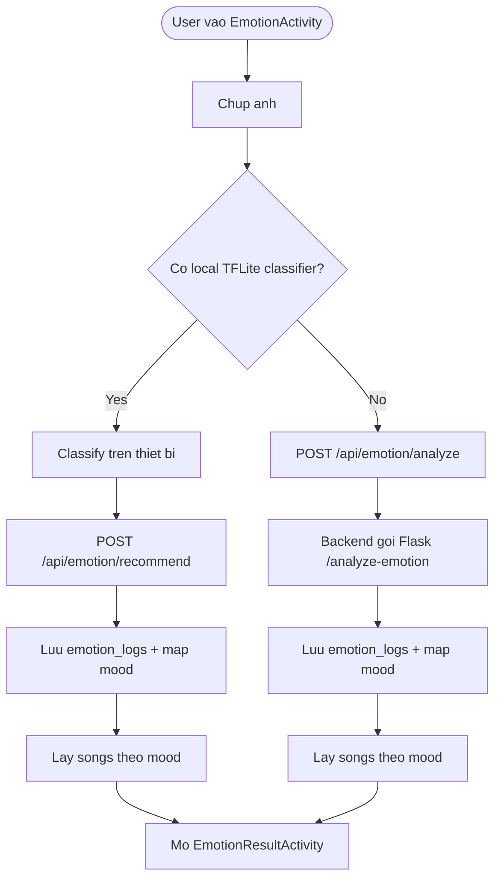
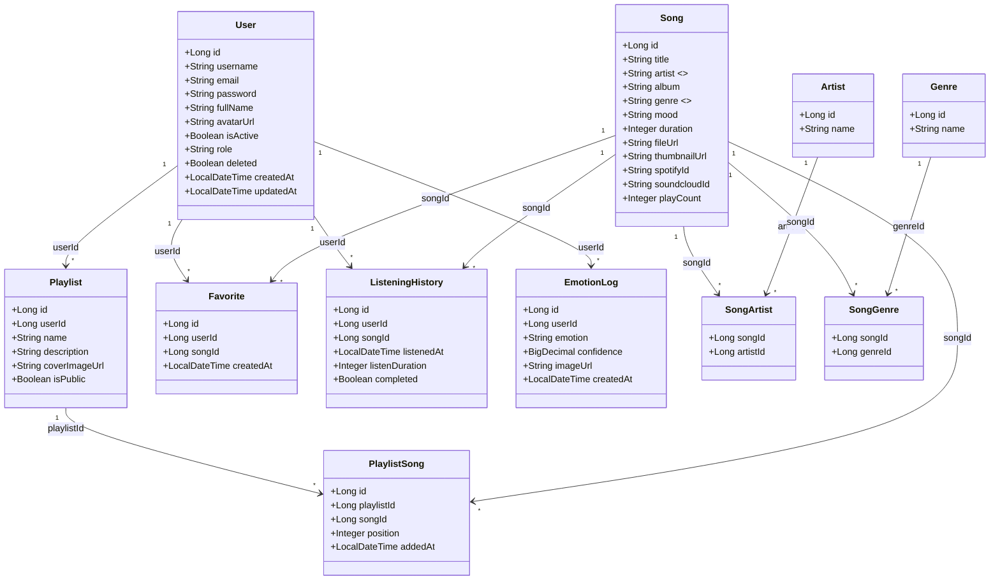
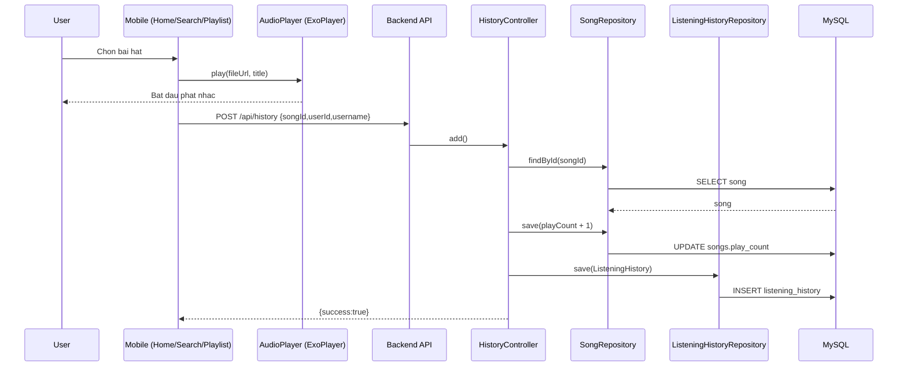
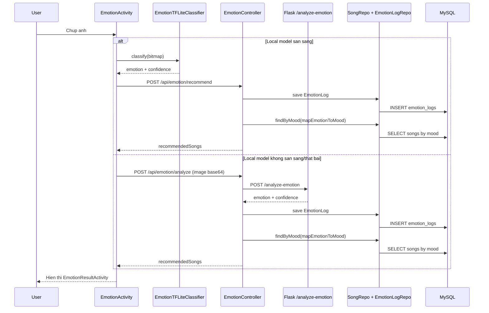
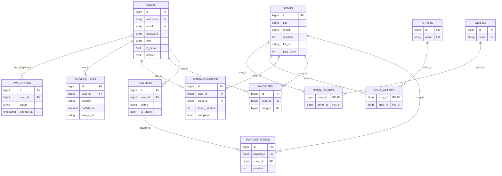
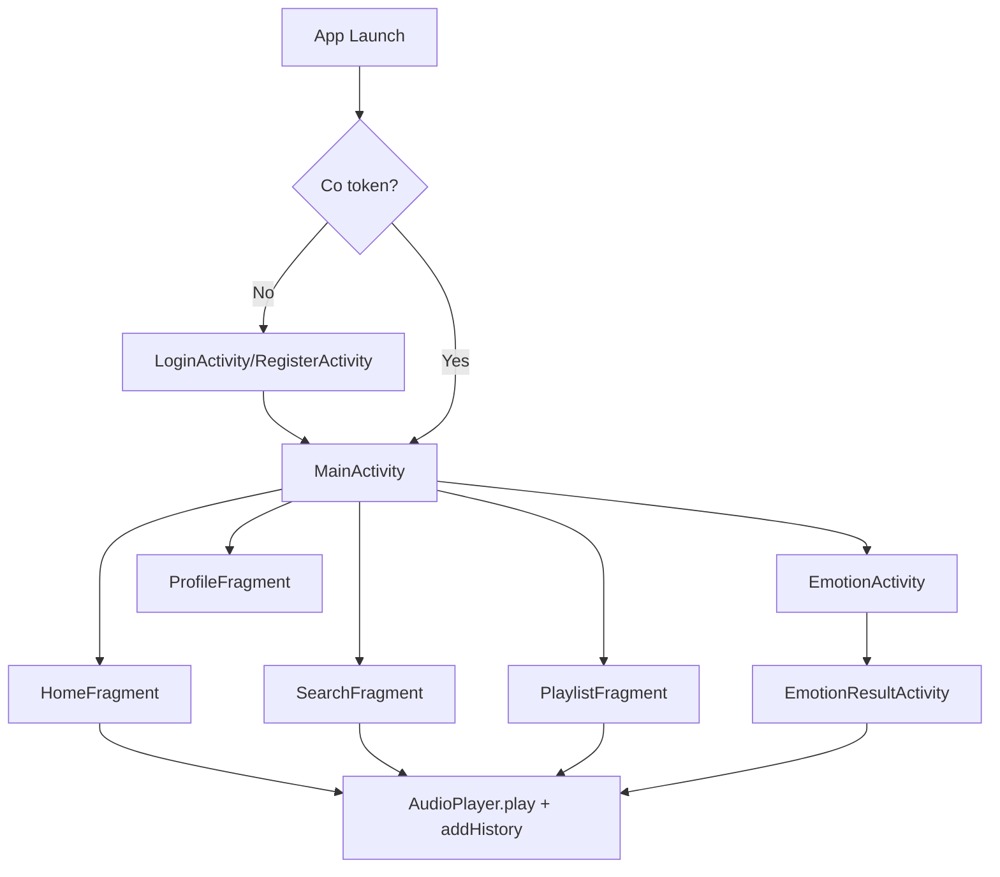
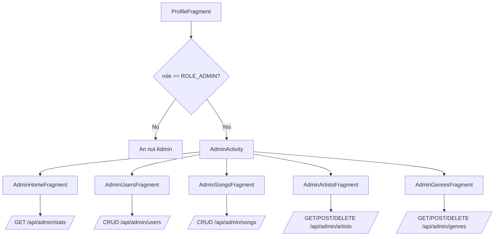

# TAI LIEU KIEN TRUC VA THIET KE HE THONG MUSICAPP

Tai lieu nay duoc viet lai dua tren ma nguon hien tai trong cac module:

- `app/backend` (Spring Boot API + JWT)
- `app/mobile` (Android app Java + CameraX + ExoPlayer + TFLite)
- `AI` (Flask service phan tich cam xuc)
- `database` (MySQL schema)

## 1. Kien truc tong quan

### 1.1 Cac khoi he thong

- Client:
  - Android mobile app (`MainActivity`, `HomeFragment`, `SearchFragment`, `PlaylistFragment`, `ProfileFragment`, `EmotionActivity`, `EmotionResultActivity`, `AdminActivity`).
  - Chua co web frontend rieng trong repo hien tai.
- API Server:
  - Spring Boot backend (`/api/**`) voi cac nhom endpoint: auth, songs, genres, emotion, me, favorites, history, playlists, admin.
  - Bao mat JWT qua `JwtAuthenticationFilter`.
- AI Service:
  - Flask service (`AI/app.py`) endpoint `/analyze-emotion` va `/health`.
- Data Layer:
  - MySQL (users, songs, playlists, favorites, history, emotion logs, artists/genres, junction tables).
- Playback Layer (trong mobile):
  - `AudioPlayer` dung ExoPlayer phat audio tu `fileUrl`.

### 1.2 So do kien truc tong quan

```mermaid
flowchart LR
    subgraph MobileClient[Android Mobile Client]
        UI[Activities/Fragments UI]
        APIClient[Retrofit + JwtInterceptor]
        Player[AudioPlayer (ExoPlayer)]
        LocalML[EmotionTFLiteClassifier]
        SP[SharedPreferences Session]
    end

    subgraph Backend[Spring Boot API Server]
        C1[Auth/Song/Playlist/History/Favorite Controllers]
        C2[EmotionController + AdminController + MeController]
        SEC[SecurityConfig + JwtAuthenticationFilter + JwtService]
        REPO[JPA Repositories + JdbcTemplate]
    end

    subgraph AIService[Flask AI Service]
        A1[/POST /analyze-emotion/]
        A2[TensorFlow model infer]
    end

    subgraph DB[MySQL]
        T1[(users, songs, playlists)]
        T2[(favorites, listening_history, emotion_logs)]
        T3[(artists, genres, song_artists, song_genres)]
    end

    UI --> APIClient
    UI --> Player
    UI --> LocalML
    UI --> SP

    APIClient -->|HTTP + Bearer JWT| Backend
    Backend --> REPO
    REPO --> DB

    C2 -->|/api/emotion/analyze| A1
    A1 --> A2
    C2 -->|/api/emotion/recommend| REPO
```

### 1.3 Ghi chu quan trong tu code hien tai

- Security dang cho phep `permitAll` cho mot so endpoint user (`/api/favorites/**`, `/api/history/**`, `/api/playlists/**`, `/api/me`) de tranh 403 khi dev mobile.
- Backend van parse JWT neu co header Bearer hop le.
- Luong emotion co 2 cach:
  - On-device TFLite: mobile classify roi goi `/api/emotion/recommend`.
  - Backend AI: mobile gui base64 image qua `/api/emotion/analyze`, backend goi Flask.

## 2. Bieu do User Case tong quan

### 2.1 Actors

- Khach (`Guest`)
- Nguoi dung (`User`)
- Quan tri (`Admin`)
- He thong AI (`AI Service`) la external service duoc backend goi

### 2.2 So do use case tong quan



## 3. Bieu do User Case chi tiet

### Use case chi tiet: Nhan dien cam xuc va goi y nhac

- Actor chinh: `User`
- Muc tieu: Lay danh sach bai hat phu hop theo cam xuc.
- Preconditions:
  - User da dang nhap (co token va userId trong session mobile).
  - Camera duoc cap quyen.

#### Luong chinh

1. User mo `EmotionActivity`.
2. User chup anh khuon mat.
3. He thong thu classify bang `EmotionTFLiteClassifier` tren thiet bi.
4. Neu classify local thanh cong: mobile goi `POST /api/emotion/recommend?userId=...`.
5. Backend map `emotion -> mood`, luu `emotion_logs`, query bai hat theo mood.
6. Backend tra `recommendedSongs`.
7. Mobile mo `EmotionResultActivity` hien thi ket qua va danh sach bai.

#### Luong thay the

- A1: Neu local model loi/khong tai duoc:
  - Mobile gui base64 image qua `POST /api/emotion/analyze?userId=...`.
  - Backend goi Flask `/analyze-emotion`, lay emotion/confidence roi tiep tuc goi y nhac.
- A2: Neu backend/AI loi:
  - Tra message that bai va khong hien thi danh sach goi y.

#### So do use case chi tiet



## 4. Bieu do lop (Class Diagram)

Luu y: Ma backend hien tai map quan he bang cac truong `*_id` (khong dung object relation JPA truc tiep).



## 5. Bieu do tuan tu (Sequence Diagram)

### 5.1 Luong phat nhac + luu lich su



### 5.2 Luong goi y nhac theo cam xuc (co 2 nhanh)



## 6. So do thuc the quan he (ER)

He thong hien tai dung RDBMS (MySQL), vi vay tai lieu dung ER la chinh.



### 6.1 Ghi chu ve NoSQL

- Hien tai repository khong su dung NoSQL.
- Neu chuyen sang MongoDB, co the map collection tuong ung:
  - `users`, `songs`, `playlists`, `favorites`, `listening_history`, `emotion_logs`.
  - Quan he many-to-many (`song_artists`, `song_genres`) co the dung array `artistIds` va `genreIds` trong document `songs`.

## 7. Giao dien dap ung chuc nang va luong

### 7.1 Danh sach man hinh va chuc nang

- Auth:
  - `LoginActivity`: dang nhap, luu token/user info vao SharedPreferences.
  - `RegisterActivity`: dang ky va auto dang nhap.
- Main app:
  - `MainActivity`: bottom navigation + mini player.
  - `HomeFragment`: trending, recent, quick mood, start emotion flow.
  - `SearchFragment`: tim kiem, loc theo genre/mood.
  - `PlaylistFragment`: playlist cua toi, favorites, recent.
  - `ProfileFragment`: profile, doi mat khau, vao admin (neu role admin).
- Emotion:
  - `EmotionActivity`: camera + classify + recommend.
  - `EmotionResultActivity`: hien thi ket qua va danh sach bai goi y.
- Admin:
  - `AdminActivity` + `AdminHomeFragment`, `AdminUsersFragment`, `AdminSongsFragment`, `AdminArtistsFragment`, `AdminGenresFragment`.

### 7.2 Luong UI chinh (nguoi dung)



### 7.3 Luong UI admin



### 7.4 Mapping UI -> API (tom tat)

- `LoginActivity` -> `POST /api/auth/login`
- `RegisterActivity` -> `POST /api/auth/register`
- `HomeFragment` -> `GET /api/songs`, `POST /api/history`, `GET /api/favorites`
- `SearchFragment` -> `GET /api/songs/search`, `GET /api/songs/genre/{genre}`, `GET /api/genres`
- `PlaylistFragment` -> `GET/POST /api/playlists`, `GET /api/playlists/{id}/songs`, `POST/DELETE /api/playlists/{id}/songs/{songId}`
- `ProfileFragment` -> `GET/PATCH /api/me`
- `EmotionActivity` -> `POST /api/emotion/recommend` hoac `POST /api/emotion/analyze`
- `Admin*` -> `/api/admin/**`

## 8. Ket luan

Tai lieu da duoc lam lai theo code hien tai cua du an. Trong pham vi repository nay:

- Kien truc la Mobile Android + Spring Boot API + Flask AI + MySQL.
- Da co day du cac flow user, admin, playback, emotion recommendation.
- ER theo SQL la mo hinh du lieu chinh; NoSQL hien khong duoc su dung trong code.
